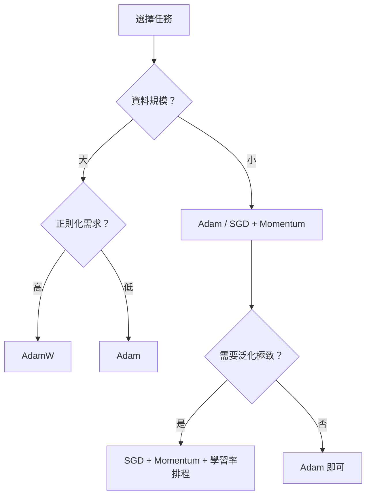

# Adam Optimizer（自適應矩估計最佳化器）

Adam（Adaptive Moment Estimation）是 Kingma 與 Ba 在 2014 年提出的隨機最佳化演算法，目前已成為深度學習領域中最廣泛使用的預設優化器。它結合了動量法（Momentum）與 RMSProp 兩者的優點，為每個參數維度獨立維護自適應學習率，並在訓練初期透過偏差校正（bias correction）來解決估計偏移問題。

## 從 SGD 到自適應方法

### 普通 SGD 的問題

標準小批量梯度下降（Mini-batch SGD）更新規則：

$$\theta_{t+1} = \theta_t - \alpha \nabla_\theta L(\theta_t)$$

其中 $\alpha$ 是全局學習率。這存在三個根本問題：

1. **固定的學習率**：不同參數可能需要不同的學習率（例如稀疏特徵 vs 頻繁特徵）
2. **峽谷效應**：在病態曲率（ill-conditioned curvature）區域，SGD 在陡峭方向震盪、在平緩方向進展緩慢
3. **手動調參**：學習率排程需要手動設計，缺乏自適應性

### 動量法（Momentum）

動量法引入速度項來累積歷史梯度，以平滑更新方向：

$$v_t = \beta_1 v_{t-1} + (1 - \beta_1) g_t$$
$$\theta_{t+1} = \theta_t - \alpha v_t$$

其中 $g_t = \nabla_\theta L(\theta_t)$ 是當前梯度。直覺上，若梯度在連續步驟中方向一致（如平緩的下坡），速度會累積加快收斂；若梯度方向頻繁切換（如峽谷兩側），速度會因相互抵消而減小振幅。

### RMSProp

RMSProp（Root Mean Square Propagation）由 Hinton 提出，透過追蹤梯度平方的指數加權移動平均來為每個參數設定不同學習率：

$$v_t = \beta_2 v_{t-1} + (1 - \beta_2) g_t^2$$
$$\theta_{t+1} = \theta_t - \frac{\alpha}{\sqrt{v_t + \epsilon}} \odot g_t$$

其中 $\odot$ 表示逐元素相乘。對於梯度大的維度，$v_t$ 較大，因此有效學習率 $\alpha / \sqrt{v_t}$ 較小；反之亦然。這解決了不同參數尺度不一的問題。

## Adam 演算法

Adam 將動量法與 RMSProp 整合為單一架構。演算法流程如下：

**輸入**：學習率 $\alpha$、衰減係數 $\beta_1, \beta_2 \in [0, 1)$、穩定項 $\epsilon$、初始參數 $\theta_0$

**初始化**：一階矩 $m_0 = 0$、二階矩 $v_0 = 0$、時間步 $t = 0$

**迭代**：

$$t \leftarrow t + 1$$
$$g_t = \nabla_\theta L_t(\theta_{t-1})$$
$$m_t = \beta_1 m_{t-1} + (1 - \beta_1) g_t$$
$$v_t = \beta_2 v_{t-1} + (1 - \beta_2) g_t^2$$
$$\hat{m}_t = \frac{m_t}{1 - \beta_1^t}$$
$$\hat{v}_t = \frac{v_t}{1 - \beta_2^t}$$
$$\theta_t = \theta_{t-1} - \alpha \frac{\hat{m}_t}{\sqrt{\hat{v}_t + \epsilon}}$$

### 關鍵設計

**一階矩（First Moment）** $m_t$：梯度的指數加權移動平均，即帶衰減的動量項。它捕捉梯度的方向和趨勢，而非瞬時的噪聲。

**二階矩（Second Moment）** $v_t$：梯度平方的指數加權移動平均，代表梯度的大小尺度。它用來正規化學習率：梯度大的維度獲得小學習率，梯度小的維度獲得大學習率。

**偏差校正（Bias Correction）**：在訓練初期，$m_t$ 和 $v_t$ 被初始化為零，導致估計值向零偏移。校正因子 $1 - \beta_1^t$ 和 $1 - \beta_2^t$ 補償了這種偏差。當 $t$ 很小時，校正效果顯著；隨著 $t$ 增大，校正因子趨近於 1。

**更新步長的分析**：Adam 的更新量為 $\alpha \cdot \hat{m}_t / \sqrt{\hat{v}_t}$。有效步長在參數空間中的量級約為 $\alpha$，這使得 Adam 對梯度的尺度變化具有不變性（scale-invariant）。

## 偏差校正的數學推導

初始化 $m_0 = 0, v_0 = 0$ 導致 $m_t$ 和 $v_t$ 在訓練初期嚴重偏向零。推導校正因子：

對 $m_t$ 展開遞迴式：

$$m_t = \beta_1 m_{t-1} + (1 - \beta_1) g_t$$
$$= (1 - \beta_1) \sum_{i=1}^t \beta_1^{t-i} g_i$$

計算期望值（假設 $g_i$ 的分布平穩）：

$$\mathbb{E}[m_t] = (1 - \beta_1) \sum_{i=1}^t \beta_1^{t-i} \mathbb{E}[g_i] = \mathbb{E}[g_t] \cdot (1 - \beta_1^t)$$

因此 $\mathbb{E}[m_t] \neq \mathbb{E}[g_t]$，偏差由 $(1 - \beta_1^t)$ 縮放。校正因子為其倒數：

$$\hat{m}_t = \frac{m_t}{1 - \beta_1^t} \quad \Rightarrow \quad \mathbb{E}[\hat{m}_t] = \mathbb{E}[g_t]$$

同理對二階矩：

$$v_t = (1 - \beta_2) \sum_{i=1}^t \beta_2^{t-i} g_i^2$$
$$\mathbb{E}[v_t] = \mathbb{E}[g_t^2] \cdot (1 - \beta_2^t)$$
$$\hat{v}_t = \frac{v_t}{1 - \beta_2^t} \quad \Rightarrow \quad \mathbb{E}[\hat{v}_t] = \mathbb{E}[g_t^2]$$

當 $t=1$ 時，校正因子 $1/(1-\beta_1)$ 約為 10（對 $\beta_1=0.9$），大幅放大初始估計。當 $t$ 很大時，校正因子趨近 1，影響可忽略。

## 收斂性分析

Kingma & Ba 證明了 Adam 在凸最佳化中的收斂性。設損失函數 $L_t(\theta)$ 為凸函數，且梯度有界 $\|\nabla L_t(\theta)\|_2 \leq G$ 以及 $\|\nabla L_t(\theta)\|_\infty \leq G_\infty$，則 Adam 的後悔（regret）滿足：

$$R(T) = \sum_{t=1}^T L_t(\theta_t) - \min_\theta \sum_{t=1}^T L_t(\theta) \leq O\left(\frac{G^2 \sqrt{T}}{\epsilon \sqrt{1 - \beta_2}} + \frac{G_\infty d^{1/2} T^{1/2}}{(1 - \beta_1)\sqrt{1 - \beta_2}}\right)$$

這個界意味著平均後悔隨 $T^{-1/2}$ 收斂，與 SGD 同階。

### 非凸最佳化的挑戰

在非凸最佳化中（深度學習的實際情況），Adam 的收斂保證不如 SGD 完備。Reddi 等人（2018）指出 Adam 可能不收斂的反例：在某些簡單的凸問題中，$\hat{v}_t$ 可能隨時間遞減後再增加（因為 $\beta_2$ 的移動平均導致 $v_t$ 對近期梯度的權重較大），使學習率不降反升，導致震盪甚至發散。

### AMSGrad

AMSGrad 修改了 $v_t$ 的更新方式——使用歷史最大值而非指數移動平均：

$$v_t = \max(v_{t-1}, \beta_2 v_{t-1} + (1 - \beta_2) g_t^2)$$

這保證了 $\sqrt{v_t}$ 單調不減，從而 $\alpha / \sqrt{\hat{v}_t}$ 單調不增，恢復了收斂性保證。但在實務上，AMSGrad 的改進通常不明顯，AdamW 的影響更大。

### Nadam

Nadam（Nesterov Adam）將 Nesterov 加速動量融入 Adam。Nesterov 動量在計算梯度前先用當前動量「預看一步」：

$$g_t = \nabla f(\theta_t - \alpha \beta_1 m_{t-1})$$

Nadam 將其近似整合到 Adam 的更新規則中，對某些序列建模任務有幫助。

## 超參數解讀

### 學習率 $\alpha$

預設值通常為 0.001 或 0.01。與 SGD 不同，Adam 對學習率不太敏感，但過大的 $\alpha$ 仍會導致發散。本專案 `nn/optim.py`（合併於 `nn/nn.py` 第 155-199 行）的 Adam 實作預設 $\alpha = 0.01$。

### $\beta_1$（一階衰減率）

控制動量累積的窗口大小。$\beta_1 = 0.9$ 對應約 10 步的指數衰減窗口。越大則動量越平滑、對瞬時變化的反應越慢。本專案預設為 0.85。

### $\beta_2$（二階衰減率）

控制梯度平方移動平均的窗口大小。$\beta_2 = 0.999$ 對應約 1000 步的窗口，提供穩定的方差估計。本專案預設為 0.99。

### $\epsilon$

防止除以零的微小常數，通常設為 $10^{-8}$。$\epsilon$ 的大小會影響有效學習率：較大的 $\epsilon$ 會壓抑極小梯度上的更新幅度。

### $L_2$ 正則化與權重衰減的差異

在標準 SGD 中，L2 正則化（在損失中加入 $\frac{\lambda}{2}\|\theta\|^2$）與權重衰減（每次更新時乘以 $(1 - \eta\lambda)$）是等價的。但對於 Adam，兩者不等價：L2 正則化會影響動量項的計算，導致正則化與自適應學習率耦合，削弱正則化效果。

## AdamW：修正權重衰減

AdamW（Decoupled Weight Decay）由 Loshchilov & Hutter（2017）提出，將權重衰減從梯度計算中解耦：

**標準 Adam + L2 正則化**：
$$g_t = \nabla_\theta L_t(\theta_{t-1}) + \lambda \theta_{t-1}$$

**AdamW 的更新**：
$$g_t = \nabla_\theta L_t(\theta_{t-1}) \quad \text{（不含正則化項）}$$
$$\theta_t = \theta_{t-1} - \alpha \frac{\hat{m}_t}{\sqrt{\hat{v}_t + \epsilon}} - \alpha \lambda \theta_{t-1}$$

最後一項 $\alpha\lambda\theta_{t-1}$ 是獨立於 Adam 更新之外的權重衰減。這樣做的好處是：

1. 權重衰減與自適應學習率脫鉤
2. 正則化強度不受學習率自適應的干擾
3. 在許多任務上超越標準 Adam，尤其在 LLM 訓練中

AdamW 已成為預訓練大型語言模型（如 LLaMA、GPT）的事實標準。

## Adam 變體

| 變體 | 改進 | 發表 |
|------|------|------|
| **AMSGrad** | 使用 $v_t$ 的最大值而非指數加權，保證學習率不增加 | Reddi et al. (2018) |
| **AdamW** | 權重衰減解耦 | Loshchilov & Hutter (2017) |
| **Nadam** | 融入 Nesterov 加速動量 | Dozat (2016) |
| **RAdam** | 根據方差強弱決定是否校正動量 | Liu et al. (2019) |
| **AdaBelief** | 根據預測誤差調整學習率 | Zhuang et al. (2020) |
| **Lion** | 僅使用梯度的符號，記憶體減半 | Chen et al. (2023) |

## 本專案中的實現

本專案的 `Adam` 類實現於 `nn/nn.py:155-199`。核心方法 `step()` 依次執行以下步驟：

1. 更新時間步計數器 $t$
2. 對每個參數計算 $m_t = \beta_1 \cdot m_{t-1} + (1 - \beta_1) \cdot g_t$
3. 計算 $v_t = \beta_2 \cdot v_{t-1} + (1 - \beta_2) \cdot g_t^2$
4. 計算偏差校正後的 $\hat{m}_t$ 和 $\hat{v}_t$
5. 應用更新：$\theta \leftarrow \theta - \alpha \cdot \hat{m}_t / (\sqrt{\hat{v}_t} + \epsilon)$

與 PyTorch 的 `torch.optim.Adam` 相比，本實作省略了 L2 正則化耦合和 AMSGrad 選項，但保留了核心演算法。在 `nn/chargpt.py`（第 43 行）中，還加入了線性學習率衰減：`optimizer.lr = 0.01 * (1 - step / num_steps)`，這是實務上常用的增強。

## 實務建議

1. **學習率**：對於 NLP 任務（如本專案的 chargpt），$\alpha=0.01$ 配合線性衰減是合理的起點；對於電腦視覺任務，$\alpha=0.001$ 更常見
2. **$\beta$ 配置**：預設 $\beta_1=0.9, \beta_2=0.999$ 在絕大多數任務上表現良好。若訓練不穩定，可稍微降低 $\beta_2$ 使學習率更保守
3. **梯度裁剪**：Adam 自適應學習率無法防止梯度爆炸，仍需配合梯度裁剪（gradient clipping），如 `nn/chargpt.py:36-40` 所示
4. **AdamW 優先**：對於需要強正則化的場景（如 LLM 預訓練），優先使用 AdamW 而非 Adam + L2
5. **學習率 warmup**：在訓練初期使用線性 warmup 可以避免早期梯度不穩定的問題，尤其搭配 Transformer 時

## Adam 與 SGD 的比較

| 特性 | SGD + Momentum | Adam |
|------|---------------|------|
| 學習率 | 全局，需手動排程 | 逐參數自適應 |
| 超參數敏感性 | 高 | 低 |
| 收斂速度 | 較慢 | 快 |
| 泛化能力 | 通常較好 | 可能略差 |
| 記憶體開銷 | 低（1x 參數量） | 較高（2x 參數量，存儲 m 和 v）|
| 適合任務 | CV 中常見 | NLP、RL、生成模型 |

關於 SGD 泛化能力優於 Adam 的現象，一種解釋是 SGD 傾向於收斂到 sharp minima，而 Adam 傾向於 flat minima，但這個觀點仍有爭論。實務上，可以先使用 Adam 快速找到好的區域，再切換到 SGD 進行 fine-tuning。

## 梯度統計與可視化

Adam 維護的 m 和 v 提供了訓練過程中有價值的診斷資訊：

- **m 的範數**：反映梯度動量的強度，若持續很小可能陷入鞍點或平坦區域
- **v 的對數**：反映每個參數的梯度方差，若某些參數的 v 長時間很小，對應的學習率持續很大，可能不穩定
- **信噪比**（Signal-to-Noise Ratio）：$\hat{m}_t / \sqrt{\hat{v}_t}$ 衡量更新方向的一致性。信噪比高時更新步長大且可靠；信噪比低時步長小，防止被噪聲主導

## Optimizer 選擇流程



實務經驗：當你對任務還不熟悉時，先用 Adam（預設參數）做 baseline，再根據結果微調或切換到其他優化器。

## Lion Optimizer（EvoLved Sign Momentum）

Lion（Chen et al., 2023）是近期提出的高效優化器，由符號動量（sign momentum）驅動：

$$m_t = \beta_1 m_{t-1} + (1 - \beta_1) g_t$$
$$\theta_t = \theta_{t-1} - \alpha \cdot \text{sign}(\beta_2 m_t + (1 - \beta_2) g_t)$$

特點：
- 僅保留梯度的符號資訊（±1），捨棄幅度
- 記憶體開銷減半（只需存儲 m，無需 v）
- 在 LLM 預訓練和影像分類任務上超越 AdamW
- 需要比 AdamW 更小的學習率和更大的 weight decay

Lion 的符號更新行為可用貝葉斯觀點解釋：當梯度符號在連續步驟中一致時，動量累積提供高度確定的更新方向。

## 學習率 Warmup 的理論解釋

在 Transformer 訓練中（如本專案的 chargpt），線性 warmup 與 Adam 的偏差校正相輔相成：

**為何需要 warmup**：訓練初期參數完全隨機，產生的梯度包含大量噪聲。若直接使用較大學習率，Adam 的自適應機制可能根據不穩定的早期梯度調整 v，導致後續有效學習率過小或震盪。

**Warmup 策略**：
1. 前 $T_{\text{warmup}}$ 步：學習率從 0 線性增加到 $\alpha_{\text{max}}$
2. 後續步：餘弦衰減或線性衰減至 0

$$\alpha_t = \alpha_{\text{max}} \cdot \min\left(\frac{t}{T_{\text{warmup}}}, 1\right)$$

這讓模型在低學習率下探索參數空間的合理的區域，再透過高學習率高效收斂。

## Adam 在泛化方面的觀點討論

SGD 泛化優於 Adam 並非普遍真理。最近的實驗表明：

- **資料量充足**：AdamW 可達到與 SGD 相當的泛化性能
- **Learning rate 調參**：SGD 需要手動排程（如 cosine decay），Adam 若配合同等排程，差距縮小
- **Batch size 效應**：小 batch 時 SGD 泛化更好，大 batch 時 Adam 更有優勢
- **架構相關**：CNN 中 SGD 較好，Transformer 中 Adam 明顯優於 SGD

結論：優化器選擇應結合任務、架構和資源綜合考慮，沒有萬能的最優解。

## 實作層面的注意事項

### 梯度累積（Gradient Accumulation）

當 GPU 記憶體不足以容納大 batch 時，梯度累積透過多個小 batch 的梯度累加來模擬大 batch 的效果：

```python
accumulation_steps = 8
for i, batch in enumerate(loader):
    loss = model(batch)
    loss.backward()
    if (i + 1) % accumulation_steps == 0:
        optimizer.step()
        optimizer.zero_grad()
```

使用 Adam 時須注意：累積梯度可能會稀釋單個 batch 的梯度噪聲結構。若累積步數過多，m 和 v 的更新基於平均梯度，失去了小 batch 的正則化效益。

### 混合精度訓練

在 float16 下訓練時，Adam 的 v 可能發生下溢（underflow，梯度平方太小）。解決方案：
- **Loss Scaling**：訓練前放大 loss，反向傳播後縮小梯度
- **FP32 Master Copy**：Adam 的 m 和 v 始終以 float32 存儲，權重更新也在 float32 精度下進行
- **BF16**（bfloat16）：Google 提出的格式，保留與 FP32 相同的指數範圍，有效解決下溢問題

### 記憶體優化

Adam 需要儲存 3 倍的參數記憶體（權重本身 ×1、m ×1、v ×1）。對於 7B 的 LLM，僅 Adam 狀態就需 $7 \times 2 \times 4 = 56$ GB（fp32）。

節省方案：
- **Adafactor**：分解 v 的因式分解形式，記憶體降為 O(rank)
- **Lion**：不需要 v，記憶體減半
- **權重分片（ZeRO Stage 2）**：m 和 v 分布在各 GPU 上，按需收集

---

**上一篇**：[Gradient-Descent.md](Gradient-Descent.md)

**相關連結**：[Backpropagation.md](Backpropagation.md) | [Transformer.md](Transformer.md) | [Character-Level-Model.md](Character-Level-Model.md)
