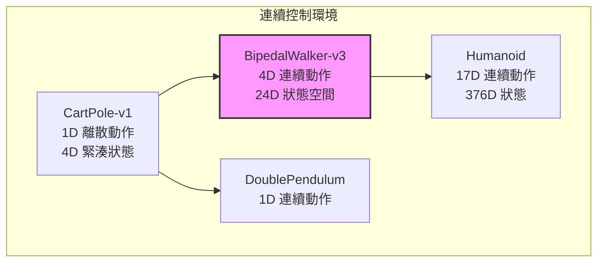

# BipedalWalker（雙足步行者環境）

BipedalWalker 是一個經典的連續控制（continuous control）強化學習環境，由 OpenAI Gym 團隊設計。智慧體需要控制一個二維雙足機器人在崎嶇地形上行走。本專案實現了簡化版本 `BipedalWalker-v3`，位於 `world/envs/bipedal_walker.py`。

## 問題描述

BipedalWalker 的核心任務是：**控制一個二維平面上的雙足步行者，使其從起點走到終點，盡量不跌倒**。

### 為什麼這個問題困難

雙足步行是本質上不穩定的任務。人類嬰兒需要大約一年才能學會穩定行走，機器人也需要克服類似的挑戰：

1. **高維度連續動作空間**：4 個連續關節力矩輸出，組合無限多種。
2. **不穩定的平衡控制**：直立狀態是 unstable equilibrium，微小擾動就會放大。
3. **冗餘自由度**：多個關節可以達成同一目標，但效率不同。
4. **週期性運動模式**：行走本質上是週期性的，但需要根據地形調整步態。

## 環境的物理模型

BipedalWalker 使用簡化的二維物理引擎。雖然不如 MuJoCo 或 Bullet 精確，但足夠捕捉雙足行走的核心挑戰。

### 機器人結構

步行者由以下剛體組成：
- **機身（Hull）**：主體，包含主要感測器和控制單元
- **左腿（Leg 1）**：包含髖關節（hip）和膝關節（knee）
- **右腿（Leg 2）**：同樣包含髖關節和膝關節

每個關節由馬達提供力矩，控制範圍為 $[-30, 30]$ N·m（在 `step()` 方法中透過 `torque = action * 30.0` 縮放）。

### 物理更新

本專案的物理更新使用簡化的尤拉積分（Euler integration）：

```python
self._hull_angular_vel += (torque[0] + torque[1]) * 0.01
self._hull_angular_vel *= 0.99  # 阻尼
self._hull_angle += self._hull_angular_vel * 0.1
```

這裡的 $0.99$ 阻尼係數模擬了關節的摩擦和空氣阻力，防止角速度無限制增長。真實的 BipedalWalker 環境（OpenAI Gym 版本）使用 Box2D 物理引擎，包含碰撞檢測、地面反作用力等更複雜的機制。

## 觀測空間（Observation Space）

BipedalWalker-v3 的觀測空間是 24 維連續向量，包含以下資訊：

### 機身狀態（維度 0-3）
| 維度 | 變數 | 說明 |
|------|------|------|
| 0 | $x_{\text{hull}}$ | 機身的水平位置 |
| 1 | $y_{\text{hull}}$ | 機身的垂直高度 |
| 2 | $\sin(\theta_{\text{hull}})$ | 機身角度的正弦值 |
| 3 | $\dot{\theta}_{\text{hull}}$ | 機身角速度 |

使用 $\sin(\theta)$ 而非 $\theta$ 本身，原因是：
- 角度在 $\pm\pi$ 邊界處的數值跳躍問題（$\pi$ 和 $-\pi$ 實際上很接近）
- 正弦值是平滑連續的，便於神經網路學習

### 腿部關節（維度 4-11）

| 維度 | 變數 | 說明 |
|------|------|------|
| 4 | $\sin(\theta_{\text{leg1}})$ | 左腿絕對角度 |
| 5 | $\dot{\theta}_{\text{leg1}}$ | 左腿角速度 |
| 6 | $\sin(\theta_{\text{leg2}})$ | 右腿絕對角度 |
| 7 | $\dot{\theta}_{\text{leg2}}$ | 右腿角速度 |
| 8 | $\sin(\theta_{\text{hip1}})$ | 左髖關節角度 |
| 9 | $\dot{\theta}_{\text{hip1}}$ | 左髖關節角速度 |
| 10 | $\sin(\theta_{\text{hip2}})$ | 右髖關節角度 |
| 11 | $\dot{\theta}_{\text{hip2}}$ | 右髖關節角速度 |

注意：在 `bipedal_walker.py` 的 `_get_obs()` 方法中，維度 8-11 的實現與 4-7 相同（同一個變數），這意味著簡化版本中髖關節和腿部整體角度目前是等同的。在完整的 OpenAI Gym 版本中，這些是獨立測量的。

### 接觸資訊（維度 12-19）

維度 12-19 是 8 個接觸感測器，分別對應：
- `left_leg_h`：左腿髖部接觸
- `left_leg_a`：左腿踝部接觸  
- `right_leg_h`：右腿髖部接觸
- `right_leg_a`：右腿踝部接觸
- `hip1`, `knee1`, `hip2`, `knee2`：各關節的接觸感測器

在目前簡化版本中，這些維度未實現真實的碰撞檢測，設為 0。

### 觀測空間正規化

```python
high_obs = np.full(24, 1.0, dtype=np.float32)
self._observation_space = Box(-high_obs, high_obs, dtype=np.float32)
```

所有觀測值被限制在 $[-1, 1]$ 範圍內（使用 Box 空間定義），但實際數值可能超出這個範圍。神經網路的輸入層應根據實際資料範圍進行正規化。

## 動作空間（Action Space）

動作空間是 4 維的連續空間 $[-1, 1]^4$：

| 維度 | 動作 | 範圍 |
|------|------|------|
| 0 | 左髖關節力矩 | $[-1, 1]$ |
| 1 | 右髖關節力矩 | $[-1, 1]$ |
| 2 | 左膝關節力矩 | $[-1, 1]$ |
| 3 | 右膝關節力矩 | $[-1, 1]$ |

每個維度在物理引擎中會縮放為實際力矩：

$$\tau_{\text{actual}} = a \times 30.0 \text{ N·m}$$

選擇 4 維動作空間而非 2 維的原因：
- 獨立控制左右腿可以實現更複雜的步態
- 膝關節鎖定/伸直的獨立控制對平衡至關重要
- 不對稱步態（如跛行時一條腿用力較少）也需要這種自由度

## 獎勵函數（Reward Function）

獎勵塑造（reward shaping）是 BipedalWalker 中最關鍵的設計之一：

$$R = R_{\text{forward}} + R_{\text{bonus}} + R_{\text{penalty}}$$

### 前進獎勵

$$R_{\text{forward}} = +1.0 \text{ 每步}$$

只要步行者還未跌倒，每步都獲得 +1 的基本獎勵。這鼓勵智慧體盡可能長時間保持直立。

### 直立獎勵

```python
if self._hull_pos[1] > 1.0:
    reward += 0.1
```

機身高度較高時給予額外獎勵，誘導步行者嘗試伸直膝蓋站立而非蹲著前進。

### 力矩懲罰

$$R_{\text{penalty}} = -0.01 \text{ 每步}$$

小額的固定懲罰，用於抑制不必要的關節抖動（jittering）和能量浪費。在完整的 OpenAI Gym 版本中，這個懲罰是根據實際應用的力矩大小計算的：

$$R_{\text{penalty}} = -0.1 \times \| \text{action} \|^2$$

### 終點獎勵

完整的 BipedalWalker 中，到達終點時會獲得 $+10$ 的額外獎勵。這在當前簡化版本中尚未實現。

## 終止條件（Termination Conditions）

### 自然終止（Terminated）

$$|\theta_{\text{hull}}| > 1.0 \text{ rad} \ (\approx 57.3°)$$

當機身傾斜角度超過約 57 度（接近側倒）時，回合終止。這比 CartPole 的 $12°$ 更寬鬆，因為行走過程中身體自然會擺動。

### 截斷（Truncated）

```python
self.max_steps = 1600  # 預設
```

超過最大時間步數時強制終止。在 50 FPS 下，1600 步約等於 32 秒的模擬時間。如果步行者在 32 秒內未能到達終點，回合被截斷。

## 環境複雜度與變體

### 地形變化

在完整的 BipedalWalker-v3（OpenAI Gym）中，地面不是完全平坦的。地形包含：
- **起點平台**：平坦區域
- **隨機起伏**：正弦波狀的地形起伏
- **終點區域**：特殊的標記區域
- **崎嶇地形**：一些版本包含階梯或石塊障礙

本專案的簡化版本使用完全平坦的地形（`TERRAIN_HEIGHT = 0.0`），降低了學習難度，但環境的基本動力學挑戰仍然存在。

### 難度等級

| 難度 | 地形 | 訓練所需步數 |
|------|------|-------------|
| 平坦（本版本） | $y=0$ | ~10 萬步 |
| 簡單起伏 | 小幅度正弦波 | ~50 萬步 |
| 完整版本 | 隨機崎嶇地形 | ~100 萬步以上 |
| Hardcore | 階梯、深溝、岩石 | ~300 萬步以上 |

## 馬可夫決策過程視角

從 MDP 的視角分析 BipedalWalker：

### 狀態空間的維度詛咒

24 維觀測空間意味著狀態空間是 $\mathbb{R}^{24}$ 的超立方體。即便每個維度只離散化為 10 個區間，總狀態數高達 $10^{24}$——遠超過 FrozenLake 的 16 或 64 個狀態。這意味著 Q 表完全不可行，必須使用函數逼近（function approximation）。

### 獎勵函數的設計陷阱

BipedalWalker 的獎勵設計體現了 reward shaping 的經典挑戰：

1. **欺騙性捷徑**：智慧體可能發現「原地站立不走路」也能獲得一定獎勵，因為存活獎勵每步 +1。需要力矩懲罰來打破這種捷徑。
2. **多重目標**：需要同時最大化前進距離、保持平衡、最小化能量消耗。這些目標有時互相衝突（快速行走 vs 低能耗）。
3. **獎勵尺度**：不同獎勵項目的尺度需要仔細平衡。太大會主導學習，太小則被忽略。

### 部分可觀測性

目前的觀測向量只包含關節角度和速度，缺乏：
- 地形的前瞻資訊（完整版本有雷射測距儀，lidar）
- 雙腳與地面的接觸力（觸覺回饋）
- 全身質心的全局位置與速度

這使得 BipedalWalker 本質上是部分可觀測的（Partially Observable MDP, POMDP），智慧體需要從歷史資訊中推斷不可觀測的狀態。

## 與其他環境的比較



BipedalWalker 處於中間難度：比 CartPole 更複雜（連續動作、更高維度），但比 Humanoid（17 個關節）簡單。這使它成為測試連續控制演算法的理想基準。

## 演算法適用性

### 可以直接應用的方法

- **DDPG（Deep Deterministic Policy Gradient）**：連續動作空間的經典 Actor-Critic 方法
- **PPO（Proximal Policy Optimization）**：目前最穩定流行的選擇
- **SAC（Soft Actor-Critic）**：最大熵框架，探索效率高
- **TD3（Twin Delayed DDPG）**：解決 DDPG 的 Q 值過估計問題

### 需要修改的方法

- **DQN**：需要離散化動作空間（不推薦，解析度不足）
- **Q-Learning**：無法直接處理連續動作
- **REINFORCE**：可以使用（高斯策略），但樣本效率較低

## 視覺化與除錯

本專案提供基於 ANSI 字元的簡易渲染（`render(mode="ansi")`），將步行者繪製為 60×20 的字元網格。這對於快速驗證行為是否合理很有幫助，但無法像 OpenAI Gym 的 Box2D 渲染那樣看到腿部動畫。

## 訓練 BipedalWalker 的實務挑戰

### 樣本效率

BipedalWalker 的收斂通常需要數十萬到數百萬個時間步。PPO 的典型收斂速度：

| 演算法 | 達到 200 分所需步數 |
|--------|-----------------|
| PPO | ~30-50 萬步 |
| SAC | ~20-40 萬步 |
| DDPG | ~50-100 萬步 |
| TD3 | ~30-60 萬步 |

### 超參數敏感度

連續控制問題對超參數極其敏感：
- **學習率**：$10^{-4}$ 到 $3 \times 10^{-4}$ 是常見範圍，過大導致策略崩潰，過小收斂極慢
- **獎勵尺度**：獎勵放大或縮小 10 倍可能徹底改變學習行為
- **網路結構**：隱藏層大小（256 或 512）和層數（2 或 3）對最終性能有顯著影響
- **熵正則化係數**：控制探索程度，SAC 對此尤為敏感

### 局部最優陷阱

雙足步行者的常見次優策略包括：
- **原地跳躍**：獲得存活獎勵但不前進
- **拖腿行走**：一條腿拖行，效率低但勉強步行
- **倒立行走**：偶爾出現的奇怪步態，利用物理引擎的漏洞
- **過度擺動**：腿部快速抖動以維持平衡但消耗大量能量

防止這些次優策略通常需要精心的獎勵塑造或引入先驗知識（如對稱性約束、步態模板）。

## 總結

BipedalWalker 是一個具有代表性的連續控制問題，它在低維度觀測空間中保留了真實機器人控制的核心挑戰：不穩定的動態平衡、冗餘自由度、連續動作規劃。雖然本專案的實現是簡化版本（平坦地形、簡化物理），但它仍然足以展示連續控制演算法的優劣，並作為通往更複雜環境（如 Humanoid、Ant、HalfCheetah）的橋樑。

---

**相關連結**：[CartPole-Environment.md](CartPole-Environment.md) | [Policy-Gradient.md](Policy-Gradient.md) | [Reinforcement-Learning.md](Reinforcement-Learning.md)
