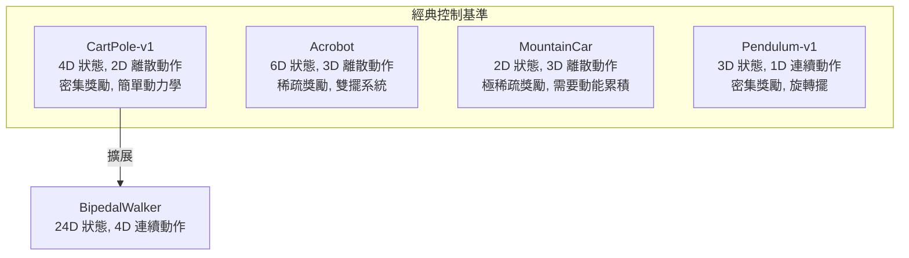

# CartPole Environment（小車平衡桿環境）

CartPole（也稱為倒單擺，inverted pendulum）是強化學習中最經典的控制基準問題之一，起源於 Barto、Sutton 和 Anderson 在 1983 年的論文。智慧體需要控制一輛在軌道上移動的小車，使其上方豎直放置的桿子保持平衡。

## 歷史背景

### 經典論文

CartPole 問題最早由 Widrow 和 Smith（1963）在自適應控制領域提出，但真正在強化學習中發揚光大是藉由 Barto、Sutton 和 Anderson 1983 年的論文《Neuronlike Adaptive Elements That Can Solve Difficult Learning Control Problems》。

這篇論文的重要性在於：
- 首次展示了一個簡單的類神經元結構（ASE/ACE）可以學會平衡倒單擺
- 奠定了演員-評論家（Actor-Critic）架構的雛形
- 論文中使用的「失敗就懲罰、成功就獎勵」的思想直接影響了後續的 TD 學習理論

### 在強化學習中的地位

CartPole 有著「強化學習的 Hello World」之稱。它的地位類似於 MNIST 在監督學習中的角色：
- **低維度**：4 維狀態空間，易於可視化和除錯
- **快速迭代**：一個 episode 通常只有 10-500 步，訓練速度快
- **易於理解**：物理機制直觀，策略可解釋
- **不過於簡單**：非線性動力學保證了需要真正學習而非簡單記憶

## 物理模型

### 系統示意

```
           θ (桿子角度)
            |
            O  (桿子頂端)
            |
            |   ← 桿子（質量 m, 長度 2l）
            |
            ========================  ← 小車（質量 M）
        ────────── 滑軌 ──────────
    ←──── x (小車位置) ────→
```

### 狀態變數

CartPole-v1 的觀測空間是一個 4 維連續向量：

| 索引 | 符號 | 名稱 | 單位 | 範圍 |
|------|------|------|------|------|
| 0 | $x$ | 小車位置 | m | $[-4.8, 4.8]$ |
| 1 | $\dot{x}$ | 小車速度 | m/s | $(-\infty, \infty)$ |
| 2 | $\theta$ | 桿子角度 | rad | $[-0.418, 0.418]$ ($\approx \pm 24°$) |
| 3 | $\dot{\theta}$ | 桿子角速度 | rad/s | $(-\infty, \infty)$ |

數學上，角度 $\theta = 0$ 對應桿子完全豎直，順時針為正。但環境中角度被限制在 $\pm 0.418$ rad（約 $\pm 24°$），超過此範圍即終止。

### 動作空間

動作空間是離散的 2 個動作：

| 動作編號 | 名稱 | 施加力 |
|---------|------|--------|
| 0 | LEFT | $F = -10.0$ N（向左推） |
| 1 | RIGHT | $F = +10.0$ N（向右推） |

## 動力學方程式

CartPole 的運動方程式基於牛頓力學推導。系統有兩個自由度：小車的水平移動 $x$ 和桿子的旋轉 $\theta$。

### 關鍵參數

| 參數 | 符號 | 值 | 單位 |
|------|------|----|------|
| 重力加速度 | $g$ | 9.8 | m/s² |
| 小車質量 | $M$ | 1.0 | kg |
| 桿子質量 | $m$ | 0.1 | kg |
| 桿子半長 | $l$ | 0.5 | m |
| 施力大小 | $F$ | 10.0 | N |
| 時間步長 | $\Delta t$ | 0.02 | s |

### 推導過程

為了推導桿子的角加速度 $\ddot{\theta}$，首先要計算系統的有效慣量。

桿子質心的水平位置為：

$$x_c = x + l \sin\theta$$

對時間微分得到水平速度：

$$\dot{x}_c = \dot{x} + l \dot{\theta} \cos\theta$$

系統在水平方向的總動量方程：

$$M\ddot{x} + m(\ddot{x} + l\ddot{\theta}\cos\theta - l\dot{\theta}^2\sin\theta) = F$$

整理可得：

$$\ddot{x} = \frac{F + ml\dot{\theta}^2\sin\theta - ml\ddot{\theta}\cos\theta}{M + m} \quad \text{(1)}$$

對桿子質心取力矩平衡（繞桿子的支點）：

$$I\ddot{\theta} = mgl\sin\theta - ml\ddot{x}\cos\theta$$

其中 $I = \frac{1}{3}ml^2$ 是繞一端旋轉的轉動慣量。

代入 $I$ 並整理可得桿子的角加速度：

$$\ddot{\theta} = \frac{g\sin\theta - \ddot{x}\cos\theta}{l\left(\frac{4}{3} - \frac{m\cos^2\theta}{M+m}\right)} \quad \text{(2)}$$

為避免代數循環（(1) 包含 $\ddot{\theta}$，(2) 包含 $\ddot{x}$），將 (1) 代入 (2) 消去 $\ddot{x}$，得到最終的閉合形式：

首先計算中間量：

$$\text{temp} = \frac{F + ml\dot{\theta}^2\sin\theta}{M + m}$$

$$\ddot{\theta} = \frac{g\sin\theta - (\text{temp})\cos\theta}{l\left(\frac{4}{3} - \frac{m\cos^2\theta}{M+m}\right)}$$

$$\ddot{x} = \text{temp} - \frac{ml\ddot{\theta}\cos\theta}{M + m}$$

### 數值積分

本專案使用尤拉積分（Euler integration）進行數值模擬：

```python
x        += TAU * x_dot
x_dot    += TAU * x_acc
theta    += TAU * theta_dot
theta_dot += TAU * theta_acc
```

其中 `TAU = 0.02` 秒。尤拉積分是一階精確的數值方法，對 CartPole 這類剛性較低的系統已經足夠。更精確的模擬可以使用 RK4（四階龍格-庫塔法），但對 RL 訓練來說，尤拉積分結合小時間步長已經能產生足夠真實的動力學行為。

### 線性化近似

當桿子接近豎直（$\theta \approx 0$）時，可以對系統進行線性化：

$$\sin\theta \approx \theta, \quad \cos\theta \approx 1, \quad \dot{\theta}^2 \approx 0$$

代入後可得線性化的運動方程：

$$\ddot{\theta} \approx \frac{g\theta - \frac{F}{M+m}}{l\left(\frac{4}{3} - \frac{m}{M+m}\right)}$$

這個線性化系統是不穩定的（極點在右半平面），對應倒單擺的 unstable equilibrium 本質。控制系統理論告訴我們，只要 $\theta$ 和 $\dot{\theta}$ 可觀測，這個系統是可控的（controllable），即存在一個回授控制器可以使系統穩定。

## 獎勵函數

CartPole 的獎勵函數極其簡單：

$$r_t = \begin{cases} 1 & \text{如果 } |x| \leq 2.4 \text{ 且 } |\theta| \leq 12^\circ \\ 0 & \text{否則（回合終止）} \end{cases}$$

這是一個**密集獎勵（dense reward）**的設計：每存活一步就獲得 1 分。最大可能回報為 500（如果撑滿 500 步）。

### 獎勵函數的設計哲學

與 FrozenLake 的稀疏獎勵不同，CartPole 使用密集獎勵：
- 獎勵信號連續且頻繁（每步都有反饋）
- 智慧體可以清楚感知「自己是否在做對的事」
- 不需要資格跡或蒙特卡羅方法來解決信用分配問題

這使得 CartPole 非常適合**梯度方法**的快速原型測試。

## 終止條件

### 自然終止（Terminated）

智慧體失敗的三種方式：

1. **小車超出邊界**：$|x| > 2.4$ m（小車撞到軌道末端）
2. **桿子傾倒**：$|\theta| > 12^\circ \ (\approx 0.2094 \text{ rad})$ 
3. **兩者同時發生**（通常是傾倒導致位移過大）

### 截斷（Truncated）

達到最大步數（預設 500 步）時強制終止，表示智慧體成功平衡了整段時間。

```python
terminated = bool(
    x < -self.X_THRESHOLD
    or x > self.X_THRESHOLD
    or theta < -self.THETA_THRESHOLD_RAD
    or theta > self.THETA_THRESHOLD_RAD
)
```

## 平衡動力學分析

### 不穩定平衡點

CartPole 的豎直狀態（$\theta = 0, \dot{\theta} = 0$）是 unstable equilibrium（不穩定平衡點）。物理直覺：

- 桿子稍微傾斜 → 重力產生力矩使傾斜加劇 → 需要小車移動來抵銷
- 小車移動產生的慣性力可以作用在桿子上，使桿子回正
- 這類似於手掌上立一根掃帚：需要持續的微小調整

### 控制策略直覺

一個好的策略的典型行為：

1. 桿子向左倒（$\theta > 0$）→ 小車也向左加速（action = LEFT）
2. 使桿子質心相對小車保持在正上方
3. 同時需要限制小車的位置，避免撞到邊界

這是一個典型的**雙積分器（double integrator）**控制問題，但在非線性動力學下需要更複雜的策略。

## 應用神經網路策略

CartPole 的低維度狀態空間非常適合使用小型 MLP 作為策略網路：

**策略梯度方法**（如 `world/examples/cartpole_vpg.py`）：

```python
self.policy_net = nn.Sequential(
    nn.Linear(4, 128),       # 輸入層：4 維狀態
    nn.ReLU(),
    nn.Linear(128, 64),      # 隱藏層
    nn.ReLU(),
    nn.Linear(64, 2),        # 輸出層：2 個動作
    nn.Softmax(dim=1)        # 機率分布
)
```

- 輸入：4 維觀測向量 $[x, \dot{x}, \theta, \dot{\theta}]$
- 輸出：softmax 機率分布 $\pi(\text{LEFT}|s)$, $\pi(\text{RIGHT}|s)$
- 優化器：Adam（lr=0.005）
- 折扣因子：$\gamma = 0.99$

為什麼這層網路足夠？因為 CartPole 的最優策略邊界在狀態空間中相當平滑，不需要深層網路來建模。事實上，一個單隱藏層網路（甚至線性策略）在有合適特徵工程的情況下也能解決問題。

## 收斂準則

訓練 CartPole 的常見收斂標準：連續 20 個回合的平均回報 > 195（原始版本為 199，但官方標準是 195）。達到這個標準的典型表現：

- VPG/REINFORCE：約 100-1000 回合（取決於超參數和隨機種子）
- DQN：約 100-500 回合
- 手動設計的 LQR 控制器：0 回合（直接解析解）

## 與其他環境的比較



| 特性 | CartPole | FrozenLake | BipedalWalker |
|------|----------|------------|---------------|
| 狀態維度 | 4（連續） | 1（離散） | 24（連續） |
| 動作空間 | 2 離散 | 4 離散 | 4 連續 |
| 隨機轉移 | 無 | 有（滑溜） | 無 |
| 獎勵類型 | 密集 | 稀疏 | 中等 |
| 物理精確度 | 中等 | 無 | 簡化 |
| 問題難度 | 簡單 | 中等 | 困難 |

## 常見變體

| 變體 | 差異 | 用途 |
|------|------|------|
| CartPole-v0 | 最大步數 200 | 原始版本 |
| CartPole-v1 | 最大步數 500 | 目前標準（本專案實現） |
| CartPoleContinuous | 動作空間連續（推力大小可調） | 測試連續控制演算法 |
| CartPoleStochastic | 加入隨機外力干擾 | 測試演算法的魯棒性 |

## 參考文獻與源碼

本專案實現 `world/envs/cartpole.py` 遵循 OpenAI Gym CartPole-v1 的介面規範，包含了：

- 完整牛頓力學推導的運動方程式
- ANSI 和 Pygame 兩種渲染模式
- 與 Gym 相容的 `Env` 抽象介面
- 可設定的最大步數（預設 500）

```python
import world
env = world.make("CartPole-v1")
obs, info = env.reset(seed=42)
```

---

**相關連結**：[Policy-Gradient.md](Policy-Gradient.md) | [BipedalWalker.md](BipedalWalker.md) | [Reinforcement-Learning.md](Reinforcement-Learning.md)
