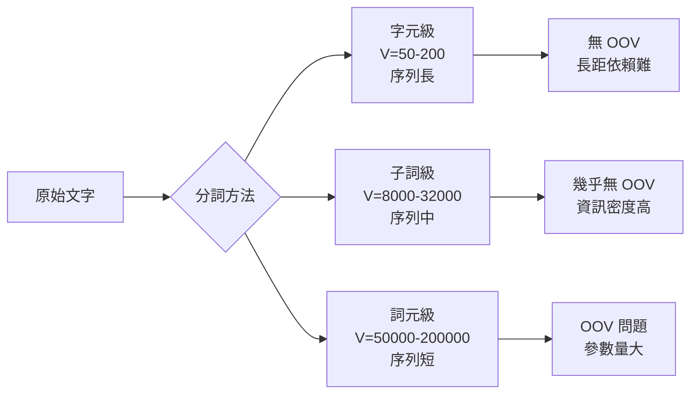

# Character-Level Model（字元層級語言模型）

字元層級模型（character-level model）是以字元（character）為基本單位進行語言建模的方法。與詞元層級（word-level）或子詞（subword，如 BPE、WordPiece）模型不同，字元模型將文字視為離散字元的序列，具有詞彙量極小、能處理任意文字（包括拼寫錯誤和生僻詞）等獨特優勢。

## 語言建模的基本框架

語言模型（Language Model, LM）的目標是學習文字序列的機率分布。對一個長度為 T 的序列 $(x_1, x_2, ..., x_T)$，語言模型將其機率分解為條件機率的乘積（自回歸分解）：

$$p(x_1, x_2, ..., x_T) = \prod_{t=1}^T p(x_t | x_1, x_2, ..., x_{t-1})$$

訓練目標是最大化這個機率（等價於最小化負對數似然）：

$$L = -\sum_{t=1}^T \log p(x_t | x_{<t})$$

### 字元級 vs 詞元級 vs 子詞

**詞元級模型**：
- 優點：一個 token 攜帶豐富語義，序列長度短（約為字元級的 1/5），模型能捕捉更高層次的語義
- 缺點：詞彙量大（數萬到數十萬），罕見詞處理困難（OOV, out-of-vocabulary），參數矩陣大

**子詞模型**（BPE, WordPiece, SentencePiece）：
- 優點：平衡了詞彙大小和序列長度，常見詞不拆、罕見詞拆為子詞，幾乎無 OOV
- 缺點：需要預先學習分詞器（tokenizer），管線較複雜

**字元級模型**：
- 優點：詞彙量僅約 50-200（視字母表而定），無需分詞器，可處理任何文字
- 缺點：序列長度為詞元級的 5-10 倍，長距離依賴更難學習

本專案的 chargpt 使用字元級模型，詞彙量 = 唯一字元數 + 1（BOS token）。

## 詞彙建構（Vocabulary Construction）

### 流程

從訓練文本中提取所有不重複字元：

```python
docs = [line.strip() for line in open('data/input.txt') if line.strip()]
uchars = sorted(set(''.join(docs)))
vocab_size = len(uchars) + 1  # +1 是 BOS token
```

以 `data/input.txt`（英文姓名列表）為例，字元集可能包括 26 個小寫字母、大小寫字母加上標點符號，總詞彙量約 50-70。

### 字元到索引的映射

每個字元被映射到一個唯一整數索引（詞彙表編號），反之亦然：

```
索引 0: 'a'
索引 1: 'b'
...
索引 25: 'z'
索引 26: 'BOS' (特殊標記)
```

## BOS Token（Beginning of Sequence）

BOS（Beginning of Sequence）token 是特殊的控制標記，放在序列開頭和結尾。其設計決策隱含地在建模：

$$p(\text{序列}) = p(\text{第一個 token} | \text{BOS}) \times \prod_{t=2}^T p(x_t | x_{<t}) \times p(\text{BOS} | \text{完整序列})$$

BOS token 在訓練和推理中的角色：

**訓練時**：

$$\text{輸入 tokens} = [\text{BOS}, c_1, c_2, ..., c_n]$$
$$\text{目標 tokens} = [c_1, c_2, ..., c_n, \text{BOS}]$$

模型學習：
- 看到 BOS 後預測序列的第一個字元
- 看到序列最後一個字元後預測 BOS（表示序列結束）

**推理時**：
- 以 BOS 作為初始輸入，觸發生成
- 若模型預測出 BOS，則停止生成

這種設計使模型同時學習了「何時開始」和「何時結束」。

## 自回歸生成（Autoregressive Generation）

自回歸生成是指模型一次生成一個 token，將新生成的 token 回饋到輸入中，形成遞迴過程。

### 貪婪解碼（Greedy Decoding）

最簡單的方式：每次選擇機率最高的 token。

$$\hat{x}_{t+1} = \arg\max_{v \in V} p(x_{t+1} = v | x_{\leq t})$$

缺點是缺乏多樣性，且容易陷入重複循環。

### 溫度採樣（Temperature Sampling）

溫度採樣引入溫度參數 $T$ 來控制機率分布的平滑度：

$$p_T(x_t | x_{<t}) = \frac{\exp(z_t / T)}{\sum_j \exp(z_j / T)}$$

- **$T = 0$**：退化為貪婪解碼（取最大值）
- **$T = 1$**：原始 softmax 分布
- **$T < 1$**：分布更尖銳（peakier），生成更確定性（高機率 token 更可能被選中）
- **$T > 1$**：分布更平滑，生成更隨機、更多樣化

本專案 `nn/chargpt.py:75-76` 的實作：

```python
exps = np.exp(last_logits / temperature - np.max(last_logits / temperature))
probs = exps / np.sum(exps)
current_token = np.random.choice(range(vocab_size), p=probs)
```

先將 logits 除以溫度，再透過 softmax 得到機率分布，最後從分布中採樣。除以溫度前減去最大值是為了數值穩定性。

### Top-k 採樣

只從機率最高的 k 個 token 中採樣，其餘 token 機率設為零：

```python
top_k_indices = np.argsort(probs)[-k:]
filtered_probs = np.zeros_like(probs)
filtered_probs[top_k_indices] = probs[top_k_indices]
filtered_probs /= filtered_probs.sum()
```

這樣可以過濾低機率 token，防止生成無意義的內容。

### Top-p（Nucleus）採樣

選取累積機率超過閾值 p 的最小 token 集合進行採樣：

```python
sorted_indices = np.argsort(probs)[::-1]
cumsum = np.cumsum(probs[sorted_indices])
threshold_idx = np.searchsorted(cumsum, p)
selected = sorted_indices[:threshold_idx + 1]
```

Top-p 是比 Top-k 更自適應的方法——當分布尖銳時選擇少數 token，分布平坦時選擇更多 token。

### 重複懲罰（Repetition Penalty）

為防止模型重複生成相同 token，在採樣時壓低已出現 token 的機率：

$$z_i^{\text{penalized}} = \begin{cases} z_i / \theta & \text{if } i \in \text{history} \\ z_i & \text{otherwise} \end{cases}$$

其中 $\theta > 1$ 為懲罰係數。

## KV Cache（Key-Value 快取）

### 為什麼需要 KV Cache

在自回歸推理中，時間步 $t$ 需要計算 attention 時，Q、K、V 從所有 $t$ 個 token 計算。時間步 $t+1$ 本質上只需要計算新 token 的 Q、K、V，但注意力需要 attend 到所有 t+1 個 token。

若每次都重新計算所有 token 的 K、V，時間複雜度為 $O(t^2)$。KV Cache 儲存歷史 K、V 向量，使推理時間複雜度降為 $O(t)$（僅 $O(1)$ 計算新 token）。

### 實現機制

本專案 `nn/gpt.py:57-60` 的 KV Cache 實作：

```python
if kv_cache is not None:
    past_k, past_v = kv_cache
    k = cat([past_k, k], axis=2)  # 沿序列維度拼接
    v = cat([past_v, v], axis=2)
```

即：將當前步計算的 (k, v) 與歷史快取拼接，再計算注意力。

### 記憶體成本

KV Cache 需要儲存所有 Transformer 層的所有歷史 token 的 K、V 向量。對於 L 層、n_head 個注意力頭、head_dim 維度的模型，快取大小為：

$$2 \times L \times \text{n\_head} \times \text{head\_dim} \times T \text{（float32）}$$

以 GPT-3 175B 為例（L=96, d_model=12288, T=2048），KV Cache 約需 $2 \times 96 \times 12288 \times 2048 \times 4 \text{ bytes} \approx 18 \text{ GB}$。

本專案的 small GPT（n_layer=1, n_embd=16, n_head=4, T=16）的 KV Cache 極小，適合教學展示。

## 梯度裁剪（Gradient Clipping）

### 為什麼需要梯度裁剪

在 RNN 語言模型中，梯度爆炸（exploding gradient）是常見問題——因為序列長度上的反覆矩陣乘法（或注意力計算）可能導致梯度範數指數級增長。梯度範數過大會破壞最佳化過程：單步更新量過大，參數跳出收斂區域。

### 全局梯度裁剪（Global Gradient Norm Clipping）

計算所有參數梯度的總範數，若超過閾值則統一縮放：

$$g_{\text{total}} = \sum_{i} \|g_i\|_2^2$$

$$\text{scale} = \min\left(1, \frac{\text{max\_norm}}{g_{\text{total}} + \epsilon}\right)$$

$$g_i \leftarrow g_i \cdot \text{scale}$$

本專案 `nn/chargpt.py:36-40` 的實作：

```python
max_norm = 1.0
total_norm = np.sqrt(sum(np.sum(p.grad ** 2) for p in params))
if total_norm > max_norm:
    clip_coef = max_norm / (total_norm + 1e-6)
    for p in params:
        p.grad *= clip_coef
```

這種裁剪方式保留了梯度的方向，只縮放其大小。閾值 max_norm 是重要超參數（常見值 0.5-5.0）。

### 逐元素梯度裁剪（Element-wise Clipping）

全局裁剪的另一種變體是逐元素裁剪，將每個梯度元素限制在 $[-\text{clip\_value}, \text{clip\_value}]$ 範圍內。這會改變梯度方向，但實現更簡單。

## 字元模型的學習曲線

字元級語言模型的訓練過程通常呈現清晰的模式：

1. **早期**（前 50 步）：loss 快速下降，模型學會輸出頻率最高的字元
2. **中期**（50-300 步）：loss 持續下降，模型開始捕捉常見的字母組合（bigram/trigram）
3. **後期**（300-1000 步）：loss 緩慢下降，模型學習更長距離的依賴和命名慣例

以名字生成為例，第 1 步可能給出「aaaa...」，第 100 步能生成「emma」，第 500 步能生成合理的英文姓名。

## 本專案的完整流程

`nn/chargpt_demo.py` 示範了完整的訓練與生成流程：

1. **資料準備**：從 Karpathy 的 makemore 倉庫下載 `names.txt`（約 32000 個英文姓名）
2. **詞彙建構**：從姓名中提取所有不重複字元
3. **模型初始化**：建立小型 GPT（vocab_size=~50, n_layer=1, n_embd=16, n_head=4）
4. **訓練**：每個 step 採樣一個姓名，隨機截取長度 `<= block_size` 的子序列
5. **生成**：使用 KV Cache 加速，溫度採樣生成新姓名

### 訓練細節

訓練資料的組織方式：

```python
tokens = [BOS] + [uchars.index(ch) for ch in doc] + [BOS]
x = tokens[:n]      # 輸入：BOS 開頭
y = tokens[1:n+1]   # 目標：偏移一位
```

這是一個標準的自回歸語言模型結構：模型看到 tokens[0:t] 預測 tokens[1:t+1]。

### 學習率策略

採用線性衰減（`nn/chargpt.py:43`）：

```python
optimizer.lr = 0.01 * (1 - step / num_steps)
```

從初始學習率 0.01 線性下降至零。這是一種簡單有效的 learning rate schedule。

## 困惑度（Perplexity）

語言模型的標準評估指標是困惑度（perplexity, PPL）：

$$PPL = \exp\left(-\frac{1}{T}\sum_{t=1}^T \log p(x_t | x_{<t})\right) = \exp(L)$$

其中 $L$ 是平均負對數似然。困惑度直觀的解釋是「模型在平均情況下有多少個合理選項」：
- PPL=1：完美預測（不確定性為 0）
- PPL=V：隨機猜測（V 是詞彙量，所有 token 等機率）
- PPL=10：平均需要從 10 個可能的字元中猜測

字元級模型的 PPL 通常較低（約 2-8），因為字元分布的熵本就低於詞元分布。

## Beam Search（束搜索）

溫度採樣每次獨立決策，可能導致局部最優但全局不連貫。Beam Search 保留 k 個假設序列（beam），在每一步擴展所有假設並保留 top-k：

**Beam Size = 1**：退化為貪婪解碼，效率高但品質低
**Beam Size = 2-5**：適合翻譯、摘要等任務，生成品質提升明顯
**Beam Size 過大**：收益遞減且計算成本線性增長，且傾向於短序列（length bias）

## Top-k 與 Top-p 採樣詳解

### Top-k 採樣

固定 k 值。若分布尖銳，k=50 可能包含許多低機率 token；若分布平坦，k=50 可能遺漏合理選項。

### Top-p（Nucleus）採樣

動態選擇 token 集合，使累積機率剛好超過 $p$：

```python
probs_sorted = np.sort(probs)[::-1]
cumsum = np.cumsum(probs_sorted)
threshold = np.searchsorted(cumsum, p)
selected = probs >= probs_sorted[threshold]
filtered = probs * selected
filtered /= filtered.sum()
```

Top-p 的優勢在於自適應性：當模型對一個 token 極有把握時，$p$ 閾值選取少數 token；當模型不確定時，選取更多 token 增加多樣性。

### 兩者結合

實務上常同時使用 Top-k 和 Top-p——先選取 top-k 個 token（過濾長尾），再從中做 top-p 過濾。這在 Hugging Face Transformers 中是預設配置。

## 子詞分詞器的理論基礎

字元級模型簡單但序列長；詞級模型序列短但詞彙大。子詞分詞器（BPE、WordPiece、SentencePiece）尋求平衡：

### BPE（Byte-Pair Encoding）

1. 初始化為字元詞彙表
2. 重複合併最頻繁的相鄰 token 對
3. 直到詞彙量達到目標大小

BPE 的頻率驅動本質保證了：常見詞保持完整（「the」→「the」），罕見詞被分解（「tokenization」→「token」「ization」）。

### Unigram LM

與 BPE 不同，Unigram 從大詞彙量開始逐步刪除使似然下降最少的 token。是 SentencePiece 的兩種分詞模式之一。

### 分詞表示法對模型的影響



---

**上一篇**：[Transformer.md](Transformer.md)

**相關連結**：[Embedding.md](Embedding.md) | [Adam-Optimizer.md](Adam-Optimizer.md) | [Loss-Function.md](Loss-Function.md)
