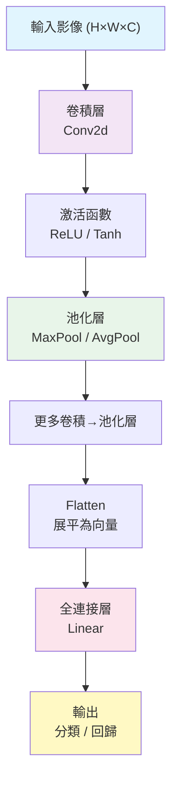

# Convolutional Neural Network（卷積神經網路）

卷積神經網路（CNN）是一種專門處理網格狀拓撲結構資料（如影像、語音頻譜）的深度學習架構。其核心操作——卷積（convolution）——利用局部連接、權重共享（weight sharing）和平移等變性（translation equivariance）三大設計原則，大幅減少了參數量並提升了泛化能力。

## CNN 架構總覽



## 從全連接到卷積

考慮一個 $224 \times 224 \times 3$ 的彩色影像。若使用全連接層（fully connected layer）將其映射到 1024 個隱藏神經元，參數量為 $224 \times 224 \times 3 \times 1024 \approx 1.54$ 億——這還僅僅是一層。這種做法存在兩個根本問題：

1. **參數爆炸**：過多的參數導致過擬合、訓練極慢、記憶體不足
2. **忽略空間結構**：每個像素被視為獨立特徵，丟失了鄰近像素間的相關性

CNN 透過以下機制解決這些問題：

- **局部連接（local connectivity）**：每個神經元只連接到輸入的一小塊區域（感受野，receptive field）
- **權重共享（weight sharing）**：同一卷積核（kernel）在整個輸入上滑動，參數被重複使用
- **多層抽象**：底層檢測邊緣/紋理，中層檢測形狀/部件，高層檢測完整物體

## 卷積運算的數學

### 離散卷積

二維離散卷積定義為：

$$(I * K)(i, j) = \sum_{m} \sum_{n} I(i + m, j + n) \cdot K(m, n)$$

其中 $I$ 是輸入影像，$K$ 是卷積核（kernel/filter）。卷積核在輸入上滑動，每個位置做一次逐元素乘積後求和（類似滑動視窗的加權平均）。

### 捲積 vs 互相關（Cross-correlation）

在深度學習實作中，通常使用互相關而非嚴格的數學卷積：

$$S(i, j) = (I * K)(i, j) = \sum_{m} \sum_{n} I(i + m, j + n) \cdot K(m, n)$$

數學卷積會先將 kernel 旋轉 180 度再滑動。由於 kernel 權重是學習出來的，兩種操作的表示能力相同；深度學習框架統一使用互相關但習慣上仍稱之為「卷積」。

### 輸出尺寸計算

給定輸入尺寸 $H \times W$、卷積核尺寸 $K_H \times K_W$、步長（stride）$S$、填補（padding）$P$，輸出尺寸為：

$$H_{\text{out}} = \left\lfloor \frac{H + 2P - K_H}{S} + 1 \right\rfloor$$
$$W_{\text{out}} = \left\lfloor \frac{W + 2P - K_W}{S} + 1 \right\rfloor$$

**步長（Stride）**：卷積核每次移動的像素數。$S=1$ 為密集卷積，$S>1$ 可降採樣。

**填補（Padding）**：在輸入邊緣補零。最常見為 same padding（$P = (K-1)/2$，輸出與輸入同尺寸）和 valid padding（$P=0$，輸出小於輸入）。

## 通道（Channel）與多卷積核

### 輸入通道

彩色影像有三個通道（RGB），中間層特徵圖（feature map）可能有數百個通道。對於輸入通道數 $C_{\text{in}}$，每個卷積核本身也擴展到 $C_{\text{in}}$ 個通道：

$$S(i, j) = \sum_{c=1}^{C_{\text{in}}} \sum_{m} \sum_{n} I_c(i + m, j + n) \cdot K_c(m, n)$$

### 輸出通道

使用多個卷積核可產生多個輸出通道。設輸出通道數為 $C_{\text{out}}$，則總參數量為 $C_{\text{out}} \times C_{\text{in}} \times K_H \times K_W$。每個輸出通道對應一個二維特徵圖，捕捉輸入中不同類型的特徵。

## Pooling（池化）層

池化層對特徵圖進行下採樣（downsampling），降低空間維度、減少參數量、提供局部平移不變性（translation invariance）。

### 最大池化（Max Pooling）

在每個 $k \times k$ 區域內取最大值：

$$Y_{i,j} = \max_{m=0}^{k-1} \max_{n=0}^{k-1} X_{i \cdot S + m, j \cdot S + n}$$

反向傳播時，梯度只回傳到最大值所在的位置，其他位置梯度為零（本專案 `nn/cnn.py:159-168` 中 `argmax` 的用法）。

### 平均池化（Average Pooling）

在每個 $k \times k$ 區域內取平均值：

$$Y_{i,j} = \frac{1}{k^2} \sum_{m=0}^{k-1} \sum_{n=0}^{k-1} X_{i \cdot S + m, j \cdot S + n}$$

反向傳播時，梯度平均分配到區域內每個元素（`nn/cnn.py:200-201`）。

## im2col：將卷積轉換為矩陣乘法

卷積運算的直覺實作涉及多層巢狀迴圈（batch、通道、高度、寬度、卷積核各維度），效率極低。**im2col**（image to column）技巧將輸入特徵圖中每個卷積視窗展平為矩陣的一列（或一行），再與展開後的權重矩陣做一次批次矩陣乘法。

### 實作步驟

1. **零填補（padding）**：對輸入進行邊緣補零
2. **生成索引**：`get_im2col_indices`（`nn/cnn.py:21-35`）計算每個卷積視窗在填補後輸入中的索引
3. **收集視窗**：`im2col_indices`（`nn/cnn.py:37-44`）從填補後的輸入按其索引取出所有視窗，展平為矩陣
4. **矩陣相乘**：展開後的權重 $C_{\text{out}} \times (C_{\text{in}} K_H K_W)$ 與 im2col 矩陣 $(C_{\text{in}} K_H K_W) \times (N H_{\text{out}} W_{\text{out}})$ 相乘
5. **還原形狀**：將結果重排回 $(N, C_{\text{out}}, H_{\text{out}}, W_{\text{out}})$

反向傳播中，`col2im_indices`（`nn/cnn.py:46-56`）將梯度矩陣還原為原始輸入形狀，使用 `np.add.at` 處理多個卷積視窗中重疊元素的梯度累加。

### 效能權衡

- **優點**：將卷積化為高度最佳化的 GEMM（通用矩陣乘法），顯著加速訓練和推理
- **缺點**：記憶體開銷大。im2col 建立的矩陣大小為 $(C_{\text{in}} K_H K_W) \times (N H_{\text{out}} W_{\text{out}})$，對大影像和小卷積核，矩陣可能遠大於原始輸入（冗餘儲存）

## Batch Normalization（批次歸一化）

訓練深層 CNN 時，前一層參數更新會改變下一層輸入的分布——稱為內部協變量偏移（internal covariate shift）。Batch Normalization（BN）透過歸一化每個 mini-batch 的特徵來緩解這個問題。

### 前向傳播

$$\mu_B = \frac{1}{m} \sum_{i=1}^m x_i \quad \text{(批次均值)}$$
$$\sigma_B^2 = \frac{1}{m} \sum_{i=1}^m (x_i - \mu_B)^2 \quad \text{(批次方差)}$$
$$\hat{x}_i = \frac{x_i - \mu_B}{\sqrt{\sigma_B^2 + \epsilon}} \quad \text{(歸一化)}$$
$$y_i = \gamma \hat{x}_i + \beta \quad \text{(可學習的縮放和平移)}$$

在 2D 卷積中，BN 對每個通道獨立歸一化，統計量的計算跨越 N、H、W 三個維度（`nn/cnn.py:251-252`）。

### 推理模式

推理時沒有 mini-batch，BN 使用訓練期間累積的移動平均（running mean/var）進行歸一化。本專案的實作在 `nn/cnn.py:258-262` 區分 `self.training` 和 `self.eval` 模式。

### BN 的梯度

BN 的反向傳播需要考慮歸一化操作對 $\mu_B$ 和 $\sigma_B^2$ 的依賴，推導較為複雜。`nn/cnn.py:282-290` 實作了正確的 BN 反向公式：

$$\frac{\partial L}{\partial x_i} = \frac{1}{m\sqrt{\sigma^2 + \epsilon}} \left( m \cdot d\hat{x}_i - \sum d\hat{x}_j - \hat{x}_i \cdot \sum d\hat{x}_j \cdot \hat{x}_j \right)$$

## Dropout（通道級捨棄）

Dropout 在訓練時隨機將一部分神經元設為零，是一種正則化（regularization）技術，防止過擬合。

### 2D Dropout 的通道級捨棄

全連接層的標準 Dropout 按神經元隨機捨棄；對 2D 卷積層則通常使用 **channel-wise Dropout**（Dropout2d），以通道為單位整層捨棄（`nn/cnn.py:321-322`）。

訓練階段，每個樣本在每次前向傳播中以機率 $p$ 隨機捨棄整層通道：

```python
mask = np.random.binomial(1, 1 - p, (B, C, 1, 1))
out = x * mask / (1 - p)
```

推理階段不執行 Dropout。

## 經典 CNN 架構

### LeNet-5（LeCun, 1998）

MNIST 手寫數字辨識的奠基之作。結構：

```
Input (1×28×28) 
  → Conv(6×5×5, S=1, P=0) → Tanh → AvgPool(2×2, S=2)
  → Conv(16×5×5) → Tanh → AvgPool(2×2, S=2)
  → Flatten → FC(120) → FC(84) → FC(10) → Softmax
```

LeNet 確立了 CNN 的基本模式：卷積→池化→卷積→池化→全連接。

### AlexNet（Krizhevsky, 2012）

ImageNet 比賽的突破性工作，將深度學習推入主流：

- 5 層卷積 + 3 層全連接
- 使用 ReLU 激活（解決 Tanh 的梯度飽和問題）
- 使用 Dropout 防止過擬合
- 使用重疊池化（overlapping pooling）
- 在兩個 GPU 上訓練（當時限制）

```
Input (3×227×227)
  → Conv(96×11×11, S=4) → ReLU → MaxPool(3×3, S=2)
  → Conv(256×5×5, P=2) → ReLU → MaxPool(3×3, S=2)
  → Conv(384×3×3, P=1) → ReLU
  → Conv(384×3×3, P=1) → ReLU
  → Conv(256×3×3, P=1) → ReLU → MaxPool(3×3, S=2)
  → FC(4096) → ReLU → Dropout
  → FC(4096) → ReLU → Dropout
  → FC(1000) → Softmax
```

### VGGNet（Simonyan & Zisserman, 2014）

引入堆疊小卷積核（3×3）的概念，其理論基礎：

- 兩個 3×3 卷積級聯的感受野等於一個 5×5
- 三個 3×3 卷積級聯的感受野等於一個 7×7
- 但參數量更少：$3 \times 3 \times C^2 \times 3$ vs $7 \times 7 \times C^2$
- 且多層非線性激活增加模型的表達能力

### ResNet（He et al., 2015）

解決非常深網路的退化問題（degradation problem：層數增加但訓練誤差反而上升）。

殘差連接（skip connection / residual connection）：

$$y = F(x, \{W_i\}) + x$$

其中 $F(x)$ 是待學習的殘差映射。如果 $F(x) \to 0$，輸出接近於輸入，這保證了深層至少不會比淺層差。

殘差連接的另一個重要好處是：反向傳播時梯度可以繞過卷積層直接傳到早期層，緩解梯度消失。

## 本專案中的實現

本專案的 CNN 層實現在 `nn/cnn.py`，包含：

| 類 | 功能 | 起始行 |
|----|------|--------|
| `Conv2d` | 2D 卷積層（含 im2col 加速） | 行 63 |
| `MaxPool2d` | 最大池化 | 行 135 |
| `AvgPool2d` | 平均池化 | 行 174 |
| `Flatten` | 展平特徵圖為向量 | 行 210 |
| `BatchNorm2d` | 批次歸一化 | 行 226 |
| `Dropout2d` | 通道級 Dropout | 行 306 |

`nn/mnist/train.py` 中的 `MNISTNet` 展示了一個典型的 CNN 結構：Conv2d(1→32)→MaxPool→Conv2d(32→64)→MaxPool→Flatten→FC(128)→FC(10)，標準的 2 卷積 + 2 全連接的 LeNet 變體。

## 計算複雜度分析

設輸入特徵圖尺寸為 $N \times C_{\text{in}} \times H \times W$，輸出通道 $C_{\text{out}}$，卷積核 $K \times K$，輸出尺寸 $H_{\text{out}} \times W_{\text{out}}$：

- **時間複雜度**（FLOPs）：$N \cdot C_{\text{out}} \cdot C_{\text{in}} \cdot K^2 \cdot H_{\text{out}} \cdot W_{\text{out}}$
- **空間複雜度**（參數量）：$C_{\text{out}} \cdot C_{\text{in}} \cdot K^2$

典型的 CNN 在層數加深時，空間維度（H, W）透過池化下降，而通道數量（C）增加，形成一種「空間壓縮、特徵升維」的模式。

## 1×1 卷積

1×1 卷積（也稱為 Network-in-Network）在不改變空間維度的情況下進行通道間的線性變換：

- **降維/升維**：壓縮或擴張通道數，用於瓶頸結構（bottleneck）
- **跨通道互動**：將每個空間位置的 $C_{\text{in}}$ 維特徵映射到 $C_{\text{out}}$ 維特徵
- **計算效率**：大幅減少參數量和 FLOPs

以 ResNet 的 Bottleneck 為例：先 $1\times1$ 降維 → $3\times3$ 卷積 → $1\times1$ 升維，總參數量遠小於直接 $3\times3$ 卷積。

## 深度可分離卷積（Depthwise Separable Convolution）

將標準卷積分解為兩步，大幅降低參數量：

1. **Depthwise 卷積**：每個輸入通道使用單獨的 $K\times K$ 卷積核
2. **Pointwise 卷積**：$1\times1$ 卷積組合通道資訊

標準卷積參數量：$C_{\text{in}} \cdot C_{\text{out}} \cdot K^2$
深度可分離：$C_{\text{in}} \cdot K^2 + C_{\text{in}} \cdot C_{\text{out}}$

當 $C_{\text{out}}$ 較大時，參數量約為標準卷積的 $1/C_{\text{out}} + 1/K^2$。在 MobileNet、Xception 等輕量架構中廣泛應用。

## 轉置卷積（Transposed Convolution）

也稱為反卷積（deconvolution），用於上採樣（upsampling）——從低解析度特徵圖恢復高解析度輸出。在語義分割（如 U-Net）、生成模型（如 GAN）中常用。

其數學本質是卷積的轉置運算：若標準卷積定義了前向傳播 $y = Wx$，轉置卷積定義了 $x' = W^T y$，可視為從輸出形狀到輸入形狀的映射。

## 現代 CNN 架構演化

### GoogLeNet / Inception（Szegedy, 2014）

引入 Inception 模組——在同一層使用多種尺度的卷積核（1×1、3×3、5×5）並聯後拼接，捕捉不同尺度的特徵。輔助分類器在訓練時提供額外梯度信號。

### ResNet（He, 2015）

殘差連接 $y = F(x) + x$ 解決了深層網路的退化問題（degradation），使 152 層網路的訓練成為可能。

批歸一化加在卷積與激活之間：BN → ReLU → Conv → BN → ReLU → Conv 的「全預激活」（full pre-activation）設計效果最佳。

### DenseNet（Huang, 2017）

每層將前面所有層的特徵圖 concat 起來作為輸入：

$$x_l = H_l([x_0, x_1, ..., x_{l-1}])$$

極致使用特徵重用（feature reuse），參數效率極高，但記憶體開銷大。

### EfficientNet（Tan & Le, 2019）

系統性研究網路深度、寬度、解析度的複合縮放（compound scaling）。提出神經架構搜索找出的 EfficientNet-B0，在同等精度下參數量僅為 ResNet-50 的 1/8。

## 感受野（Receptive Field）

定義：輸出特徵圖上一個元素對應的輸入影像區域大小。

對於 $d$ 層 $K\times K$ 卷積（步長 1）：

$$\text{RF} = 1 + d \cdot (K - 1)$$

空洞卷積（dilated convolution）在不增加參數量的情況下擴大感受野：

$$\text{output}(i) = \sum_k \text{input}(i + r \cdot k) \cdot w(k)$$

其中 $r$ 為膨脹率（dilation rate），感受野指數級擴大。

---

**上一篇**：[Backpropagation.md](Backpropagation.md)

**相關連結**：[MNIST.md](MNIST.md) | [Activation-Function.md](Activation-Function.md) | [Loss-Function.md](Loss-Function.md)
