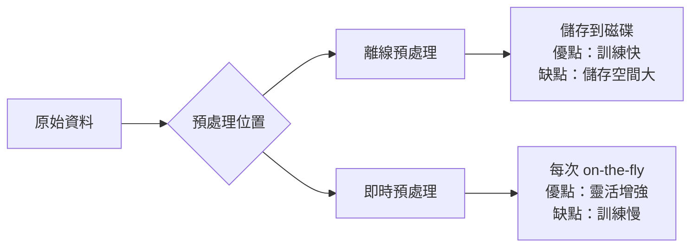

# DataLoader & Dataset（資料載入與資料集）

資料載入管線（data loading pipeline）是深度學習訓練流程中不可或缺的前端元件。其核心功能是以高效、靈活的方式將原始資料轉換為模型可接受的張量格式，並支援批次（batching）、隨機打亂（shuffling）、資料增強（data augmentation）等操作。

## 資料迭代模式

### 基本需求

一個完整的資料載入系統需要滿足：

1. **隨機訪問（random access）**：支援透過索引取得單個樣本 `dataset[i]`
2. **批次組裝（batching）**：將多個樣本打包成批次張量
3. **隨機打亂（shuffling）**：每個 epoch 改變樣本順序，防止模型學到順序偏誤
4. **多執行緒/多進程預載**：在 GPU 計算時平行載入下一批資料（本專案因使用純 NumPy 省略此需求）
5. **資料增強（data augmentation）**：在訓練時對樣本施加隨機變換，增加資料多樣性

### Dataset 抽象

Dataset 定義了訪問單個資料點的方式，核心接口為 `__getitem__` 和 `__len__`。在 PyTorch 中（本專案 `nn/datasets.py` 直接 re-export 自 torchvision）：

```python
class Dataset:
    def __init__(self):
        # 載入資料
        pass
    
    def __len__(self):
        return # 資料總數
    
    def __getitem__(self, idx):
        return # (input, label) 元組
```

### DataLoader 抽象

DataLoader 封裝了資料集的迭代邏輯：

```python
for batch_images, batch_labels in DataLoader(dataset, batch_size=64, shuffle=True):
    # 訓練步驟
```

DataLoader 的內部流程：

1. 若 `shuffle=True`，先產生隨機排列的索引
2. 依 `batch_size` 將索引分組
3. 對每個批次，收集對應的樣本 `[dataset[i] for i in indices]`
4. 將樣本列表堆疊為張量
5. 回傳給訓練迴圈

### 本專案的實作方式

本專案 `nn/datasets.py` 直接從 torchvision 導入標準元件：

```python
from torch.utils.data import DataLoader, Dataset
from torchvision import datasets
from torchvision.transforms import Compose, Grayscale, Normalize, RandomRotation, Resize, ToTensor
```

這意味著所有標準的 PyTorch 資料工具都可使用。由於本專案的 Tensor 基於 NumPy，因此在訓練迴圈中需要將 PyTorch 張量轉換為 NumPy 陣列（`nn/mnist/train.py:50-51`）：

```python
images_np = images.numpy()
labels_np = labels.numpy().reshape(-1, 1)
```

## Batching（批次化）的理論

### Batch Size 的影響

批次大小（batch size）是重要的超參數，直接影響：

**梯度估計的方差**：

$$\nabla L_B(\theta) = \frac{1}{B} \sum_{i=1}^B \nabla L_i(\theta)$$

這是一個對全資料梯度的估計。其協方差矩陣為：

$$\text{Cov}(\nabla L_B) = \frac{\sigma^2}{B}$$

其中 $\sigma^2$ 是單個樣本梯度的方差。更大的 batch size 提供更穩定的梯度估計，但需要更多記憶體。

**Batch Size 與泛化能力**：

經驗觀察顯示（Keskar et al., 2016）：
- 小 batch（32-256）：梯度噪聲大，傾向於收斂到 flat minima，泛化更好
- 大 batch（1024+）：梯度更精確，傾向於收斂到 sharp minima，泛化較差

但近年的大規模訓練已證明，搭配學習率 warmup 和適當的學習率調整，大 batch 訓練可以達到同樣好的泛化性能。

## Shuffling（隨機打亂）

### 為什麼需要 Shuffling

若資料按照標籤順序排列（如先全部是 0 類、再是 1 類……），則每個 mini-batch 中的樣本都來自同一類別。模型學到的只是在類別內尋找差異，而非跨類別的區分能力。Shuffling 確保每個 batch 包含多樣化的樣本，梯度更新方向更具代表性。

### 實作方式

最簡單的方式是在每個 epoch 開始前隨機排列索引：

```python
indices = np.random.permutation(len(dataset))
for i in range(0, len(indices), batch_size):
    batch_indices = indices[i:i+batch_size]
    batch = [dataset[j] for j in batch_indices]
    yield collate(batch)
```

### 注意事項

- 對時間序列資料（如語言模型），shuffling 只能在文件層級進行，不能打亂文件內部的 token 順序
- 對平行資料庫，須確保輸入和標籤使用相同的隨機種子和打亂順序

## 資料增強（Data Augmentation）

### 基本原理

資料增強是對訓練樣本施加隨機但保持語義的變換，是一種隱式正則化。它擴大了有效訓練集大小，提高了模型的泛化能力。

本專案提供了一套標準的影像變換元件（來自 torchvision.transforms）：

### Compose（組合變換）

將多個變換依序串聯：

```python
transform = Compose([
    Resize(32),          # 調整尺寸
    Grayscale(),         # 灰階化
    RandomRotation(10),  # 隨機旋轉 ±10 度
    ToTensor(),          # 轉為張量
    Normalize((0.5,), (0.5,)),  # 歸一化
])
```

### Resize（調整尺寸）

將影像縮放到指定大小。使用雙線性插值（bilinear interpolation）或最近鄰插值（nearest neighbor）。

當原始資料集影像尺寸不一致時（如 ImageNet），需要先調整為統一尺寸。

### Grayscale（灰階化）

將彩色影像轉換為單通道灰階。轉換公式：

$$Y = 0.299 R + 0.587 G + 0.114 B$$

這對應於人眼對 RGB 通道亮度敏感度的權重。

### RandomRotation（隨機旋轉）

在給定角度範圍內隨機旋轉影像。旋轉後的空白區域通常以最近的像素值填充（或填零）。

旋轉變換矩陣：

$$R(\theta) = \begin{pmatrix} \cos\theta & -\sin\theta \\ \sin\theta & \cos\theta \end{pmatrix}$$

### Normalize（歸一化）

正規化至指定均值和標準差：

$$x_{\text{norm}} = \frac{x - \text{mean}}{\text{std}}$$

對於影像，常見的歸一化方式：

1. **全域歸一化**：將像素值從 [0, 255] 映射到 [0, 1]（除以 255）
2. **通道歸一化**：每個通道減去資料集的均值後除以標準差
3. **到 [-1, 1]**：`Normalize((0.5,), (0.5,))` 將 [0, 1] 映射到 [-1, 1]

歸一化使各通道的特徵尺度一致，有助於最佳化收斂。

### ToTensor（轉張量）

將 PIL Image 或 NumPy 陣列（H×W×C）轉換為 PyTorch 張量（C×H×W），並將像素值從 [0, 255] 縮放到 [0.0, 1.0]。

通道順序變換：PIL 使用 HWC（高度×寬度×通道）格式，深度學習慣例使用 CHW（通道×高度×寬度）格式。

## MNIST 資料載入模式

本專案 `nn/mnist/train.py` 展示了完整的資料載入模式：

```python
transform = Compose([ToTensor(), Normalize((0.5,), (0.5,))])
trainSet = datasets.MNIST(root="./data", train=True, download=True, transform=transform)
trainSet = Subset(trainSet, list(range(1000)))  # 取子集加速
trainLoader = DataLoader(trainSet, batch_size=64, shuffle=True)

for epoch in range(5):
    for batch_idx, (images, labels) in enumerate(trainLoader):
        images_np = images.numpy()          # 轉為 NumPy
        labels_np = labels.numpy().reshape(-1, 1)
        x = Tensor(images_np, requires_grad=True)
        logits = model.forward(x)
        loss = logits.cross_entropy(labels_np)
        # ... 反向傳播、最佳化 ...
```

### 子集訓練（Subset）

`Subset(trainSet, list(range(1000)))` 取前 1000 筆資料進行快速原型開發，這是實務上常用的技巧。

### Download 機制

`datasets.MNIST(..., download=True)` 會在第一次執行時自動從網路下載 MNIST 資料集到 `./data` 目錄，並快取在本地。

## 本專案的限制

值得注意的是，`nn/datasets.py` 被包裹在 `try/except ImportError` 中（`nn/__init__.py:8-22`）。當 torch/torchvision 未安裝時，DataLoader、Dataset 等元件無法使用，但神經網路核心功能（Tensor、Module、CNN 層等）仍正常工作。

此外，本專案僅有 Python 版本的 datasets 支援。TypeScript 和 Rust 版本沒有對應的資料載入基礎設施，因為它們的資料來源通常直接使用 NumPy 檔案或原始位元組。

## DataLoader 的效能考量

### 平行資料載入

在 GPU 訓練中，資料載入速度可能成為瓶頸。`DataLoader(num_workers=N)` 可以使用多個 worker 進程平行載入資料，每個 worker 獨立迭代資料集並將結果放入共享佇列。

本專案以 CPU 進行訓練（NumPy 後端），不涉及 GPU 與 CPU 的資料傳輸瓶頸，因此 `num_workers=0`（主進程載入）即可滿足需求。

### 預取（Prefetching）

DataLoader 可以在當前 batch 訓練的同時準備下一批資料。這種預取機制隱藏了資料載入的延遲。

### 記憶體映射（Memory Mapping）

對於超大資料集（如 ImageNet），直接載入所有資料到記憶體並不現實。解決方案：
- 使用記憶體映射檔案（memory-mapped file）
- 使用串流式讀取（如 TFRecord、WebDataset）
- 使用磁碟上的 HDF5 或 LMDB 資料庫

## Collate Function（資料組裝）

DataLoader 的最後一步是**collate**——將樣本列表組合成批次張量。預設行為：

1. 假設每個樣本是一個 tuple `(data, label)`
2. 將所有樣本的 data 堆疊（stack）為 `(B, C, H, W)` 張量
3. 將所有樣本的 label 堆疊為 `(B,)` 張量

自定義 collate 函數可用於：

```python
def custom_collate(batch):
    images = torch.stack([item[0] for item in batch])
    labels = torch.tensor([item[1] for item in batch])
    filenames = [item[2] for item in batch]  # 字串資訊不進張量
    return images, labels, filenames

loader = DataLoader(dataset, batch_size=32, collate_fn=custom_collate)
```

### 可變長度序列的 Collate

對 NLP 任務，批次中的序列長度不同。Collate 時需要：
1. 對齊（padding）到批次內最大長度
2. 建立 attention mask 區分有效位置和 padding 位置

PyTorch 的 `pad_sequence` 和 `default_collate` 可處理此需求。

## 分散式資料載入

當訓練擴展到多 GPU 或多節點時，每個 GPU 需要接收資料集的不同分片（shard）。PyTorch 的 `DistributedSampler` 自動分配：

```python
sampler = DistributedSampler(dataset, num_replicas=world_size, rank=rank)
loader = DataLoader(dataset, batch_size=64, sampler=sampler, shuffle=False)
```

`shuffle=True` 在每個 epoch 由 `DistributedSampler.set_epoch(epoch)` 控制，確保不同節點的隨機打亂模式各異。

## 資料集管線的最佳實踐

### 資料集快取（Caching）

對小資料集（如 MNIST、CIFAR），可將所有資料載入記憶體以加速 epoch 切換。PyTorch 的 `MemoryMappedDataset` 或自定義 `__getitem__` 中的 LRU cache 都是常見方案。

### 預處理管線的權衡



### 資料增強與正則化

在訓練時對影像應用隨機變換（旋轉、翻轉、裁切、色彩抖動）是一種隱式正則化，等效於在模型訓練中引入額外的資料分布資訊。測試時應使用相同的圖像預處理但禁用隨機性（`model.eval()` + `transform = Compose([Resize, ToTensor, Normalize])`）。

---

**上一篇**：[Loss-Function.md](Loss-Function.md)

**相關連結**：[MNIST.md](MNIST.md) | [Convolutional-Neural-Network.md](Convolutional-Neural-Network.md) | [Backpropagation.md](Backpropagation.md)
