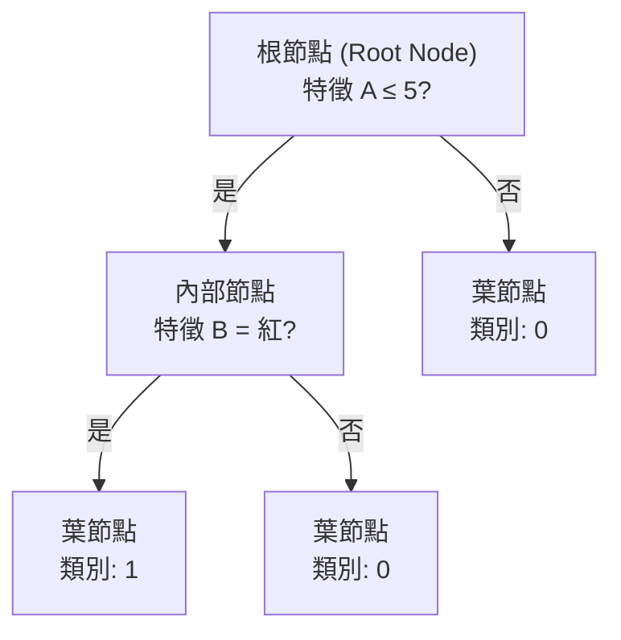

# Decision Tree（決策樹）

決策樹 (decision tree) 是一種非參數化的監督式學習演算法，可用於分類和迴歸任務。它透過遞迴地將資料分割成愈來愈純粹的子集來建立一個樹狀的決策模型，具有極佳的可解釋性。

## 樹狀結構

決策樹由三種節點 (node) 組成：



### 節點類型

1. **根節點 (root node)**：樹的最頂端節點，包含全部訓練資料
2. **內部節點 (internal node)**：包含決策規則（特徵 + 分割點），將資料導向子節點
3. **葉節點 (leaf node)**：終端節點，儲存預測結果（分類的類別或迴歸的平均值）

從根到葉的每條路徑對應一條決策規則 (decision rule)。

## 遞迴分割（Recursive Partitioning）

決策樹的構建是自上而下 (top-down) 的貪婪演算法：

```
函數 BuildTree(資料 D, 深度 depth):
    若 depth ≥ max_depth 或 |D| < min_samples_split:
        返回葉節點（多數類別或平均值）
    
    對每個特徵 f:
        對每個可能分割點 t:
            計算分割後的資訊增益 (information gain)
    選擇最佳 (f*, t*)
    
    左子樹 = BuildTree(D[f* ≤ t*], depth+1)
    右子樹 = BuildTree(D[f* > t*], depth+1)
    返回內部節點
```

這個過程是**貪婪**的：每次只考慮當前最佳的分割，不考慮對未來分割的影響。雖然會產生局部最優 (locally optimal) 而非全局最優的樹，但在計算上可行且實務上表現良好。

## 不純度衡量（Impurity Measures）

決策樹需要一個指標來量化一個節點的「不純度」(impurity)——即節點中資料的混亂程度。純度越高（類別越單一）越好。

### 分類的常用指標

#### 1. 熵 (Entropy)

源自資訊理論，衡量不確定性：

$$H(S) = -\sum_{k=1}^{K} p_k \log_2 p_k$$

其中 $p_k$ 為節點中第 $k$ 類的樣本比例。

- $H = 0$：所有樣本屬於同一類（純度最高）
- $H = \log_2 K$：所有類別均勻分布（純度最低）

本專案 `ml/tree.py:DecisionTree._entropy` 的實作：

```python
def _entropy(self, y):
    probs = np.bincount(y.astype(int)) / len(y)
    probs = probs[probs > 0]
    return -np.sum(probs * np.log2(probs))
```

#### 2. 吉尼不純度 (Gini Impurity)

$$\text{Gini}(S) = 1 - \sum_{k=1}^{K} p_k^2 = \sum_{k=1}^{K} p_k (1 - p_k)$$

- $\text{Gini} = 0$：純節點
- 最大值：$1 - \frac{1}{K}$（均勻分佈時）

Gini 與熵在數值上不同但行為相似。Gini 的計算更快（無需對數），實務上兩者的選擇對最終效能影響很小。

#### Gini vs Entropy 比較

| 指標 | 範圍 | 計算成本 | 傾向 |
|------|------|----------|------|
| Entropy | $[0, \log_2 K]$ | 需計算 $p\log p$，較慢 | 傾向產生更平衡的樹 |
| Gini | $[0, 1-1/K]$ | 僅需 $p^2$，快速 | 傾向選擇多數類 |

### 迴歸的指標

迴歸決策樹使用**均方誤差 (MSE)** 作為不純度指標：

$$\text{MSE}(S) = \frac{1}{|S|} \sum_{i \in S} (y_i - \bar{y}_S)^2$$

其中 $\bar{y}_S$ 為節點中目標變數的平均值。

## 資訊增益（Information Gain）

資訊增益衡量的是分割前後不純度的減少：

$$\text{Gain}(S, f, t) = H(S) - \sum_{v \in \{\text{left}, \text{right}\}} \frac{|S_v|}{|S|} H(S_v)$$

資訊增益越大，表示這個分割越能有效分離不同類別的資料。

本專案 `ml/tree.py:DecisionTree._best_split` 遍歷所有特徵的所有可能分割點，選擇資訊增益最大的分割：

```python
def _best_split(self, X, y):
    best_gain = -1.0
    for feat_idx in range(n_features):
        thresholds = np.unique(X[:, feat_idx])
        for t in thresholds[1:]:
            left_mask = X[:, feat_idx] <= t
            gain = self._information_gain(y, left_mask, right_mask)
            if gain > best_gain:
                best_gain = gain
                best_split = {"feat_idx": feat_idx, "threshold": t}
    return best_split
```

### 資訊增益率的問題

資訊增益傾向選擇有較多唯一值的特徵（如 ID 欄位）。為了解決這個問題，可使用**增益率 (gain ratio)** 或**吉尼指數**。

## 分割類型

### 二元分割
決策樹在每個節點將資料分為兩組（如 $x_j \leq t$ 和 $x_j > t$）。這是本專案 `DecisionTree` 採用的方式。

### 多元分割
將類別特徵分割為多個子集（每個類別一個分支），但可能導致資料過早稀疏。

## 剪枝（Pruning）

完全生長的決策樹通常會過擬合 (overfitting) 訓練資料。剪枝是減少樹複雜度的方法：

### 預剪枝（Pre-pruning）
在建樹過程中提前停止：
- `max_depth`：限制最大深度，本專案 `DecisionTree(max_depth=10)`
- `min_samples_split`：內部節點的最小樣本數，本專案 `min_samples_split=2`
- `min_samples_leaf`：葉節點的最小樣本數
- `max_leaf_nodes`：限制葉節點總數

本專案 `ml/tree.py` 的終止條件：

```python
def _build_tree(self, X, y, depth):
    if depth >= self.max_depth or len(y) < 2 * self.min_samples_split:
        return self._leaf_value(y)
```

### 後剪枝（Post-pruning）
先讓樹完全生長，再從底部向上剪除不必要的分支（如成本複雜度剪枝, Cost Complexity Pruning, CCP）。

## 二元特徵分割的計算細節

對於連續特徵，決策樹需要選擇最佳分割點 $t$。常用的策略是：

1. 對特徵值排序
2. 考慮相鄰值的中間點作為候選
3. 計算每個候選的資訊增益

對於類別特徵，可將每個類別值作為分割標準。

## 決策樹的優缺點

### 優點
- **可解釋性強**：規則清晰，可直接視覺化
- **無需特徵標準化**：對特徵尺度不敏感
- **處理非線性關係**：自然適應非線性決策邊界
- **可處理混合型資料**：數值和類別特徵均可
- **特徵選擇內建**：重要特徵自然出現在樹的上層

### 缺點
- **容易過擬合**：完全生長的樹幾乎能記住所有訓練資料
- **不穩定**：資料的微小變化可能導致完全不同的樹
- **貪婪演算法**：無法保證全局最優
- **偏斜資料偏好**：傾向選擇取值較多的特徵
- **難以捕捉加法結構**：需要多次分割來模仿簡單的線性關係

## 回歸樹（Regression Tree）

回歸決策樹與分類樹結構相同，但葉節點儲存的是連續值的預測（通常為平均值），而不純度衡量使用 MSE。

## 應用場景

- **醫療診斷**：根據症狀推斷疾病
- **信用評估**：根據申請人特徵決定是否放貸
- **客戶分群**：根據行為特徵分類客戶
- **特徵重要性分析**：樹的結構顯示哪些特徵最關鍵

## 延伸：集成方法

單一決策樹容易過擬合且不穩定，但它是許多強大集成方法的基礎：

| 方法 | 核心思想 |
|------|----------|
| Random Forest | Bagging + 隨機特徵子空間 |
| Gradient Boosting | 逐步擬合殘差（如 XGBoost, LightGBM） |
| AdaBoost | 加權樣本，聚焦難分類樣本 |

---

**上一篇**：[Logistic-Regression.md](Logistic-Regression.md)

**相關連結**：[Random-Forest.md](Random-Forest.md) | [Logistic-Regression.md](Logistic-Regression.md) | [Train-Test-Split.md](Train-Test-Split.md)
