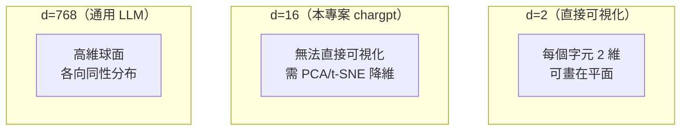

# Embedding（嵌入）

嵌入（embedding）是將離散符號（如字詞、字元、影像區塊）映射到連續向量空間的技術。深度學習中的 Embedding 層本質上是一個可學習的查找表（lookup table），為詞彙表中每個符號分配一個稠密（dense）向量表示。這種表示相較於傳統的 one-hot 編碼，具有低維度、富含語義、可學習等顯著優勢。

## 從 One-Hot 到稠密表示

### One-Hot 編碼

假設詞彙表大小為 $V$，one-hot 編碼將第 $i$ 個符號表示為長度為 $V$ 的向量，只有第 $i$ 個位置為 1，其餘為 0：

$$e_i = [0, 0, ..., 1_{i\text{-th}}, ..., 0]^T$$

這個編碼的問題：

1. **維度災難**：若 $V=50000$（常見詞彙量），每個向量長度 50000
2. **向量稀疏**：99.998% 的元素為零，儲存效率極低
3. **無語義資訊**：任意兩個不同符號的 one-hot 向量點積為零，無法反映語義相似度

### 稠密嵌入

嵌入層將每個符號映射到 $d$ 維稠密向量（$d \ll V$，通常 $d \in [64, 4096]$）：

$$E \in \mathbb{R}^{V \times d} \quad (\text{嵌入矩陣})$$
$$\text{embed}(i) = E[i, :] \quad \text{或} \quad \text{embed}(one\_hot) = one\_hot \cdot E$$

其本質是 $V$ 個 $d$ 維向量的查找表。每個符號對應一個可學習的向量。

### 語義維度假設

嵌入向量的各個維度可以學習到語義特徵（distributional semantics 的實現）：

$$\text{embed}(\text{"king"}) - \text{embed}(\text{"man"}) + \text{embed}(\text{"woman"}) \approx \text{embed}(\text{"queen"})$$

這種向量算術現象表明嵌入空間捕捉了語義以及語法關係。

## 嵌入層的數學

### 前向傳播：查找操作

給定符號索引 $i$ 的 N 維張量 $X$（例如批次序列索引 $X \in \mathbb{Z}^{B \times T}$），嵌入層輸出：

$$Y = E[X]$$

其中 $E \in \mathbb{R}^{V \times d}$ 是嵌入矩陣。這個操作本質上是使用 NumPy/PyTorch 的高階索引（fancy indexing）：

```python
out = weight[indices]  # 取出每個索引對應的行向量
```

### 反向傳播：梯度累加

嵌入層的梯度計算與標準神經網路層不同。對於權重梯度 $\partial L / \partial E$，每個輸入索引會選取權重矩陣的對應行，並將梯度回傳到這些行。

關鍵問題在於**重複索引**：當同一個符號在批次中出現多次時（例如輸入序列 "ababa" 中 'a' 出現 3 次），其梯度需要累加而非覆蓋。

使用標準的 NumPy 索引賦值會造成問題：

```python
weight.grad[idx] = out.grad  # 錯誤！重複索引只保留最後一次
```

正確做法使用 `np.add.at`（本專案 `nn/nn.py:121`）：

```python
np.add.at(self.weight.grad, idx, out.grad)
```

`np.add.at` 保證對重複索引進行累加（unary operation with buffering），而非最後寫入覆蓋先前結果。

### 數學上的梯度形式

假設輸入索引 $i_t \in \{0, ..., V-1\}$，輸出 $y_t = E[i_t]$，Loss 為 $L$：

$$\frac{\partial L}{\partial E[i, :]} = \sum_{t: i_t = i} \frac{\partial L}{\partial y_t}$$

即索引 $i$ 的嵌入向量梯度是所有出現該索引的位置的輸出梯度之和。這正是 `np.add.at` 實現的語義。

## 嵌入維度選擇

### 維度與表達能力的關係

嵌入維度 $d$ 是關鍵超參數：

- **維度太小**（underfitting）：無法容納足夠的語義資訊，表達能力受限
- **維度太大**（overfitting）：記憶體消耗大，且可能導致過擬合

經驗法則（根據詞彙量 $V$）：

| 詞彙量 | 推薦嵌入維度 | 範例 |
|--------|------------|------|
| 50-100（字元級） | 8-32 | chargpt: 16 |
| 1000-10000（子詞） | 64-256 | |
| 10000-50000（詞元級） | 256-1024 | GPT-2: 768 |
| 50000+（大詞彙） | 1024-8192 | GPT-3: 12288 |

### 與模型維度的關係

在 Transformer 中，嵌入維度 $d_{\text{emb}}$ 通常等於模型維度 $d_{\text{model}}$。這樣嵌入層的輸出可以直接進入 Transformer 各層的計算。事實上，一些實現將嵌入矩陣與語言模型頭（LM head）的權重綁定（weight tying），使用同一個矩陣：

$$W_{\text{embed}} = W_{\text{lm\_head}}^T$$

這既可以減少參數量，又能讓嵌入空間與輸出預測空間一致。

## 位置嵌入（Positional Embedding）

### 為什麼需要位置編碼

Transformer 和許多序列模型本身不具有順序概念——它們處理的是集合而非序列。位置嵌入提供每個 token 在序列中的位置資訊。

### 可學習位置嵌入

本專案 `nn/gpt.py:143` 使用可學習位置嵌入：

```python
self.wpe = Embedding(block_size, n_embd)
```

其中 `block_size` 是最大序列長度。位置索引 0 到 `block_size-1` 各自對應一個可學習的嵌入向量。

前向傳播時，位置編碼與 token 嵌入逐元素相加：

```python
tok_emb = self.wte(idx)           # (B, T, C)
pos = np.arange(past_len, past_len + T)
pos_emb = self.wpe(pos)           # (T, C)
x = tok_emb + pos_emb             # (B, T, C)
```

### 位置嵌入 vs 位置編碼

| 方法 | 範例 | 特點 |
|------|------|------|
| 可學習嵌入 | BERT、GPT-2 | 靈活但無法處理超出 block_size 的序列 |
| 三角函數編碼 | 原始 Transformer | 無需學習，可推廣到任意長度 |
| 旋轉位置編碼（RoPE） | LLaMA、GPT-NeoX | 以旋轉矩陣編碼相對位置，複雜度低 |
| 相對位置偏差（ALiBi） | MPT、Bloom | 注意力 logits 加偏差項，極簡且高效 |

## 嵌入的統計學理解

### 分布假說（Distributional Hypothesis）

「出現在相似上下文的詞具有相似的語義」——這個來自語言學（Harris, 1954）的觀察正是 word embedding 的理論基礎。嵌入網路透過最大化條件機率（如 word2vec 的 CBOW 目標：根據上下文預測中心詞）或者最小化語言模型 loss，將分布假說轉化為向量的幾何關係。

### 嵌入作為矩陣分解

從矩陣分解的角度看，嵌入学到了共現矩陣（co-occurrence matrix）的低秩近似：

$$M_{V \times V} \approx E_{V \times d} \cdot C_{d \times V}$$

其中 $M_{ij}$ 是詞 $i$ 和 $j$ 的共現頻率，$E$ 是嵌入矩陣，$C$ 是上下文矩陣。GloVe（Global Vectors）模型明確使用了這種分解觀點。

## 本專案的 Embedding 實作

`nn/nn.py:105-124` 的 `Embedding` 類：

```python
class Embedding(Module):
    def __init__(self, num_embeddings: int, embedding_dim: int) -> None:
        self.weight = Tensor(
            np.random.normal(0, 0.08, (num_embeddings, embedding_dim)),
            requires_grad=True
        )

    def __call__(self, indices: Tensor) -> Tensor:
        idx = indices.data.astype(int)
        out_data = self.weight.data[idx]
        out = Tensor(out_data, (self.weight,), requires_grad=True)

        def _backward() -> None:
            np.add.at(self.weight.grad, idx, out.grad)

        out._backward = _backward
        return out
```

### 初始化方式

使用均值為 0、標準差為 0.08 的正態分布初始化。這個選擇不是任意的——它與本專案中 Linear 層的初始化一致（`nn/nn.py:94`）：

```python
std = 0.08
self.weight = Tensor(np.random.normal(0, std, ...), requires_grad=True)
```

合理的初始化確保各層輸出方差在合理範圍內。對嵌入層，方差太大可能導致輸入到後續層的值過大，不利於訓練。

### 使用場景

在本專案中，`Embedding` 被用於兩個地方：

1. **Token 嵌入**（`nn/gpt.py:142`）：將字元索引映射到連續向量空間
2. **位置嵌入**（`nn/gpt.py:143`）：將位置索引映射到連續向量空間

兩個嵌入的輸出逐元素相加後送入 Transformer 層。

## 上下文嵌入（Contextual Embedding）

傳統嵌入（如 word2vec、GloVe）為每個詞彙分配靜態向量，無法處理一詞多義（polysemy）。例如「bank」在「river bank」和「savings bank」中的語義不同。

**ELMo**（Embeddings from Language Models, 2018）提出了上下文嵌入的概念：詞的嵌入向量取決於其所在的完整句子。ELMo 使用雙向 LSTM 從兩個方向編碼上下文。

**BERT**（2018）和 **GPT**（2018）進一步將上下文嵌入推廣到 Transformer 架構中。在本專案中，embedding 層輸出僅作為 Transformer 的輸入，而 Transformer 的每一層都在執行上下文感知的表示學習——最終的輸出是上下文嵌入。

## 嵌入層的初始化與訓練

### 初始化策略

1. **隨機初始化**（本專案使用）：$\mathcal{N}(0, 0.08)$，簡單通用
2. **預訓練初始化**：使用 word2vec/GloVe 預訓練向量初始化，在低資源任務中有幫助
3. **Uniform 初始化**：$\text{Uniform}(-r, r)$，其中 $r = \sqrt{3/\text{embedding\_dim}}$

### 訓練動態

嵌入層的梯度通常比其他層更稀疏——因為每個 batch 中詞彙表的大部分 token 並未出現。這導致：

- 頻繁 token 的嵌入更新多、收斂快
- 罕見 token 的嵌入更新少，可能停留在初始值附近
- 可使用「詞頻門檻」過濾極罕見 token（如出現次數 < 5 的詞）

## 嵌入正則化

### Embedding Dropout

對嵌入層的輸出應用 dropout：在每個訓練 step 以機率 $p$ 隨機將一些 token 的嵌入向量設為零。

### 權重綁定（Weight Tying）

在語言模型中，輸入嵌入矩陣與輸出 LM head 的權重共享（Press & Wolf, 2016）：

```python
self.embed.weight = self.lm_head.weight  # 共享權重
```

好處：
- 參數減少約 $V \times d$ 個參數（詞彙量大時節省顯著）
- 嵌入空間與輸出預測空間一致，提升模型品質
- 訓練更穩定，因為梯度同時作用於同一個矩陣的兩端

### 歸一化

對嵌入向量做 L2 歸一化後再送入後續層：

$$\hat{e}_i = \frac{e_i}{\|e_i\|_2}$$

這強制所有嵌入向量位於單位超球面上，簡化了嵌入空間的幾何結構，常用於度量學習和句子相似度任務。

## Word2Vec 的兩種架構

雖然本專案不使用 word2vec，但其理論是嵌入層的前身：

### CBOW（Continuous Bag of Words）

根據上下文詞預測目標詞：

$$J_\theta = -\log p(w_t | w_{t-k}, ..., w_{t-1}, w_{t+1}, ..., w_{t+k})$$

### Skip-gram

根據目標詞預測上下文詞：

$$J_\theta = -\sum_{-k \leq j \leq k, j \neq 0} \log p(w_{t+j} | w_t)$$

兩者都使用嵌入層 + 輸出層的雙線性結構。Skip-gram 對罕見詞更好，CBOW 訓練速度更快。

### 負採樣（Negative Sampling）

word2vec 的訓練不使用完整的 softmax（詞彙量大時過慢），而是使用負採樣——從詞彙表中隨機選取 k 個負例，訓練區分目標詞和非目標詞的二分類器：

$$J = -\log\sigma(v_{w_O}' \cdot v_{w_I}) - \sum_{k=1}^K \log\sigma(-v_{w_k}' \cdot v_{w_I})$$

其中 $\sigma$ 是 Sigmoid 函數，$v_{w_O}'$ 是目標詞的輸出向量，$v_{w_I}$ 是輸入詞的嵌入向量。最佳的負例分佈不是均勻分布，而是經過平滑的詞頻分布 $\frac{f(w)^{3/4}}{\sum f(w)^{3/4}}$。

### GloVe（Global Vectors）

GloVe 結合了矩陣分解（如 LSA）和局部上下文視窗方法（如 word2vec）：

$$J = \sum_{i,j=1}^V f(X_{ij}) (v_i^T v_j' + b_i + b_j - \log X_{ij})^2$$

其中 $X_{ij}$ 是詞 $i$ 和 $j$ 的共現次數，$f$ 是截斷權重函數。GloVe 的優勢在於充分利用了全局統計資訊。

## 不同嵌入維度的視覺化比較

對於小規模詞彙（如字元級 50 個 token），可以將不同維度的嵌入可視化：



嵌入維度越高，每個維度編碼的資訊越抽象，但也越容易過擬合。在字元級模型中，d=16 通常足夠捕捉 50 個字元間的語法關係（母音 vs 子音、常用 vs 罕用）。

---

**上一篇**：[Character-Level-Model.md](Character-Level-Model.md)

**相關連結**：[Transformer.md](Transformer.md) | [Character-Level-Model.md](Character-Level-Model.md) | [MNIST.md](MNIST.md)
