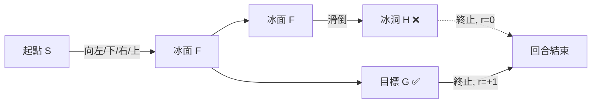
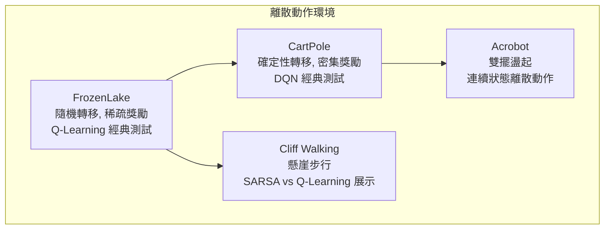

# FrozenLake Environment（冰湖環境）

FrozenLake 是一個經典的網格世界（gridworld）強化學習環境，由 OpenAI Gym 團隊設計。智慧體需要在結冰的湖面上從起點導航到目標點，同時避開冰洞（hole）。這個環境雖然看起來簡單，但引入了強化學習中的一些核心挑戰，特別是**隨機轉移（stochastic transition）**和**稀疏獎勵（sparse reward）**。

## 地圖結構

### 4x4 地圖（FrozenLake-v0, FrozenLake-v1）

```
SFFF    S: 起點（Start）   藍色
FHFH    F: 冰面（Frozen）  白色（安全）
FFFH    H: 冰洞（Hole）    紅色（終止，獎勵=0）
HFFG    G: 目標（Goal）    綠色（終止，獎勵=1）
```

### 8x8 地圖（FrozenLake8x8-v1）

```
SFFFFFFF
FFFFFFFF
FFFHFFFF
FFFFFHFF
FFFHFFFF
FHHFFFHF
FHFFHFHF
FFFHFFFG
```

8x8 版本的地圖更複雜，洞更多，路徑更長，是驗證 Q-Learning 等演算法擴展性的良好測試。

### 狀態表示

每個格子對應一個整數狀態 ID，計算方式為：

$$s = r \times \text{ncol} + c$$

其中 $(r, c)$ 是格子的行和列索引。4x4 地圖有 16 個狀態（0-15），8x8 地圖有 64 個狀態（0-63）。

### 格子類型

| 類型 | 符號 | 行為 | 獎勵 |
|------|------|------|------|
| 起點 | S | 安全，起始位置 | 0 |
| 冰面 | F | 安全，可通行 | 0 |
| 冰洞 | H | 終止 | 0 |
| 目標 | G | 終止 | +1 |



## 隨機轉移（滑溜機制）

FrozenLake 最關鍵的設計是「滑溜」（slippery）屬性，這也是它作為 RL 基準環境的重要價值所在。

### 非滑溜模式（FrozenLake-v0）

當 `is_slippery=False` 時，環境是確定性的：智慧體選擇哪個方向，就往哪個方向移動。

```
選擇 LEFT → 必定向左移動一格
```

這是一個簡單的路徑規劃問題，幾乎任何 RL 演算法都能快速解決。

### 滑溜模式（FrozenLake-v1, FrozenLake8x8-v1）

當 `is_slippery=True` 時，實際移動方向不完全由選擇決定：

```python
if self._is_slippery:
    candidates = [(action - 1) % 4, action, (action + 1) % 4]
    action = int(self._np_random.choice(candidates))
```

### 隨機機制詳解

當智慧體選擇一個動作 $a$ 時，實際移動方向均勻隨機選自三個候選方向：

| 選擇的動作 | 可能的實際移動（各 $\frac{1}{3}$ 機率） |
|-----------|--------------------------------------|
| LEFT (0)  | LEFT (0), UP (3), DOWN (1) |
| DOWN (1)  | DOWN (1), LEFT (0), RIGHT (2) |
| RIGHT (2) | RIGHT (2), DOWN (1), UP (3) |
| UP (3)    | UP (3), RIGHT (2), LEFT (0) |

注意：永遠不會往選中方向的**正對方向**滑動（如選 LEFT 不會滑 RIGHT），因為候選集合是 $\{a-1, a, a+1\} \mod 4$。

### 轉移矩陣的影響

隨機轉移讓問題從簡單路徑規劃變成**不確定環境下的決策**：

- 智慧體不能依賴「選下就向下走」的假設
- 最短路徑可能不是最優路徑（因為靠近洞口的危險路徑可能導致墜洞）
- 需要使用 ε-greedy 等策略進行探索，且探索策略的偏好會影響最終學到的路徑

這讓 FrozenLake-v1 成為測試 Q-Learning 與 SARSA 差異的理想環境——SARSA 會學到避開洞口的路徑，而 Q-Learning 可能學到更冒險但是更短的路徑。

## 動作空間

動作空間是離散的 4 個動作：

| 動作編號 | 名稱 | 行列偏移 |
|---------|------|---------|
| 0 | LEFT（左） | $(0, -1)$ |
| 1 | DOWN（下） | $(1, 0)$ |
| 2 | RIGHT（右） | $(0, 1)$ |
| 3 | UP（上） | $(-1, 0)$ |

世界是牢籠邊界（clipped boundary）：如果試圖向地圖邊緣外移動，位置不變。例如在 (0, 0) 選擇 UP，仍然留在 (0, 0)。

## 概率轉移矩陣

FrozenLake 的隨機轉移可以用轉移矩陣 $P(s'|s,a)$ 來完整描述。對於每個狀態-動作對，有三種可能的結果：

$$P(s' | s, a) = \begin{cases}
\frac{1}{3} & \text{往預期方向移動} \\
\frac{1}{3} & \text{往預期方向左側偏移} \\
\frac{1}{3} & \text{往預期方向右側偏移}
\end{cases}$$

注意邊界情況：如果偏移方向超出地圖範圍，智慧體會留在原地。此時多個機率質量會疊加到同一個結果上，形成非均勻分布。

### 滑溜環境中的最優策略

確定性環境（FrozenLake-v0）的最優策略很簡單：朝目標走最短路徑即可。滑溜環境（FrozenLake-v1）的最優策略則需要考慮：

1. **避開洞口周圍**：洞口周圍 1-2 格的區域也是危險的，因為滑倒可能將智慧體推入洞中。
2. **偏向牆壁行走**：靠在邊緣行走可以減少不確定性（因為偏移方向可能被牆壁擋住）。
3. **繞路更安全**：最短路徑可能經過洞口旁，繞路雖然更長但失敗率更低。

這些特性使 FrozenLake 成為比較 SARSA 和 Q-Learning 的理想平台。

## 劇集結構

FrozenLake 是典型的**情節式任務（episodic task）**：

### 終止條件

1. **自然終止（terminated）**：
   - 進入冰洞（H）：終止，獎勵 = 0
   - 到達目標（G）：終止，獎勵 = +1

2. **截斷（truncated）**：
   - 超過最大時間步數：`max_steps = 100 × nrow`（4x4 為 400 步，8x8 為 800 步）
   - 截斷時不給予跳過終止的懲罰

### 稀疏獎勵問題

FrozenLake 的核心困難之一是獎勵極其稀疏：

- 絕大多數時間步的獎勵為 0
- 唯一的非零獎勵只在到達目標時出現（+1）
- 隨機探索時偶然到達目標的機率極低（4x4 地圖約 $0.5\%$）

這使得基本的強化學習方法收斂很慢。成功解決 FrozenLake 通常需要：
- Enough exploration（足夠的探索率）
- TD 學習：透過時間差分逐步從目標向起點回傳價值資訊
- 或者使用資格跡（eligibility trace）加速傳播

### 成功率的評估

FrozenLake 的成功能用「到達目標的機率」來衡量。在滑溜環境中，即使最優策略也無法保證 100% 成功：

- **FrozenLake-v0**（無滑溜）：最優策略可達 ~100% 成功率
- **FrozenLake-v1**（滑溜）：最優策略約 70-80% 成功率
- **FrozenLake8x8-v1**（8x8 滑溜）：最優策略約 40-60% 成功率

這說明在評估 RL 演算法時，不應只看最終回報，還要看回報的變異數和穩健性。

## Q 表的適用性

FrozenLake 的狀態空間（16 或 64）很小，完全可以使用 Q 表來儲存動作價值函數。

### Q 表大小

| 版本 | 狀態數 | 動作數 | Q 表元素數 |
|------|--------|--------|-----------|
| FrozenLake-v0 | 16 | 4 | 64 |
| FrozenLake-v1 | 16 | 4 | 64 |
| FrozenLake8x8-v1 | 64 | 4 | 256 |

這意味著 FrozenLake 非常適合用來比較不同演算法（Q-Learning vs SARSA vs TD(λ)）的效果，因為：
- Q 表收斂有理論保證
- 運算速度快（數秒即可完成訓練）
- 結果可視化（直接查看 Q 表數值，了解智慧體偏好哪些路徑）

### Q 表更新策略

在 `world/examples/frozenlake_qtable.py` 中，ε-greedy 選擇動作的實現使用了降溫（annealing）：

```python
a = np.argmax(Q[s,:] + np.random.randn(1, env.action_space.n) * (1./(i+1)))
```

這裡的 `np.random.randn` 加入高斯噪聲實現探索，噪聲大小隨回合數 $i$ 增加而遞減（$1/(i+1)$）。這是一個簡單但有效的探索策略，不需要單獨的 ε 參數調節。

## 環境變體比較

| 特性 | FrozenLake-v0 | FrozenLake-v1 | FrozenLake8x8-v1 |
|------|--------------|--------------|-----------------|
| 地圖大小 | 4×4 | 4×4 | 8×8 |
| 是否滑溜 | 否 | 是 | 是 |
| 狀態數 | 16 | 16 | 64 |
| 難度 | 簡單 | 中等 | 困難 |
| 隨機性 | 無 | 高 | 高 |
| 適合測試 | 路徑規劃 | 隨機轉移下學習 | 大規模 Q 表 |

## 與其他離散控制環境的比較



FrozenLake 與 Cliff Walking 類似，都是用來展示在策略與離策略差異的經典範例。但它引入了**隨機轉移**這個額外挑戰，使得最優策略不是單純的路徑規劃。

## 實際源碼參考

本專案中 FrozenLake 的實作位於 `world/envs/frozen_lake.py`：

- `FrozenLakeEnv` 類別繼承自 `Env[int, int]`（狀態和動作都是整數）
- 使用 `Discrete(n_states)` 和 `Discrete(4)` 作為觀測和動作空間
- 內建 `MAPS` 字典定義了 4x4 和 8x8 兩張地圖
- 支援 `custom_map` 參數，可自行定義任意大小的地圖
- `is_slippery` 開關控制三個候選方向的隨機選擇機制

在 `world/__init__.py` 中註冊：

```python
register("FrozenLake-v0",     FrozenLakeEnv, map_name="4x4", is_slippery=False)
register("FrozenLake-v1",     FrozenLakeEnv, map_name="4x4", is_slippery=True)
register("FrozenLake8x8-v1",  FrozenLakeEnv, map_name="8x8", is_slippery=True)
```

## 從 MDP 視角分析

FrozenLake 是一個完全可觀測的 MDP：

$$(S, A, P, R, \gamma)$$

- $S$：16（4x4）或 64（8x8）個離散狀態
- $A$：4 個離散動作
- $P$：上述的隨機轉移矩陣
- $R$：只有到達目標 $G$ 時為 +1，其餘為 0
- $\gamma$：折扣因子，通常設為 0.90-0.99

### 最優價值函數

以 4x4 地圖為例，最優狀態價值函數 $V^*(s)$ 在非滑溜環境中的值會形成從目標向起點遞減的梯度。在滑溜環境中，由於隨機性，靠近洞口的狀態價值會顯著低於遠離洞口的狀態——即使它們在最短物理路徑上更接近目標。

## 擴展與變體

### 隨機起始位置

可以將起始位置隨機化，迫使智慧體學會全域導航而非記憶一條固定路線。

### 不同地圖布局

本專案支援 `custom_map` 參數，可以定義任意大小的地圖。例如：

```python
custom_map = [
    "SFFF",
    "FFFF",
    "FFFF",
    "FFFG"
]  # 無洞的簡單地圖
```

這對於逐步調試演算法很有幫助：先測試無洞環境確保導航正確，再加入洞口測試隨機轉移下的學習。

### 獎勵重塑

可以修改獎勵函數來加速學習：
- 每步小幅負獎勵（鼓勵走最短路徑）
- 靠近洞口時給予負獎勵（離洞口越近處罰越大）
- 到達剩餘步數較少時給予額外獎勵（鼓勵快速到達）

但需注意：獎勵重塑改變了最優策略，需要確保新增的獎勵項不與原始目標衝突。

## 範例用法

```python
import world

env = world.make("FrozenLake-v1")
obs, info = env.reset(seed=42)

for _ in range(100):
    action = env.action_space.sample()  # 隨機策略
    obs, reward, terminated, truncated, info = env.step(action)
    env.render()
    
    if terminated or truncated:
        obs, info = env.reset()
```

---

**相關連結**：[Q-Learning.md](Q-Learning.md) | [SARSA.md](SARSA.md) | [Reinforcement-Learning.md](Reinforcement-Learning.md)
