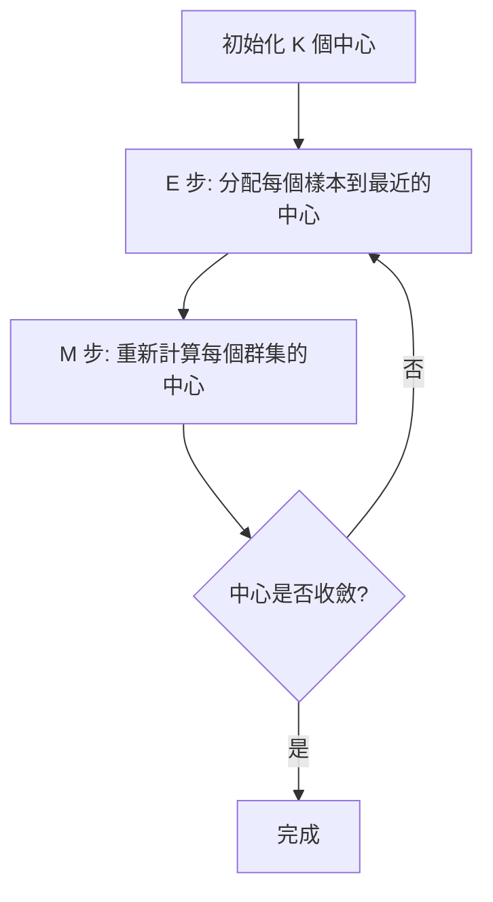
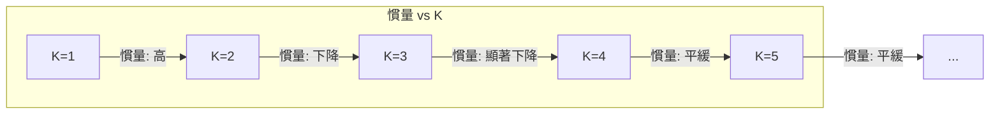
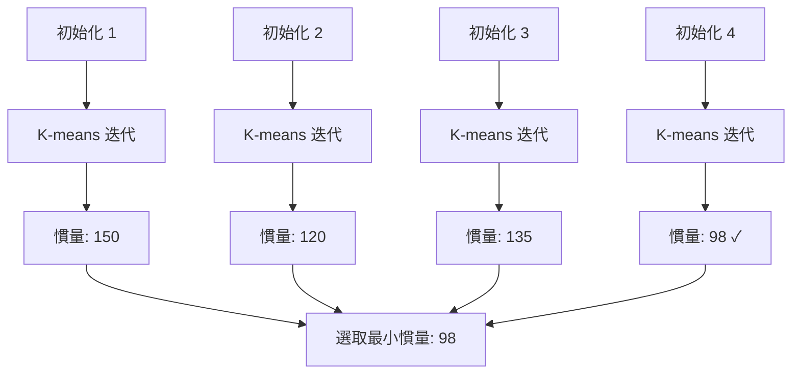
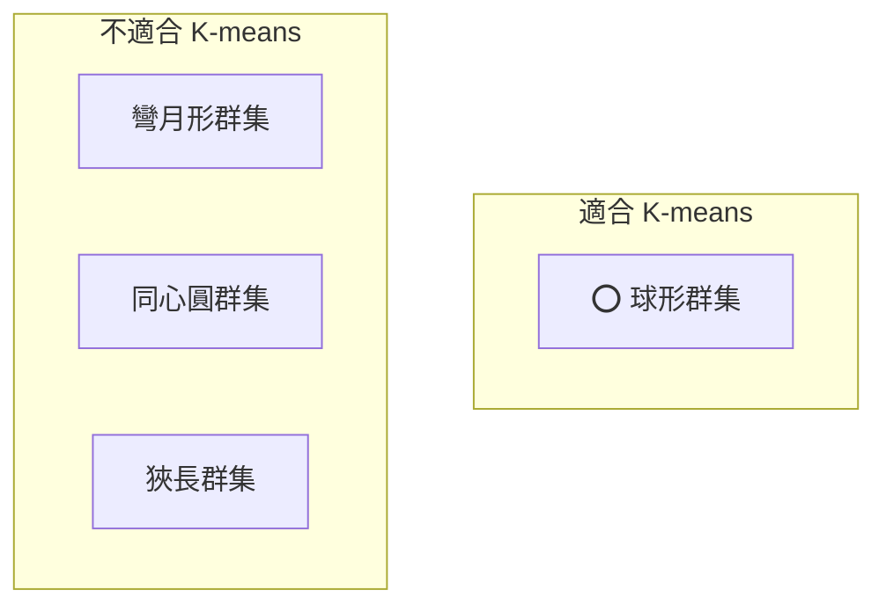

# K-Means（K 均值聚類）

K 均值聚類 (K-means clustering) 是機器學習中最經典的無監督學習 (unsupervised learning) 演算法，用於將資料劃分為 $K$ 個群集 (clusters)。其目標是找到一組群集中心 (centroids)，使得每個樣本到其所屬群集中心的距離平方和最小。

## 問題定義

給定資料集 $X = \{x_1, x_2, ..., x_N\}$，其中 $x_i \in \mathbb{R}^d$，K-means 的目標是找到 $K$ 個群集中心 $\mu_1, \mu_2, ..., \mu_K \in \mathbb{R}^d$ 和每個樣本的歸屬 $c_i \in \{1, ..., K\}$，最小化群集內平方和 (within-cluster sum of squares, WCSS)：

$$J = \sum_{i=1}^N \sum_{k=1}^K \mathbb{1}[c_i = k] \cdot \|x_i - \mu_k\|^2$$

其中 $\mathbb{1}[\cdot]$ 為指示函數，$\|\cdot\|$ 為歐幾里得距離 (Euclidean distance)。

這個目標函數是 NP-hard 的，K-means 演算法透過貪婪迭代方式尋找局部最優解。

## 演算法步驟（EM 模式）

K-means 本質上是一種**期望最大化 (Expectation-Maximization, EM)** 類型的演算法，交替執行兩個步驟：



### E 步：分配標籤（Assignment Step）

將每個樣本分配到最近的中心：

$$c_i = \arg\min_k \|x_i - \mu_k\|^2$$

本專案 `ml/clustering.py:KMeans._assign_labels` 的實作：

```python
def _assign_labels(self, X, centroids):
    distances = np.linalg.norm(
        X[:, np.newaxis] - centroids, axis=2)
    return np.argmin(distances, axis=1)
```

這裡使用廣播 (broadcasting) 一次計算所有樣本到所有中心的距離，得到形狀為 $(N, K)$ 的距離矩陣。

### M 步：更新中心（Update Step）

重新計算每個群集的中心為該群集所有樣本的平均值：

$$\mu_k = \frac{1}{|C_k|} \sum_{i \in C_k} x_i$$

其中 $C_k = \{i : c_i = k\}$ 為屬於第 $k$ 個群集的樣本集合。

```python
def _compute_centroids(self, X, labels):
    return np.array([X[labels == i].mean(axis=0)
                     for i in range(self.n_clusters)])
```

### 收斂判斷

當中心不再變化（或變化小於容許值）時，演算法收斂：

```python
if np.allclose(centroids, new_centroids):
    break
```

## 中心初始化（Centroid Initialization）

初始中心的選擇對 K-means 的結果影響巨大。

### 隨機初始化

從資料中隨機選取 $K$ 個樣本作為初始中心。這是最簡單的方法（本專案使用此方法）：

```python
indices = np.random.choice(len(X), self.n_clusters, replace=False)
centroids = X[indices].copy()
```

### K-means++ 初始化

改進的初始化方法，以機率方式選擇遠離已選中心的點：
1. 隨機選取第一個中心
2. 對每個點，計算其與最近已選中心的距離 $d(x_i)$
3. 以機率 $p_i \propto d(x_i)^2$ 選取下一個中心
4. 重複直到選出 K 個中心

K-means++ 能顯著改善最終結果的品質和收斂速度。

## 慣量（Inertia / WCSS）

慣量 (inertia) 定義為所有樣本到其所屬群集中心的距離平方和：

$$\text{Inertia} = \sum_{k=1}^K \sum_{i \in C_k} \|x_i - \mu_k\|^2$$

本專案的實作：

```python
def _compute_inertia(self, X, labels, centroids):
    return np.sum((X - centroids[labels]) ** 2)
```

慣量有以下特性：
- 隨 $K$ 增加而單調遞減（當 $K = N$ 時慣量為 0）
- 對資料尺度敏感
- 不能跨資料集比較

## 選擇 K 值：肘部法則（Elbow Method）

肘部法則透過繪製慣量與 $K$ 的關係圖來選擇最佳 $K$：



拐點 (elbow point) 出現在增加 K 帶來的慣量遞減收益變得不顯著的位置，即為最佳 K。

### 其他選擇 K 的方法

- **輪廓係數 (Silhouette Score)**：衡量群集內緊密性與群集間分離度
- **間距統計量 (Gap Statistic)**：比較實際資料的慣量與均勻分布資料的慣量
- **Davies-Bouldin Index**：群集內散度與群集間距離的比值
- **Calinski-Harabasz Index**：群集間離散度與群集內離散度的比值

## 多次初始化：n_init（Avoiding Local Optima）

K-means 的成本函數是非凸的 (non-convex)，因此隨機初始化可能導致演算法收斂到局部最優 (local optimum)。為了解決這個問題，標準做法是進行多次初始化（不同的隨機種子），選取慣量最小的結果。

本專案 `ml/clustering.py:KMeans` 使用 `n_init=10`（預設）次初始化：

```python
def fit(self, X):
    best_inertia = None
    best_centroids = None
    best_labels = None
    for _ in range(self.n_init):
        # 初始化中心並迭代
        # ...
        inertia = self._compute_inertia(X, labels, centroids)
        if best_inertia is None or inertia < best_inertia:
            best_inertia = inertia
            best_centroids = centroids
            best_labels = labels
    self.centroids = best_centroids
    self.labels = best_labels
```



## 演算法的收斂性

### 保證收斂

K-means 保證在有限次數內收斂，因為：
1. E 步（分配標籤）會減少或維持每個樣本與中心的距離
2. M 步（重新計算中心）會減少或維持每個群集的慣量
3. 慣量有下界 0

因此慣量在每次迭代中單調遞減，最終收斂。

### 收斂速度

K-means 通常收斂很快（20-50 次迭代內），但收斂速度取決於：
- 資料維度 $d$
- 群集數量 $K$
- 資料分散程度
- 初始中心的質量

## 時間複雜度

每輪迭代的時間複雜度為 $O(N \cdot K \cdot d)$：
- E 步：計算 $N \times K$ 個距離，每個距離 $O(d)$
- M 步：$K$ 個群集中心，每個求 $d$ 維平均值
- 總共 $O(T \cdot N \cdot K \cdot d)$，其中 $T$ 為迭代次數

## 限制與假設（Spherical Clusters Assumption）

K-means 隱含的重要假設：

### 1. 球形群集（Spherical Clusters）
K-means 使用歐幾里得距離，傾向發現球形 (spherical) 或類球形的群集。對於狹長、彎曲或交錯的群集結構表現不佳。



### 2. 各向同性（Isotropy）
每個特徵的尺度應相近，否則需先進行標準化。例如身高（cm）和體重（kg）若不標準化，歐幾里得距離會被尺度較大的特徵主導。

### 3. 群集大小相近
K-means 傾向產生大小相近的群集，對大小差異懸殊的群集表現不佳（大型群集可能會「吸引」偏遠處的樣本）。

### 4. 無離群值
離群值會嚴重影響中心計算。可先進行離群值檢測或資料清理。

### 5. 連續特徵
K-means 的距離計算基於連續數值，不適合類別型特徵。

## 變體與延伸

| 演算法 | 差異 |
|--------|------|
| **K-means** | 標準的 EM 迭代 |
| **K-medoids** | 使用實際資料點作為中心，對離群值更魯棒 |
| **K-means++** | 改進的初始化方法 |
| **Mini-batch K-means** | 使用小批次更新，適合大規模資料 |
| **Fuzzy C-means** | 軟分配，每個樣本屬於多個群集的機率 |
| **Bisecting K-means** | 從一個群集開始，逐步分裂 |

## 應用場景

- **客戶分群**：根據購買行為將客戶分為不同族群
- **影像壓縮**：將像素顏色分為 K 個代表色
- **異常檢測**：遠離所有群集中心的點可視為異常
- **文件聚類**：將文件按照主題分組
- **特徵學習**：學習資料的離散表示

---

**上一篇**：[Random-Forest.md](Random-Forest.md)

**相關連結**：[PCA.md](PCA.md) | [StandardScaler.md](StandardScaler.md) | [Train-Test-Split.md](Train-Test-Split.md)
