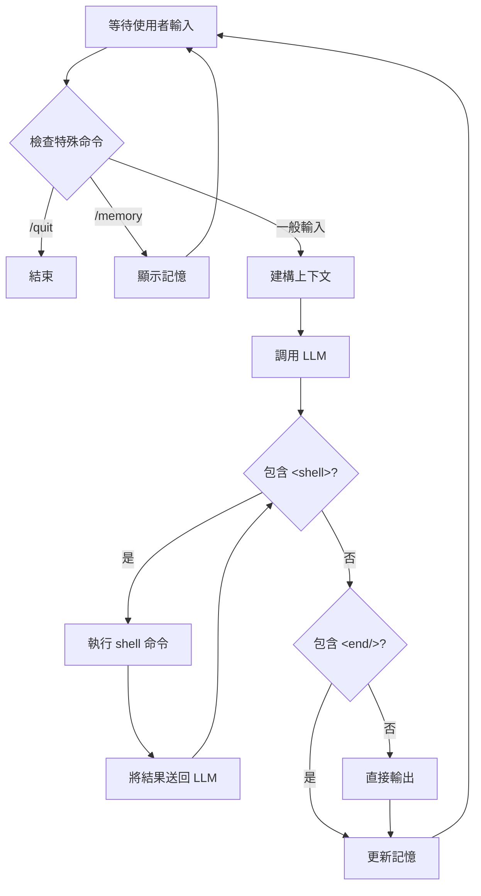
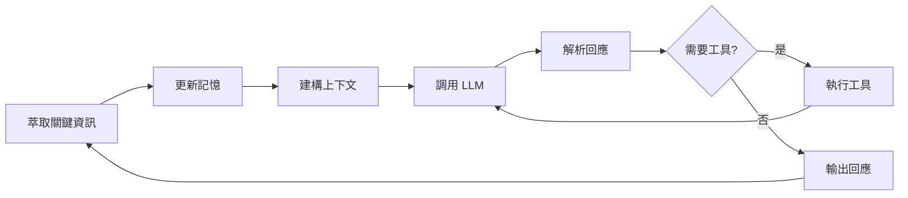

# LLM Agent 架構（LLM Agent Framework）

大型語言模型（Large Language Model, LLM）Agent 是一種以語言模型為核心決策引擎的自主系統，能在與環境互動中進行推理、記憶與工具操作。不同於傳統的問答式語言模型，Agent 具有**循環感知-推理-行動**（perception-reasoning-action loop）的能力，能夠處理需要多步驟推理和外部互動的複雜任務。

## Agent 架構（Agent Architecture）

LLM Agent 的基礎架構包含三個核心組件：**系統提示**（system prompt）、**對話歷史**（conversation history）和使用者輸入迴圈（user input loop）。

### 系統提示（System Prompt）

系統提示是固定的指令集合，定義 Agent 的身份、行為規則和任務目標，相當於 Agent 的「人格設定」與「操作手冊」。通常包含角色定義、輸出格式規範、流程指引和安全約束。本專案的系統提示將 Agent 命名為 Jarvis，規定使用 `<shell>` 標籤包裹 shell 命令、`<end/>` 標示完成，並在每次 LLM 調用時作為前綴嵌入。

### 對話歷史（Conversation History）

對話歷史記錄過去所有使用者輸入和 Agent 回應，賦予 Agent **短期記憶**（short-term memory）。它以字串列表的形式維護，每次互動後以 XML 結構化格式追加：`<user>` 與 `<assistant>` 標籤分別包裹雙方內容。

### 使用者輸入迴圈（User Input Loop）

Agent 的核心運行機制是**讀取-處理-輸出**（read-process-output）的無窮迴圈：

1. 等待使用者輸入 → 2. 檢查特殊命令 → 3. 建構上下文 → 4. 調用 LLM → 5. 解析回應、執行工具 → 6. 更新記憶 → 7. 輸出結果，回到步驟 1

關鍵在第 5 步——當 LLM 回應包含工具調用時，Agent 會執行工具、將結果回饋給 LLM，形成一個**內部子迴圈**（inner loop），直到 LLM 輸出終止標記。



## 記憶機制（Memory Mechanisms）

Agent 的記憶系統分為兩個層次：**對話歷史**（短期記憶）和**關鍵資訊**（長期記憶）。這與人類的**情節記憶**（episodic memory）和**語義記憶**（semantic memory）分類相對應。

### 對話歷史管理（Conversation History Management）

對話歷史是一個固定長度的 FIFO（先進先出）佇列。每次互動時，Agent 將使用者輸入和自身回應附加到末尾，列表長度超過 $4 \times \text{MAX\_TURNS}$ 時從開頭移除最舊記錄。上下文建構時只取最後 $2 \times \text{MAX\_TURNS}$ 條，此裁剪（trimming）策略確保歷史不超出 LLM 的上下文視窗（context window）限制。

### 關鍵資訊記憶（Key-Value Memory）

關鍵資訊（key_info）是 Agent 的長期記憶機制，儲存需要跨對話輪次保留的重要資訊。其運作流程為：**萃取**——工具執行後調用 LLM 從對話中提取記憶；**去重**——新項目不與現有記憶重複才加入；**持久化**——關鍵資訊在 Agent 生命週期中持續存在，不受對話歷史裁剪影響。

萃取提示詞要求 LLM 輸出特定 XML 結構，Agent 用正則表達式解析 `<item>` 標籤內容。這是一種**結構化輸出**（structured output）技術。關鍵資訊本質上是**摘要壓縮**（summary compression）——以資訊損失為代價，解決對話歷史裁剪後的遺失問題。

### 記憶與上下文視窗

記憶管理與 LLM 的上下文視窗直接相關。Agent 的上下文 Token 總量為：

$$\text{total\_tokens} = \text{system\_tokens} + \text{memory\_tokens} + \text{history\_tokens} + \text{user\_input\_tokens} + \text{response\_tokens}$$

任一部分過大都會導致溢出，因此 Agent 需對歷史裁剪、工具輸出截斷（如 `tool_result[:500]`），並依賴摘要壓縮控制資訊量。

## 工具使用（Tool Use）

工具使用是 Agent 與外部世界互動的橋樑。LLM 本身無法直接執行程式碼、讀寫文件或存取網路——但可以透過生成結構化指令來觸發這些操作。

### 工具調用的運作原理（Function Calling Paradigm）

Agent 工具使用遵循：**宣告階段**——系統提示告知可用工具及格式；**決策階段**——LLM 決定是否呼叫工具並輸出（如 `<shell>` 標籤）；**執行階段**——主程式解析並執行；**回饋階段**——執行結果送回 LLM 作為後續決策依據；**終止判斷**——LLM 輸出 `<end/>` 標記任務完成。這是一個**監督式工具執行**（supervised tool execution）模式。

### Shell 命令執行

本專案實作了 shell 命令作為 Agent 的工具。其安全設計考量包括：

- **命令隔離**：透過 `subprocess.run`（Python）或 `Command::new`（Rust）建立子行程執行，不影響主行程
- **超時保護**：設定命令執行超時（30 秒），防止無限阻塞
- **輸出截斷**：工具結果限制為 500 個字元，防止巨量輸出撐爆上下文
- **同步執行**：在內層子迴圈中，Agent 等工具執行完成後再調用 LLM，形成步驟式推理

### 工具回饋迴圈（Tool Feedback Loop）

當 Agent 呼叫工具後，執行結果被包裝為結構化格式送回 LLM：

```xml
<context>...</context>
<user>原始輸入</user>
<assistant>Agent 剛才的回應</assistant>
<output>
$ ls -la
...
</output>
```

LLM 根據工具輸出決定下一步：要執行更多命令、修正命令或輸出最終回應。這個迴圈持續直到 LLM 輸出 `<end/>` 或回應中不再包含工具調用。

## Ollama 整合（Ollama Integration）

Ollama 是一個本地 LLM 伺服器框架，提供類似 OpenAI API 的介面，但所有模型都在本地執行，無需網路連線或 API 金鑰。

### Ollama API 架構

Agent 透過 Ollama 的 `/api/generate` 端點與 LLM 互動。請求格式為 `{"model": "...", "prompt": "...", "stream": false}`，回應包含 `response`（生成文字）和 `context`（上下文向量）。`stream: false` 表示等待完整回應，簡化了 Agent 的程式邏輯。

### 非同步設計（Asynchronous Design）

Python（`aiohttp` + `asyncio.run`）和 TypeScript（原生 `fetch`）皆使用非同步調用，因為 LLM 推理耗時數秒到數十秒。Rust 版本則以佔位方式標註了 `async` 介面，實際實作需使用 `reqwest`。

### 本地推理的優缺點

使用 Ollama 而非雲端 API 的考量：

| 面向 | 本地 Ollama | 雲端 API（如 OpenAI） |
|------|------------|----------------------|
| 延遲 | 取決於硬體，通常 1-10 秒 | 取決於網路，通常 0.5-3 秒 |
| 隱私 | 資料完全保留在本地 | 資料需傳送至第三方伺服器 |
| 成本 | 硬體成本（一次性的） | 按 token 計費（持續性的） |
| 模型品質 | 開源模型（如 Llama、Mistral） | 專有模型（如 GPT-4） |
| 可用性 | 無網路需求 | 需要穩定的網路連線 |

## 上下文建構（Context Construction）

上下文建構是 Agent 將記憶和歷史轉換為 LLM 輸入的過程。這不僅是簡單的字串拼接，而是涉及結構化設計和 Token 預算管理的工程問題。

### 上下文結構

最終傳遞給 LLM 的完整提示詞（prompt）由以下部分組成：

```
[系統提示]          ← 固定的身份和規則定義

<memory>
  <item>長期記憶 1</item>
  <item>長期記憶 2</item>
</memory>

<history>
  <user>上一輪輸入</user>
  <assistant>上一輪回應</assistant>
</history>

<user>當前輸入</user>   ← 最新的使用者輸入
```

### 結構化設計的意義

採用 XML 風格的結構化提示詞有以下原因：

1. **分隔作用**：明確區分不同類型的資訊，幫助 LLM 理解每個部分的角色
2. **解析友好**：Agent 可以正則表達式解析 LLM 回應中的 XML 標籤
3. **可擴展性**：新增資訊類型時只需新增對應的 XML 區塊
4. **語義表達**：XML 的嵌套結構自然對應了資訊的層級關係

### Token 預算管理（Token Budget Management）

Token 預算管理是上下文建構的核心。優先級從高到低為：使用者當前輸入 > 系統提示 > 關鍵資訊記憶 > 對話歷史（只保留最近 $2 \times \text{MAX\_TURNS}$ 條）> 工具輸出（截斷至 500 字元）。

## 多輪互動（Multi-turn Interaction）

多輪互動使 Agent 能夠維持跨對話回合的狀態一致性，而不是每次輸入都從零開始。

### 狀態維持（State Persistence）

Agent 在多輪互動中維持的狀態包括：

- **記憶狀態**：`key_info` 列表中的長期記憶
- **對話狀態**：`conversation_history` 中的最近對話記錄
- **會話狀態**：Agent 的工作目錄、當前任務進度

### MAX_TURNS 限制

`MAX_TURNS` 是 Agent 對話歷史的最長保留輪數，本專案設為 5。這個限制的設計考量是：

- **Token 預算**：假設每輪對話約 $T$ 個 token，5 輪共約 $10T$ 個 token（user + assistant 各佔一份）
- **推理品質**：輪數過多時，LLM 容易在長上下文中迷失焦點
- **回應速度**：上下文越長，LLM 推理時間越長

當對話超過 MAX_TURNS 時，最舊的輪次會被裁剪掉。但關鍵資訊記憶中的內容不受影響，這是長期記憶與短期記憶的根本差異。

### 注意力稀釋（Attention Dilution）

多輪互動的根本問題是**注意力稀釋**：隨著上下文增長，注意力機制需在更多 token 間分配權重，早期資訊的影響力衰減。自注意力公式為：

$$\text{Attention}(Q, K, V) = \text{softmax}\left(\frac{QK^T}{\sqrt{d_k}}\right)V$$

當序列長度 $T$ 很大時，softmax 輸出趨於平滑，每個 token 的注意力權重降低。這是需要結構化關鍵資訊記憶來補充的原因。

## 與微調的比較（Comparison with Fine-tuning）

LLM Agent 和模型微調（fine-tuning）是兩種截然不同的能力擴展方式，各有適用場景。

### 微調（Fine-tuning）

微調是在特定資料集上對預訓練模型進行額外的梯度更新訓練。它本質上是修改模型的權重參數：

$$\theta_{\text{new}} = \theta_{\text{pretrained}} - \alpha \nabla_\theta \mathcal{L}(\theta; \mathcal{D}_{\text{ft}})$$

適用於：
- **任務特定化**：需要模型在特定領域達到專家水準
- **行為固化**：需要模型的行為改變是永久且一致的
- **效率需求**：推理時不需要額外提示詞工程
- **離線場景**：任務需求已知且不會頻繁變化

### Agent（Agentic Approach）

Agent 不修改模型權重，而是透過**提示詞工程**（prompt engineering）和**外部工具**來擴展模型的能力。適用於：

- **動態任務**：任務需求頻繁變化，無法事先預測
- **工具整合**：需要與外部系統互動（執行命令、查詢資料庫）
- **可解釋性**：Agent 的決策過程可以被記錄和審計
- **快速迭代**：修改系統提示比重新訓練快得多
- **資源限制**：無法進行昂貴的模型訓練

### 混合策略（Hybrid Strategy）

在實際應用中，Agent 和微調並非互斥。一個常見的混合策略是：

1. **基礎能力**：使用微調使模型掌握特定領域知識和格式要求
2. **動態決策**：使用 Agent 架構處理需要即時判斷和工具互動的任務
3. **安全過濾**：微調模型拒絕有害請求，Agent 執行時再經過安全檢查層

## 完整工作流程（Complete Workflow）

Agent 的完整運作可以歸納為以下六步驟循環：



### 步驟一：萃取關鍵資訊（Extract Key Info）

每輪互動結束後，Agent 調用 LLM 從對話中判斷是否有值得長期記憶的資訊。此步驟是**非同步**的——不阻塞主流程。萃取本質上是**資訊壓縮**，將原始對話提煉為簡潔的關鍵詞，類似人類將新知識存入長期記憶的認知過程。

### 步驟二：更新記憶（Update Memory）

萃取完成後，Agent 將：新關鍵資訊加入 `key_info`（去重後）；使用者輸入和 Agent 回應加入 `conversation_history`；工具執行結果加入（截斷至 500 字元）；若歷史超過容量上限則裁剪最舊記錄。

### 步驟三：建構上下文（Build Context）

從記憶結構生成提示詞：若有關鍵資訊，生成 `<memory>` 區塊；若有對話歷史，生成 `<history>` 區塊（取最後 MAX_TURNS 輪）；將使用者最新輸入附加在後；若無上下文記憶則直接使用使用者輸入。

### 步驟四：調用 LLM（Call LLM）

透過 Ollama API 傳送完整提示詞（系統提示 + 上下文 + 使用者輸入）給指定模型。涉及網路 I/O 和模型推理，是循環中最耗時的步驟。

### 步驟五：解析回應（Parse Response）

三層解析：檢查 `<end/>` 終止標記、檢查 `<shell>` 工具調用、去除標籤提取純文字。若包含工具調用則進入內層子迴圈。

### 步驟六：輸出回應（Output Response）

純文字顯示給使用者後回到步驟一，開始下一輪互動。

## Agent 的認知架構

從認知科學角度，LLM Agent 可類比為簡化的**認知架構**（cognitive architecture）：

| 認知功能 | Agent 對應 | LLM 的角色 |
|---------|-----------|-----------|
| **感知** | 接收使用者輸入 | 理解輸入語意 |
| **記憶** | conversation_history + key_info | 從上下文中提取資訊 |
| **推理** | 系統提示 + 工具執行 | 語言模型的生成能力 |
| **行動** | 輸出回應 + shell 命令 | 決定行動方案 |
| **學習** | extract_key_info | 從經驗中萃取知識 |

此類比有助於理解設計權衡：記憶系統模擬人類訊息處理模型，工具使用模擬操作能力，LLM 扮演大腦皮層的角色。

## 限制與挑戰

LLM Agent 面臨的核心挑戰包括：

- **幻覺（Hallucination）**：LLM 可能生成不存在的檔案路徑或命令，導致工具執行失敗
- **循環陷阱（Loop Trap）**：工具結果可能使 LLM 陷入重複呼叫的無限迴圈
- **Token 成本**：長對話和多次工具調用消耗大量 token（即使是本地推理，也受上下文視窗限制）
- **安全風險**：賦予 LLM shell 執行權限存在潛在的危險，需要謹慎的沙箱隔離
- **決策品質**：LLM 的決策能力取決於模型本身的品質，開源模型在複雜規劃任務上仍不如專有模型

---

**上一篇**：[GPT.md](GPT.md)

**相關連結**：[Transformer.md](Transformer.md) | [Attention-Mechanism.md](Attention-Mechanism.md) | [RMSNorm.md](RMSNorm.md)
