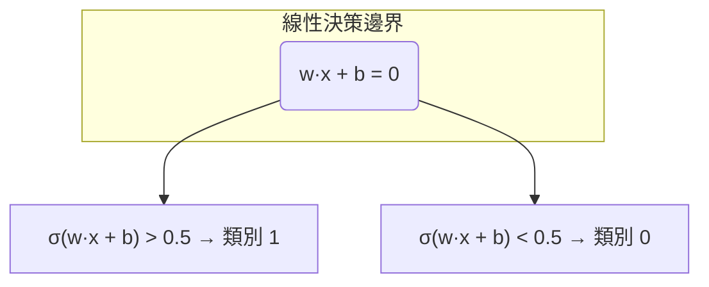

# Logistic Regression（邏輯斯諦迴歸）

邏輯斯諦迴歸 (logistic regression) 雖然名為「迴歸」，實際上是最經典的二分類 (binary classification) 演算法。它透過一個非線性的激發函數將線性組合的輸出映射到 $[0,1]$ 區間，作為類別機率的估計。

## 從線性迴歸到分類

線性迴歸 $\hat{y} = w^T x + b$ 輸出範圍為 $(-\infty, \infty)$，無法直接作為二元分類的機率（需要 $[0,1]$）。解決方案是透過一個連結函數 (link function) 將線性輸出轉換為機率。

邏輯斯諦迴歸使用的連結函數稱為**邏輯斯諦函數 (logistic function)**，也稱為 S 型函數 (sigmoid function)：

$$\sigma(z) = \frac{1}{1 + e^{-z}}$$

其中 $z = w^T x + b$ 是線性決策分數 (linear score/logit)。

```mermaid
graph LR
    x[特徵 x] --> L[線性組合]
    L -->|z = w·x + b| S[Sigmoid]
    S -->|σ(z)| P[機率 p]
    P -->|≥ 0.5| C1[類別 1]
    P -->|< 0.5| C0[類別 0]
```

## Sigmoid 函數特性

$$\sigma(z) = \frac{1}{1 + e^{-z}}$$

- **值域**：$(0, 1)$
- **對稱性**：$\sigma(-z) = 1 - \sigma(z)$
- **單調遞增**：$z$ 越大，$\sigma(z)$ 越接近 1
- **導數優雅**：$\sigma'(z) = \sigma(z)(1 - \sigma(z))$

導數的推導：

$$\sigma(z) = (1 + e^{-z})^{-1}$$

$$\frac{d\sigma}{dz} = -1 \cdot (1 + e^{-z})^{-2} \cdot (-e^{-z}) = \frac{e^{-z}}{(1 + e^{-z})^2}$$

$$= \frac{1}{1 + e^{-z}} \cdot \frac{e^{-z}}{1 + e^{-z}} = \sigma(z) \cdot (1 - \sigma(z))$$

這個性質使得梯度推導非常簡潔。

## 模型假設

邏輯斯諦迴歸模型假設：

$$p(y=1 | x) = \sigma(w^T x + b) = \frac{1}{1 + e^{-(w^T x + b)}}$$

$$p(y=0 | x) = 1 - p(y=1 | x) = \frac{1}{1 + e^{w^T x + b}}$$

這可以統一寫為：

$$p(y | x) = \sigma(w^T x + b)^y \cdot (1 - \sigma(w^T x + b))^{1-y}$$

## 決策邊界（Decision Boundary）

決策邊界是分類器區分兩個類別的幾何介面。對邏輯斯諦迴歸而言，決策邊界為 $\sigma(z) = 0.5$，即 $z = 0$：

$$w^T x + b = 0$$

這是一個**線性決策邊界**（在原始特徵空間中為超平面）。



若加入多項式特徵延伸（如 $x_1^2, x_1 x_2$），則可在原始空間形成非線性決策邊界，但仍對參數維持線性（仍屬廣義線性模型）。

## 成本函數：交叉熵（Cross-Entropy / Log Loss）

邏輯斯諦迴歸不使用 MSE 作為損失函數（因為 MSE 對 sigmoid 非凸，難以優化），而使用**交叉熵損失**（也稱為 log loss）。

對於 $N$ 個樣本的二元分類：

$$J(w, b) = -\frac{1}{N} \sum_{i=1}^N \left[ y_i \log(\hat{y}_i) + (1 - y_i) \log(1 - \hat{y}_i) \right]$$

其中 $\hat{y}_i = \sigma(w^T x_i + b)$。

### 交叉熵的直覺
- 當 $y=1$ 時，損失為 $-\log(\hat{y})$：預測機率越接近 1，損失越小
- 當 $y=0$ 時，損失為 $-\log(1 - \hat{y})$：預測機率越接近 0，損失越小
- 預測錯誤時損失趨近無窮大（模型被「懲罰」）

### 最大概似估計 (MLE) 視角

交叉熵最小化等價於最大概似估計。給定資料 $\{(x_i, y_i)\}$，概似函數為：

$$L(w, b) = \prod_{i=1}^N p(y_i | x_i, w, b) = \prod_{i=1}^N \hat{y}_i^{y_i} (1 - \hat{y}_i)^{1-y_i}$$

取對數（log-likelihood）並取負號即為交叉熵：

$$-\log L = -\sum_{i=1}^N \left[ y_i \log \hat{y}_i + (1 - y_i) \log(1 - \hat{y}_i) \right]$$

## 梯度推導

對單個樣本的損失 $L_i$ 求梯度：

$$L_i = -y_i \log(\hat{y}_i) - (1 - y_i) \log(1 - \hat{y}_i)$$

### 對權重 $w_j$ 的梯度

利用鏈式法則：

$$\frac{\partial L_i}{\partial w_j} = \frac{\partial L_i}{\partial \hat{y}_i} \cdot \frac{\partial \hat{y}_i}{\partial z_i} \cdot \frac{\partial z_i}{\partial w_j}$$

第一項：

$$\frac{\partial L_i}{\partial \hat{y}_i} = -\frac{y_i}{\hat{y}_i} + \frac{1-y_i}{1-\hat{y}_i} = \frac{-y_i(1-\hat{y}_i) + (1-y_i)\hat{y}_i}{\hat{y}_i(1-\hat{y}_i)} = \frac{\hat{y}_i - y_i}{\hat{y}_i(1-\hat{y}_i)}$$

第二項（sigmoid 導數）：

$$\frac{\partial \hat{y}_i}{\partial z_i} = \hat{y}_i(1 - \hat{y}_i)$$

第三項：

$$\frac{\partial z_i}{\partial w_j} = x_{ij}$$

乘積：

$$\frac{\partial L_i}{\partial w_j} = \frac{\hat{y}_i - y_i}{\hat{y}_i(1-\hat{y}_i)} \cdot \hat{y}_i(1-\hat{y}_i) \cdot x_{ij} = (\hat{y}_i - y_i) x_{ij}$$

對全部樣本：

$$\frac{\partial J}{\partial w} = \frac{1}{N} \sum_{i=1}^N (\hat{y}_i - y_i) x_i$$

$$\frac{\partial J}{\partial b} = \frac{1}{N} \sum_{i=1}^N (\hat{y}_i - y_i)$$

這與線性迴歸的梯度形式**完全相同**！這是廣義線性模型 (Generalized Linear Model, GLM) 框架下的普遍性質：使用典型連結函數 (canonical link function) 時，梯度形式統一為 $\frac{1}{N} X^T (\hat{y} - y)$。

## 梯度下降更新規則

$$w \leftarrow w - \alpha \cdot \frac{1}{N} \sum_{i=1}^N (\hat{y}_i - y_i) x_i$$
$$b \leftarrow b - \alpha \cdot \frac{1}{N} \sum_{i=1}^N (\hat{y}_i - y_i)$$

本專案 `ml/linear_models.py:LogisticRegression` 的實作：

```python
# ml/linear_models.py (簡化)
def _sigmoid(self, z):
    return 1 / (1 + np.exp(-np.clip(z, -500, 500)))

def fit(self, X, y):
    for _ in range(self.n_iterations):
        linear = np.dot(X, self.weights) + self.bias
        y_pred = self._sigmoid(linear)
        dw = (1 / n_samples) * np.dot(X.T, y_pred - y)
        db = (1 / n_samples) * np.sum(y_pred - y)
        self.weights -= self.lr * dw
        self.bias -= self.lr * db
```

注意 `np.clip(z, -500, 500)` 防止指數計算溢位。

## 勝算比（Odds Ratio）

邏輯斯諦迴歸的一個重要優點是其可解釋性，透過**勝算比 (odds ratio)**：

勝算 (odds) 定義為事件發生機率與不發生機率之比：

$$\text{odds} = \frac{p}{1-p}$$

在邏輯斯諦迴歸中：

$$\log\left(\frac{p}{1-p}\right) = w^T x + b$$

所以 $e^{w_j}$ 的意義為：$x_j$ 每增加一個單位，勝算 (odds) 乘以 $e^{w_j}$ 倍。

- $w_j > 0 \Rightarrow e^{w_j} > 1$：增加 $x_j$ 提高事件發生機會
- $w_j < 0 \Rightarrow e^{w_j} < 1$：增加 $x_j$ 降低事件發生機會

## 多類別延伸：Softmax 迴歸

Softmax 迴歸（也稱為多項邏輯斯諦迴歸, Multinomial Logistic Regression）將二元邏輯斯諦迴歸推廣到 $K$ 個類別：

對於第 $k$ 類：

$$p(y=k | x) = \frac{e^{w_k^T x + b_k}}{\sum_{j=1}^K e^{w_j^T x + b_j}}$$

Softmax 函數將 $K$ 個實數分數轉換為機率分佈（總和為 1，每個值在 $(0,1)$ 之間）。

### Softmax 的梯度

對於交叉熵損失 $L = -\sum_k y_k \log \hat{y}_k$（其中 $y_k$ 為 one-hot 編碼），梯度為：

$$\frac{\partial L}{\partial w_k} = (\hat{y}_k - y_k) x$$

與二元情況形式相同！

## 正則化

邏輯斯諦迴歸同樣支援正則化防止過擬合：

- L1 正則化：產生稀疏權重（特徵選擇）
- L2 正則化：控制權重大小
- Elastic Net：L1 + L2 組合

正則化後的目標函數：

$$J(w, b) = -\frac{1}{N} \sum_i \left[ y_i \log \hat{y}_i + (1-y_i) \log(1-\hat{y}_i) \right] + \lambda \|w\|^2$$

## 與其他分類方法的比較

| 方法 | 優點 | 缺點 |
|------|------|------|
| Logistic Regression | 訓練快速、可解釋性強、機率輸出 | 決策邊界線性、無法直接處理特徵交互 |
| K-Nearest Neighbors | 非參數化、決策邊界靈活 | 對特徵尺度敏感、預測速度慢 |
| Decision Tree | 可解釋、處理非線性關係 | 容易過擬合、不穩定 |
| SVM | 最大化邊際、可用核技巧 | 參數調節敏感、缺乏機率輸出 |
| Neural Network | 高度表達力、端到端學習 | 訓練成本高、可解釋性差 |

## 應用場景

- **醫學診斷**：疾病存在/不存在
- **信用評分**：違約/不違約
- **垃圾郵件過濾**：垃圾/非垃圾
- **廣告點擊率預測**：點擊/不點擊
- **客戶流失預測**：流失/留存

## 假設與限制

1. **決策邊界線性**：除非使用多項式特徵或核技巧
2. **特徵獨立性**：雖然不如 Naive Bayes 嚴格，但強特徵相關仍會影響
3. **樣本平衡**：類別不平衡時，模型傾向預測多數類（可調整類別權重或使用過採樣/欠採樣）
4. **需要大量樣本**：相較於決策樹，需要更多樣本以穩定估計

---

**上一篇**：[Linear-Regression.md](Linear-Regression.md)

**相關連結**：[Decision-Tree.md](Decision-Tree.md) | [Train-Test-Split.md](Train-Test-Split.md) | [StandardScaler.md](StandardScaler.md)
