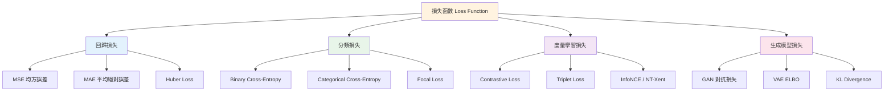

# Loss Function（損失函數）

損失函數（loss function），亦稱代價函數（cost function）或目標函數（objective function），是衡量模型預測值與真實值之間差異的量化指標。深度學習的訓練過程本質上是最小化損失函數：透過梯度下降調整模型參數 $\theta$，使損失 $L(\theta)$ 趨於極小。

$$\theta^* = \arg\min_\theta \frac{1}{N} \sum_{i=1}^N L(f(x_i; \theta), y_i)$$

## 損失函數分類總覽



## 損失函數的統計學基礎：最大似然估計

深度學習中大多數損失函數可以從**最大似然估計**（Maximum Likelihood Estimation, MLE）的角度推導。給定參數 $\theta$ 下的觀測數據 $D = \{(x_i, y_i)\}$ 的似然：

$$L(\theta) = p(D | \theta) = \prod_{i=1}^N p(y_i | x_i; \theta)$$

取負對數（negative log-likelihood, NLL）：

$$-\log L(\theta) = -\sum_{i=1}^N \log p(y_i | x_i; \theta)$$

這正是交叉熵損失（cross-entropy loss）。**最小化 NLL 等價於最大化似然**。

### 均方誤差（MSE）與高斯分布

假設目標 $y$ 滿足高斯分布 $y \sim \mathcal{N}(f(x; \theta), \sigma^2)$，則：

$$p(y | x; \theta) = \frac{1}{\sqrt{2\pi\sigma^2}} \exp\left(-\frac{(y - f(x; \theta))^2}{2\sigma^2}\right)$$

取負對數：

$$-\log p(y | x; \theta) = \frac{1}{2\sigma^2} (y - f(x; \theta))^2 + \text{常數}$$

忽略常數和 $\sigma^2$ 後，即是均方誤差（Mean Squared Error, MSE）。

### 交叉熵與分類分布

對 K 類分類問題，假設 $y$ 服從分類分布（categorical distribution）：

$$-\log p(y | x; \theta) = -\sum_{k=1}^K \mathbb{I}(y = k) \log \hat{p}_k$$

其中 $\hat{p}_k = \text{softmax}(f(x; \theta))_k$。這正是分類交叉熵損失。

## 均方誤差（Mean Squared Error）

### 定義

MSE 是回歸任務中最常用的損失函數：

$$L_{\text{MSE}}(y, \hat{y}) = \frac{1}{N} \sum_{i=1}^N (y_i - \hat{y}_i)^2$$

### 梯度推導

$$\frac{\partial L_{\text{MSE}}}{\partial \hat{y}_i} = \frac{2}{N} (\hat{y}_i - y_i)$$

$$\frac{\partial L_{\text{MSE}}}{\partial \theta} = \frac{2}{N} \sum_{i=1}^N (\hat{y}_i - y_i) \frac{\partial \hat{y}_i}{\partial \theta}$$

### 梯度特性

- 當 $|\hat{y} - y|$ 較大時，梯度也較大——對離群點（outliers）敏感
- 平方放大誤差：若存在離群點，MSE 會主導總損失

### 本專案實現

在 `nn/nn.py:16-33` 中：

```python
def mse_loss(input: Tensor, target: Tensor) -> Tensor:
    diff = input - target
    out = Tensor(np.mean(diff.data ** 2), (input, target), ...)
    def _backward():
        N = np.prod(diff.data.shape)
        input.grad  += out.grad * 2 * diff.data / N
        target.grad += out.grad * -2 * diff.data / N
```

注意反向傳播中使用了 `diff.data`（儲存的中間值）而非 `diff.grad`（永遠為零），這是實作上的一個關鍵修正。

### MAE（平均絕對誤差）作為替代

$$L_{\text{MAE}}(y, \hat{y}) = \frac{1}{N} \sum_{i=1}^N |y_i - \hat{y}_i|$$

MAE 的梯度為常數（±1/N），對離群點更穩健。但 MAE 在誤差接近零時梯度不連續，這對某些最佳化方法造成困難。

$$MSE \ vs \ MAE$$
- MSE 懲罰大誤差更重，適用於誤差服從高斯分布的場景
- MAE 對離群點更穩健，適用於誤差分布有厚尾（heavy-tail）的場景
- Huber loss 結合兩者優點：誤差小時用 MSE、誤差大時用 MAE

## 交叉熵損失（Cross-Entropy Loss）

### 二分類（Binary Cross-Entropy）

$$L_{\text{BCE}}(y, \hat{y}) = -[y \log \hat{y} + (1 - y) \log(1 - \hat{y})]$$

其中 $y \in \{0, 1\}$，$\hat{y} = \sigma(z) \in (0, 1)$。

梯度：

$$\frac{\partial L_{\text{BCE}}}{\partial z} = \hat{y} - y$$

這個梯度形式非常簡潔：預測與真實的差距直接作為更新信號。

### 多分類交叉熵

$$L_{\text{CE}}(y, \hat{y}) = -\sum_{k=1}^K y_k \log \hat{y}_k$$

在單標籤分類 $y$ 表示為 one-hot 向量時：

$$L_{\text{CE}}(y, \hat{y}) = -\log \hat{y}_c$$

其中 $c$ 是正確類別的索引。

當 $\hat{y} = \text{softmax}(z)$ 時，梯度同樣簡潔：

$$\frac{\partial L_{\text{CE}}}{\partial z_c} = \hat{y}_c - 1 \quad \text{（對正確類別）}$$
$$\frac{\partial L_{\text{CE}}}{\partial z_k} = \hat{y}_k \quad \text{（對其他類別）}$$

即 $\frac{\partial L}{\partial z} = \hat{y} - y_{\text{one-hot}}$。這就是為什麼實際實現中通常在反向傳播時做 `probs - 1`（針對正確位置）即可，無需單獨計算 softmax 和交叉熵的梯度再組合。

### 數值穩定性

直接計算 $\log(\text{softmax}(z))$ 會有數值問題：當 $z_k$ 很大時 $e^{z_k}$ 會溢出。標準實作採用 log-sum-exp trick：

$$\log\text{softmax}(z)_k = z_k - \log\sum_{j=1}^K e^{z_j}$$

並且使用：

$$\log\sum e^{z_j} = \max(z) + \log\sum e^{z_j - \max(z)}$$

這保證了 $e^{z_j - \max(z)} \leq 1$，不會溢出。

交叉熵的整體數值穩定實作（softmax + cross-entropy 合併計算）：

$$L_{\text{CE}} = -\left( z_c - \log\sum_j e^{z_j} \right)$$

梯度 = softmax(z) - one_hot(y)，既準確又穩定。

### 本專案實現

`nn/tensor.py:218-257` 的 `.cross_entropy()` 方法接收 logits 和整數標籤。其反向傳播實作：

```python
d_logits = probs.copy()
for b in range(batch_size):
    for t in range(seq_len):
        d_logits[b, t, targets_data[b, t]] -= 1
d_logits = d_logits / (batch_size * seq_len)
self.grad += out.grad * d_logits
```

注意此實作使用 Python 的雙層 for 迴圈來修改正確類別位置的機率，這種方式直覺易讀但在大資料集上較慢（可以用基於索引的向量化操作優化）。

## 損失函數與最佳化目標的關係

### 經驗風險最小化（Empirical Risk Minimization）

深度學習訓練的是**經驗風險**（empirical risk）：

$$R_{\text{emp}}(\theta) = \frac{1}{N} \sum_{i=1}^N L(f(x_i; \theta), y_i)$$

這是在訓練資料上的平均損失。然而，真正關心的是**期望風險**（expected risk）或**泛化誤差**（generalization error）：

$$R(\theta) = \mathbb{E}_{(x, y) \sim p_{\text{data}}} [L(f(x; \theta), y)]$$

過擬合發生在 $R_{\text{emp}}(\theta)$ 很小而 $R(\theta)$ 很大時。正則化（regularization）透過在損失函數中增加懲罰項來縮小兩者差距：

$$L_{\text{total}}(\theta) = L_{\text{data}}(\theta) + \lambda \Omega(\theta)$$

常見的正則化項：
- L1 正則化：$\Omega(\theta) = \|\theta\|_1$（產生稀疏解）
- L2 正則化：$\Omega(\theta) = \frac{1}{2} \|\theta\|_2^2$（權重衰減）

### 代理損失（Surrogate Loss）

在分類問題中，真正的評估指標是 0-1 損失（準確率）：

$$L_{0-1}(y, \hat{y}) = \mathbb{I}(\hat{y} \neq y)$$

但 0-1 損失不可導，無法用梯度下降最佳化。因此使用可導的「代理損失」作為訓練目標，交叉熵就是最常用的代理損失之一。

其他代理損失：

| 名稱 | 定義 | 用途 |
|------|------|------|
| Hinge Loss | $\max(0, 1 - y \cdot \hat{y})$ | SVM |
| Logistic Loss | $\log(1 + e^{-y \cdot \hat{y}})$ | 邏輯回歸 |
| Exponential Loss | $e^{-y \cdot \hat{y}}$ | AdaBoost |
| Contrastive Loss | $y \cdot d^2 + (1-y)\max(0, m-d)^2$ | Siamese Network |
| Triplet Loss | $\max(0, d(a,p) - d(a,n) + \alpha)$ | 人臉識別 |

## 本專案損失函數的總結

| 函數 | 檔案位置 | 用途場景 |
|------|---------|---------|
| `mse_loss` | `nn/nn.py:16-33` | 回歸問題（如 CartPole 控制） |
| `cross_entropy` | `nn/tensor.py:218-257` | 分類問題（如 chargpt、MNIST） |

在 `nn/chargpt.py:32` 和 `nn/mnist/train.py:56` 中都是使用 `logits.cross_entropy(y)` 來計算分類損失。

## 實務建議

1. **分類任務首選交叉熵**：一般來說，交叉熵 + softmax 是分類問題的標準配置
2. **回歸任務先試 MSE**：若發現對離群點過度敏感，改為 Huber loss 或 MAE
3. **標籤平滑（Label Smoothing）**：將 one-hot 標籤替換為 $y'_k = (1-\epsilon) y_k + \epsilon / K$，減少過擬合
4. **類別平衡**：當類別分布不均時，加權交叉熵（weighted cross-entropy）或 Focal Loss 效果更好
5. **Focal Loss**：$L_{\text{focal}} = -(1-\hat{p}_c)^\gamma \log \hat{p}_c$，專注於難分類樣本，廣泛用於物體檢測

## KL 散度（Kullback-Leibler Divergence）

KL 散度衡量兩個機率分布之間的差異，在機器學習中廣泛用於分布匹配：

$$D_{\text{KL}}(P \| Q) = \sum_i P(i) \log \frac{P(i)}{Q(i)}$$

對於離散分布 $P$ 和 $Q$，$D_{\text{KL}} \geq 0$ 且僅在 $P=Q$ 時為 0。

**與交叉熵的關係**：

$$H(P, Q) = H(P) + D_{\text{KL}}(P \| Q)$$

其中 $H(P) = -\sum P(i)\log P(i)$ 是 $P$ 的熵。當 $P$ 是固定分布（如 one-hot 標籤）時，最小化 $D_{\text{KL}}$ 等價於最小化交叉熵。

**應用場景**：
- 知識蒸餾（Knowledge Distillation）：學生模型最小化與教師模型輸出分布的 KL 散度
- 變分自編碼器（VAE）：最小化後驗 $q(z|x)$ 與先驗 $p(z)$ 的 KL 散度
- 策略梯度強化學習：PPO 使用 KL 散度約束新舊策略差異

### 交叉熵與 KL 散度的數值比較

給定真實分布 $P$ 和預測分布 $Q$：

- 交叉熵 $H(P, Q) = -\sum P \log Q$：與 KL 散度相差一個常數 $H(P)$
- 最小化交叉熵等價於最小化 KL 散度
- 在自監督學習（如 SimCLR）中，常直接最小化兩個增強視圖表示之間的交叉熵

## 對比損失（Contrastive Loss）

用於學習嵌入空間中樣本的相似性。Siamese Network 的標準損失：

$$L_{\text{contrast}}(y, d) = y \cdot d^2 + (1 - y) \cdot \max(0, m - d)^2$$

其中 $d = \|f(x_1) - f(x_2)\|_2$ 是嵌入向量的歐氏距離，$y=1$ 表示相似對，$y=0$ 表示不相似對，$m$ 是 margin。

訓練效果依賴於**負例採樣策略**——隨機採樣的負例大多太簡單（easily separable），無法提供有效的學習信號。

### InfoNCE Loss（NT-Xent）

SimCLR 和 MoCo 等對比學習方法使用的損失：

$$L_{\text{InfoNCE}} = -\log \frac{\exp(\text{sim}(z_i, z_j)/\tau)}{\sum_{k=1}^{2N} \mathbb{I}_{k\neq i} \exp(\text{sim}(z_i, z_k)/\tau)}$$

其中 $\text{sim}(\cdot)$ 是餘弦相似度，$\tau$ 是溫度參數。這可視為在 $2N-1$ 個樣本中辨識出正例的多分類交叉熵。

### Triplet Loss

FaceNet 中人臉驗證的核心損失：

$$L_{\text{triplet}} = \max(0, d(a, p) - d(a, n) + \alpha)$$

其中 $a$ 是錨點（anchor），$p$ 是正例（positive），$n$ 是負例（negative），$\alpha$ 是 margin。

目標：正例對距離至少比負例對距離小 $\alpha$。訓練需要 batch hard mining ——在一個 batch 內選取最難的負例和最難的正例來計算 loss。

## 生成模型的損失函數

### GAN 的對抗損失

生成器 $G$ 和判別器 $D$ 的 minimax 遊戲：

$$\min_G \max_D V(D, G) = \mathbb{E}_{x\sim p_{\text{data}}}[\log D(x)] + \mathbb{E}_{z\sim p_z}[\log(1 - D(G(z)))]$$

生成器原始目標 $\min_G \log(1 - D(G(z)))$ 在早期梯度微弱，實務上改用非飽和版本：

$$\max_G \log D(G(z))$$

**Wasserstein GAN** 使用 Earth Mover 距離替代 JS 散度：

$$L_{\text{WGAN}} = \underbrace{\mathbb{E}_{x\sim p_{\text{data}}}[D(x)]}_{\text{判別真實}} - \underbrace{\mathbb{E}_{z\sim p_z}[D(G(z))]}_{\text{判別生成}}$$

配合 Lipschitz 約束（權重裁剪或梯度懲罰），WGAN 顯著改善訓練穩定性。

### VAE 的 ELBO

$$L_{\text{VAE}} = \underbrace{\mathbb{E}_{z\sim q_\phi(z|x)}[\log p_\theta(x|z)]}_{\text{重建損失}} - \underbrace{D_{\text{KL}}(q_\phi(z|x) \| p(z))}_{\text{正則化}}$$

重建項通常使用 MSE（連續數據）或 BCE（離散數據如二值影像）。KL 項 $\beta$ 加權時即為 $\beta$-VAE，可控制潛空間的壓縮程度。

## 損失函數的選擇指南

| 任務類型 | 推薦損失函數 | 輸出層激活 |
|---------|------------|-----------|
| 回歸 | MSE / MAE / Huber | 線性（無激活） |
| 二分類 | Binary Cross-Entropy | Sigmoid |
| 多分類 | Categorical Cross-Entropy | Softmax |
| 多標籤分類 | BCE (per class) | Sigmoid (per class) |
| 排序學習 | Pairwise Hinge | 線性 |
| 度量學習 | Triplet / InfoNCE | L2 正規化 |
| VAE | ELBO (MSE + KL) | 線性或 Sigmoid |
| GAN | 對抗損失 (BCE) | Sigmoid (D) |
| 蒸餾 | KL Divergence | Softmax with temperature |

---

**上一篇**：[Activation-Function.md](Activation-Function.md)

**相關連結**：[Backpropagation.md](Backpropagation.md) | [Gradient-Descent.md](Gradient-Descent.md) | [Convolutional-Neural-Network.md](Convolutional-Neural-Network.md)
