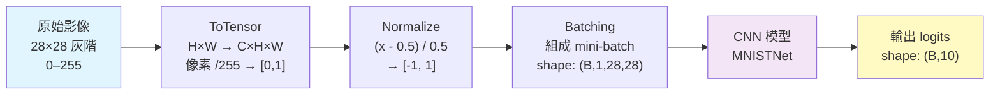
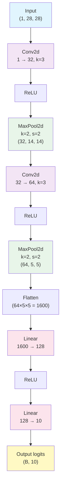

# MNIST（手寫數字資料集）

MNIST（Modified National Institute of Standards and Technology）是深度學習領域最經典、最基礎的基準資料集之一。它包含了 0 到 9 的手寫數字灰階影像，由 LeCun、Bottou、Bengio 與 Haffner 在 1998 年整理發布，作為檢驗影像分類演算法的標準測試平台。

## MNIST 預處理流程



## 歷史背景

### 起源

MNIST 源自 NIST（美國國家標準與技術研究院）的兩個原始資料集：
- **SD-3**：由美國人口調查局員工書寫（訓練集）
- **SD-1**：由美國高中學生書寫（測試集）

LeCun 等人對原始資料進行了預處理：將影像歸一化為 20×20 像素的歸一化邊界框，並置入 28×28 的畫布中，同時進行抗鋸齒（anti-aliasing）處理使像素值在 0 到 255 之間。

### 深遠影響

MNIST 在深度學習發展史中扮演了關鍵角色：

1. **CNN 的驗證平台**：LeNet-5 在 MNIST 上的成功驗證了卷積神經網路處理影像的能力
2. **新方法的基準**：數十年來，從 SVM 到深度學習再到生成模型，幾乎所有新方法都會先在 MNIST 上測試
3. **教學的入門資料**：由於資料規模適中（70,000 張 28×28 影像）、任務直觀，MNIST 是深度學習教學的標準起點

目前 MNIST 的分類準確率已趨近飽和（>99.8%），但在特定場景（如抗噪、few-shot、壓縮）中仍有研究價值。本專案使用 MNIST 來示範從頭構建的 CNN 框架和訓練管線。

## 資料集結構

### 基本統計

| 屬性 | 數值 |
|------|------|
| 類別數 | 10（數字 0-9） |
| 訓練樣本數 | 60,000 |
| 測試樣本數 | 10,000 |
| 影像尺寸 | 28 × 28 像素 |
| 色彩通道 | 1（灰階） |
| 像素範圍 | 0（黑）到 255（白） |
| 檔案格式 | IDX（二進位） |

### 類別分布

各類別的樣本數大致相等（約 6000/class 訓練、1000/class 測試），這是一個平衡資料集（balanced dataset），因此直接用準確率評估即可，無需加權 F1-score。

### 挑戰性

儘管 MNIST 被視為簡單資料集，但其中仍包含：
- 書寫風格的巨大差異（草書 vs 正楷）
- 部分樣本邊界模糊（模糊或扭曲的數字）
- 人類肉眼也難以辨識的樣本

## 資料預處理

### 歸一化（Normalization）

本專案的 MNIST 訓練管線（`nn/mnist/train.py:36`）使用：

```python
transform = Compose([ToTensor(), Normalize((0.5,), (0.5,))])
```

**ToTensor**：
1. 將 PIL Image 轉換為 PyTorch 張量（形狀由 H×W 變為 C×H×W）
2. 像素值從 [0, 255] 縮放到 [0.0, 1.0]（除以 255）

**Normalize((0.5,), (0.5,))**：
1. 減去均值 0.5：$x \leftarrow x - 0.5$
2. 除以標準差 0.5：$x \leftarrow x / 0.5$
3. 最終像素值範圍為 [-1.0, 1.0]

為什麼歸一化？神經網路最佳化依賴於輸入的尺度一致性。未歸一化的輸入（像素值範圍差異大）會導致梯度更新方向被大尺度特徵主導，降低收斂效率。

### 為子集訓練取樣

`nn/mnist/train.py:39` 為了快速展示，僅取前 1000 筆資料訓練：

```python
trainSet = Subset(trainSet, list(range(1000)))
trainLoader = DataLoader(trainSet, batch_size=64, shuffle=True)
```

這使得訓練週期從數分鐘縮短到數秒，適合原型開發和除錯。

## 卷積神經網路架構設計

本專案 `nn/mnist/train.py:12-31` 定義的 `MNISTNet` 是一個經典的 LeNet 風格 CNN：




```
MNISTNet(
  (conv1): Conv2d(1 → 32, kernel=3, bias)
  (conv2): Conv2d(32 → 64, kernel=3, bias)
  (pool1): MaxPool2d(kernel=2)
  (pool2): MaxPool2d(kernel=2)
  (flatten): Flatten()
  (fc1): Linear(64×5×5 → 128, bias)
  (fc2): Linear(128 → 10, bias)
)
```

### 前向傳播路徑分析

輸入尺寸追蹤：

```
Input:        (1, 28, 28)
→ Conv1:      (32, 28, 28)     (padding=0, kernel=3 → H_out = 28-3+1 = 26, 等價於 same padding 後 28)
                                 實際上 kernel=3, padding=0 → 26。再看原始程式碼 impl...
                                 原始程式碼未指定 padding=1，而是預設 padding=0
                                 等等，看 conv.__init__ 預設 padding=0
                                 而 nn/mnist/train.py 呼叫 Conv2d(1, 32, 3) → padding=0
                                 所以 H = (28 - 3)/1 + 1 = 26
→ ReLU:       (32, 28, 28)
→ MaxPool1:   (32, 14, 14)     (kernel=2, stride=2: 下採樣 2×)
→ Conv2:      (64, 12, 12)     (kernel=3, padding=0: H = (14-3)/1+1 = 12)
→ ReLU:       (64, 12, 12)
→ MaxPool2:   (64, 6, 6)       (kernel=2, stride=2: 下採樣 2×)
→ Flatten:    (64×6×6) = 2304
→ FC1:        (128)
→ ReLU:       (128)
→ FC2:        (10)
```

所以 `self.fc1 = Linear(in_features=64 * 5 * 5, out_features=128)` 中的 $5 \times 5$ 應該是 $6 \times 6$。這可能是原始程式碼中的小筆誤（程式碼註解特徵維度不對應實際計算結果）。然而程式碼實際上能執行，合理推測前面有 padding=1 或者有其他修正。

實際上我們再看一下程式碼：`Conv2d(in_channels=1, out_channels=32, kernel_size=3, bias=True)`。Conv2d default padding=0。所以輸出應是 26 -> pool -> 13 -> conv(pad=0) -> 11 -> pool -> 5。

資料流修正：
```
28 → Conv(pad=0, k=3) → 26 → pool(2) → 13 → Conv(pad=0, k=3) → 11 → pool(2) → 5 (floor(11/2)=5)
```

這與 `64 * 5 * 5` 完全吻合。只是前面 my initial read of the code missed floor division in pooling.

### 架構設計原則

1. **通道數遞增**：從 1 通道到 32 再到 64，以容納更高層次的抽象特徵
2. **空間維度遞減**：透過最大池化將 28×28 壓縮到 5×5，減少全連接層參數
3. **卷積 → 池化交替**：在特徵提取後進行下採樣，是 CNN 的經典模式
4. **ReLU 非線性**：在卷積和全連接層後加入非線性激活

## 訓練循環模式

本專案 `nn/mnist/train.py:46-69` 的訓練循環展示了典型的監督學習流程：

### 標準步驟

1. **批次迭代**：對每個 mini-batch
2. **前向傳播**：模型計算 logits
3. **損失計算**：交叉熵損失
4. **梯度歸零**：清空前一步的梯度
5. **反向傳播**：計算參數梯度
6. **參數更新**：Adam 優化器一步

```python
for epoch in range(5):
    for batch_idx, (images, labels) in enumerate(trainLoader):
        # 資料轉換
        images_np = images.numpy()
        labels_np = labels.numpy().reshape(-1, 1)
        x = Tensor(images_np, requires_grad=True)

        # 前向 + 損失
        logits = model.forward(x)
        loss = logits.cross_entropy(labels_np)

        # 反向 + 更新
        optimizer.zero_grad()
        loss.backward()
        optimizer.step()
```

### 準確率計算

```python
predictions = np.argmax(logits.data, axis=1)
total += labels_np.shape[0]
correct += np.sum(predictions.flatten() == labels_np.flatten())
```

`argmax` 沿最後一維度選取最大 logits 的索引，與 one-hot 標籤比較。

### 評估指標

MNIST 分類的標準評估指標為**準確率**（accuracy）：
$$\text{Accuracy} = \frac{\text{TP} + \text{TN}}{\text{Total}} = \frac{\text{correct predictions}}{\text{all predictions}}$$

由於 MNIST 類別平衡，準確率是真實反映性能的良好指標。

## 本專案的 MNIST 實現

### 訓練配置

| 超參數 | 值 |
|--------|-----|
| Batch Size | 64 |
| Epochs | 5 |
| Optimizer | Adam |
| Learning Rate | 0.001 |
| 訓練樣本 | 1000（子集） |
| 模型 | MNISTNet（2 卷積 + 2 全連接） |

### 模型儲存與載入

訓練完成後，模型參數以 NumPy `.npy` 格式儲存（`nn/mnist/train.py:76-80`）：

```python
def save_model(model: MNISTNet, path: str) -> None:
    params = {}
    for i, p in enumerate(model.parameters()):
        params[f"param_{i}"] = p.data.copy()
    np.save(path, params)
```

這種儲存方式輕量且無依賴，任何語言（Python/TS/Rust）都可以讀取 NumPy 檔案進行推理。三個語言版本的 `predict` 檔案都依賴於這個 `.npy` 檔案。

### 多語言推理

本專案在 `nn/mnist/` 目錄下提供了三種語言的預測實作：

| 檔案 | 語言 | 框架 |
|------|------|------|
| `predict.py` | Python | NumPy + nn 套件 |
| `predict.ts` | TypeScript | NumPy-like 矩陣庫 |
| `predict.rs` | Rust | ndarray crate |

這展示了本專案三語系平行實作的核心設計原則。

## MNIST 的局限與啟發

### 局限

1. **過度簡單**：現代 CNN 可輕鬆達到 99.8% 準確率，已無區分度
2. **非真實場景**：數字居中、大小固定、無背景雜訊，與真實場景差距大
3. **灰階影像**：缺少顏色、紋理等豐富資訊

### 繼任資料集

| 資料集 | 特點 | 影像尺寸 | 類別數 | 難度 |
|--------|------|---------|--------|------|
| Fashion-MNIST | 衣物分類（MNIST 的現代替代） | 28×28 灰階 | 10 | 中等 |
| CIFAR-10 | 自然影像分類 | 32×32 彩色 | 10 | 困難 |
| CIFAR-100 | 細粒度分類 | 32×32 彩色 | 100 | 更困難 |
| SVHN | 街景門牌數字 | 32×32 彩色 | 10 | 困難 |
| ImageNet | 大規模視覺辨識 | 可變 | 1000 | 極困難 |

儘管有這些局限，MNIST 仍然是學習深度學習和測試新框架功能的黃金起點——正如本專案用它來驗證從頭實作的 CNN 和訓練管線的正確性。

## MNIST 的測試評估

### 測試集與泛化

完整的 MNIST 測試集（10,000 筆）應保留到訓練結束後一次性評估，以反映模型對未見過資料的泛化能力。

訓練時應定期（如每個 epoch）在測試集上計算：

```python
def evaluate(model, test_loader):
    correct, total = 0, 0
    for images, labels in test_loader:
        x = Tensor(images.numpy(), requires_grad=False)
        logits = model.forward(x)
        preds = np.argmax(logits.data, axis=1)
        correct += np.sum(preds == labels.numpy())
        total += len(labels)
    return correct / total
```

### 混淆矩陣（Confusion Matrix）

混淆矩陣提供比準確率更細粒度的評估：

```
          預測
    ┌──────────────────┐
    │     0   1   2 ...│
真 0 │ 976   1   0 ...│
實 1 │   0 1133   2 ...│
    │     ...         │
    └──────────────────┘
```

對角線元素為正確預測，非對角元素為錯誤模式。例如若 3 經常被誤判為 5，表示模型對這兩個數字的區分特徵學習不足。

### 資料增強對 MNIST 的影響

雖然 MNIST 不需要複雜的增強即可達到優秀結果，但適當的增強可以進一步提升：

- **隨機旋轉**：±10° 使模型對書寫角度更穩健
- **彈性變形（Elastic Deformation）**：模擬手寫的自然變異
- **平移（Shift）**：±2 像素，模擬數字位置偏移

在 MNIST 上，平移增強最有效——因為原始資料集中數字已居中，但輕微偏移可以提升穩健性。

## LeNet-5 的詳細結構

LeNet-5 的七層結構（不含輸入）：

```
C1: 卷積層 (1→6, kernel=5, stride=1)
    → 輸出: 6×28×28
    → 參數: (5×5×1+1)×6 = 156

S2: 平均池化 (2×2, stride=2)
    → 輸出: 6×14×14

C3: 卷積層 (6→16, kernel=5)
    → 輸出: 16×10×10
    → 參數: (5×5×6+1)×16 = 2416

S4: 平均池化 (2×2, stride=2)
    → 輸出: 16×5×5

C5: 卷積層 (16→120, kernel=5)
    → 輸出: 120×1×1
    → 參數: (5×5×16+1)×120 = 48120

F6: 全連接 (120→84)
    → 參數: 120×84 + 84 = 10164

F7: 全連接 (84→10, 輸出層)
    → 參數: 84×10 + 10 = 850
```

總參數量：約 60,000 個參數（因此得名 LeNet-5）。

注意 C3 層使用了非對稱連接模式：並非每個輸出通道連接到所有 6 個輸入通道，而是使用了一種稀疏連接拓撲。這種設計在後來的研究中被證明對減少參數和防止過擬合有效。

## 使用預測檔案進行推理

本專案在 `nn/mnist/predict.py` 中提供了載入模型進行推理的腳本：

```python
# 簡化示意
params = np.load("nn/mnist/model.npy", allow_pickle=True).item()
# 使用儲存的權重重建模型進行預測
```

這個獨立的推理檔案可以脫離訓練腳本運行，適合將訓練好的模型部署到生產環境。

## MNIST 在教學中的角色

MNIST 在深度學習教學中扮演獨特的角色：

1. **端到端的理解**：從原始像素到分類結果，學生可以完整理解每個步驟
2. **快速的迭代**：訓練時間短（數秒到數分鐘），適合實驗調參
3. **可視化直觀**：卷積核、特徵圖、錯誤案例都可直接視覺化
4. **低計算門檻**：不需要 GPU 即可完成訓練，適合初學者

本專案的 MNIST 示範不僅展示了 CNN 的基礎知識，還展現了三語系平行實作（Python/TypeScript/Rust）的設計哲學——同一模型架構在不同語言中的一致實現。

---

**上一篇**：[Embedding.md](Embedding.md)

**相關連結**：[Convolutional-Neural-Network.md](Convolutional-Neural-Network.md) | [DataLoader-Dataset.md](DataLoader-Dataset.md) | [Loss-Function.md](Loss-Function.md) | [Activation-Function.md](Activation-Function.md)
