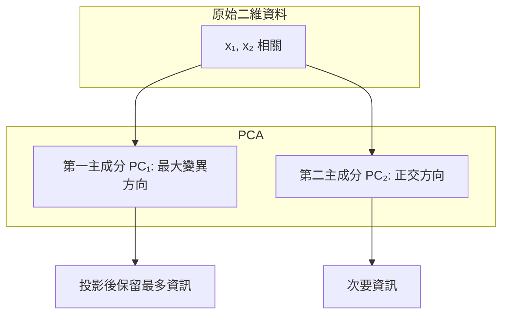
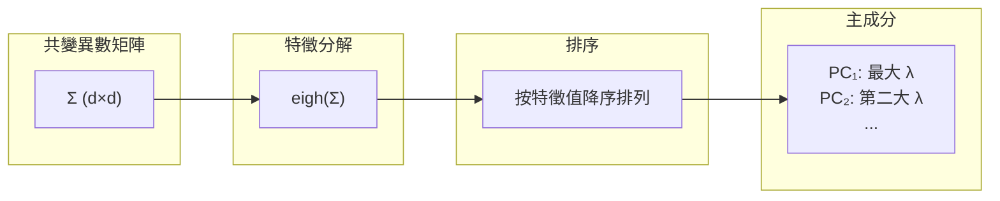
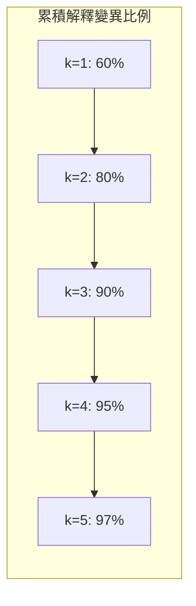
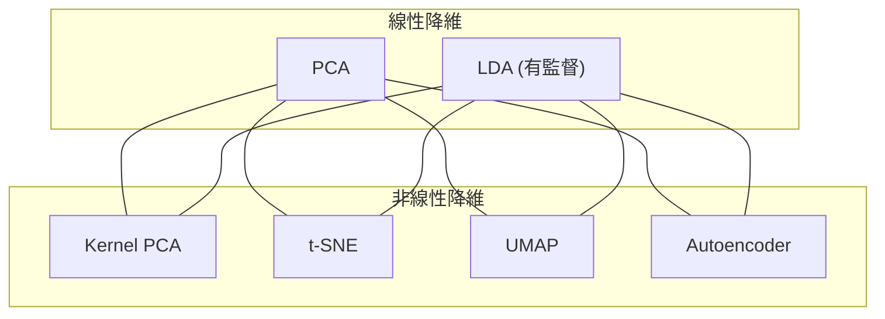

# PCA（主成分分析）

主成分分析 (Principal Component Analysis, PCA) 是最廣泛使用的線性降維 (dimensionality reduction) 技術。它透過正交變換將原始特徵轉換為一系列線性不相關的新特徵——主成分 (principal components)——這些新特徵按照解釋變異量的大小排序。

## 核心思想

PCA 的目標有兩個等價的表述：

### 最大變異視角
找到一個方向（單位向量）$w_1$，使得投影後的資料 $X w_1$ 的變異數最大：

$$w_1 = \arg\max_{\|w\|=1} \text{Var}(X w) = \arg\max_{\|w\|=1} w^T \Sigma w$$

其中 $\Sigma$ 為資料的共變異數矩陣 (covariance matrix)。



### 最小重建誤差視角
找到一個 $k$ 維子空間，使得原始資料投影到該子空間後的重建誤差（投影距離平方和）最小。

這兩個視角在數學上等價。

## 共變異數矩陣（Covariance Matrix）

給定中心化的 (centered) 資料矩陣 $X \in \mathbb{R}^{N \times d}$（每列為一個樣本，每行已減去均值），共變異數矩陣為：

$$\Sigma = \frac{1}{N-1} X^T X \in \mathbb{R}^{d \times d}$$

$\Sigma_{ij}$ 表示第 $i$ 個特徵與第 $j$ 個特徵的共變異數。

## 特徵分解（Eigendecomposition）

PCA 的核心是對共變異數矩陣進行特徵分解：

$$\Sigma v_i = \lambda_i v_i$$

其中 $v_i$ 為第 $i$ 個特徵向量 (eigenvector)，$\lambda_i$ 為對應的特徵值 (eigenvalue)。

### 主成分的幾何意義

- 特徵向量 $v_i$ 定義了主成分的方向（即投影方向）
- 特徵值 $\lambda_i$ 等於資料在該方向上的變異數：$\text{Var}(X v_i) = \lambda_i$
- 特徵值越大，該主成分「解釋」的變異越多
- 所有特徵向量互相正交 ($v_i^T v_j = 0$ for $i \neq j$)



### 演算法步驟

```
1. 對資料中心化：X_centered = X - mean(X)
2. 計算共變異數矩陣：Σ = (1/N) X_centered^T X_centered
3. 對 Σ 進行特徵分解
4. 按特徵值降序排列特徵向量
5. 選取前 k 個特徵向量作為主成分
6. 將資料投影到 k 維子空間：Z = X_centered · W_k
```

本專案 `ml/decomposition.py:PCA` 的實作：

```python
def fit(self, X):
    self.mean = np.mean(X, axis=0)
    X_centered = X - self.mean
    cov = np.cov(X_centered, rowvar=False)
    eigenvalues, eigenvectors = np.linalg.eigh(cov)
    idx = np.argsort(eigenvalues)[::-1]
    eigenvalues = eigenvalues[idx]
    eigenvectors = eigenvectors[:, idx]
    if self.n_components is not None:
        eigenvectors = eigenvectors[:, :self.n_components]
    self.components = eigenvectors.T
    self.explained_variance = eigenvalues[:self.n_components]
    return self
```

注意使用 `np.linalg.eigh`（專為對稱矩陣設計，更高效穩定）而非 `np.linalg.eig`。

## 解釋變異比例（Explained Variance Ratio）

第 $i$ 個主成分解釋的變異比例為：

$$r_i = \frac{\lambda_i}{\sum_{j=1}^d \lambda_j}$$

前 $k$ 個主成分的累積解釋變異比例為：

$$R_k = \frac{\sum_{i=1}^k \lambda_i}{\sum_{j=1}^d \lambda_j}$$

### 選擇主成分數量

常見的選擇策略：

1. **固定比例法**：取前 $k$ 個主成分使 $R_k \geq 0.95$（解釋 95% 的變異）
2. **峭壁圖 (Scree Plot)**：繪製 $\lambda_i$ vs $i$，找拐點
3. **Kaiser 準則**：保留特徵值 $\lambda_i > 1$ 的主成分（對標準化資料）
4. **交叉驗證**：在下游任務上評估不同 $k$ 的表現



## 資料白化（Data Whitening）

白化 (whitening) 是 PCA 的一個延伸，使得變換後的資料滿足：
1. 各維度不相關（共變異數矩陣為對角矩陣）
2. 各維度變異數為 1

$$
Z_{\text{whiten}} = X_{\text{centered}} \cdot W \cdot \Lambda^{-1/2}
$$

其中 $\Lambda = \text{diag}(\lambda_1, ..., \lambda_k)$ 為特徵值矩陣。

白化後的資料適合用於 ICA 或作為神經網路的前處理。

## 重建誤差（Reconstruction Error）

將降維後的資料投影回原始空間：

$$\hat{X} = Z \cdot W_k^T + \bar{x}$$

重建誤差為原始資料與重建資料的差異：

$$E_{\text{recon}} = \frac{1}{N} \|X - \hat{X}\|_F^2 = \sum_{i=k+1}^d \lambda_i$$

即重建誤差等於被捨棄的 $d-k$ 個主成分的特徵值之和。

## PCA 與 SVD 的關係

PCA 與奇異值分解 (Singular Value Decomposition, SVD) 有密切關係。給定中心化資料矩陣 $X \in \mathbb{R}^{N \times d}$（通常 $N > d$），SVD 分解為：

$$X = U \Sigma V^T$$

其中：
- $U \in \mathbb{R}^{N \times N}$：左奇異向量
- $\Sigma \in \mathbb{R}^{N \times d}$：對角線為奇異值 $\sigma_i$
- $V \in \mathbb{R}^{d \times d}$：右奇異向量

### 與 PCA 的對應關係

| SVD 成分 | PCA 對應 |
|----------|----------|
| 右奇異向量 $V$ | 主成分方向（特徵向量） |
| 奇異值 $\sigma_i$ | $\sigma_i^2 = N \cdot \lambda_i$ |
| $U \Sigma$ | 主成分分數 (principal component scores) |

在數值計算中，直接對 $X$ 做 SVD 比對 $\Sigma$ 做特徵分解更穩定（避免計算 $X^T X$ 時的平方損失精度）。

## 優點與限制

### 優點
- **無參數**：無需調整超參數（只需選擇 $k$）
- **去相關**：主成分之間正交不相關
- **降噪**：捨棄小變異方向等於濾除雜訊
- **可視化**：降至 2D/3D 便於資料探索
- **計算效率高**：有成熟的數值線性代數演算法

### 限制
- **線性假設**：只能捕捉線性關係，無法處理非線性流形（需用 Kernel PCA、t-SNE、UMAP）
- **全域結構**：所有主成分都是全域的，忽略局部結構
- **可解釋性差**：主成分是原始特徵的線性組合，物理意義不明確
- **對尺度敏感**：未標準化時，變異數大的特徵主導結果
- **離群值敏感**：離群值會顯著影響共變異數矩陣



## 應用場景

- **資料可視化**：高維資料降至 2D/3D 進行探索
- **壓縮與儲存**：用少量主成分近似原始資料
- **降噪**：只保留主要主成分，過濾小變異的雜訊
- **特徵工程**：減少特徵數避免維度災難
- **多共線性處理**：主成分正交，消除共線性
- **臉部辨識**：特徵臉 (eigenfaces) 方法，將人臉投影到「臉部主成分」空間

## 與其他降維方法的比較

| 方法 | 類型 | 保留結構 | 計算複雜度 | 可解釋性 |
|------|------|----------|------------|----------|
| PCA | 線性 | 全域變異 | $O(Nd^2)$ | 中 |
| t-SNE | 非線性 | 局部鄰域 | $O(N^2)$ | 低 |
| UMAP | 非線性 | 局部+全域拓撲 | $O(N \log N)$ | 低 |
| LDA | 線性有監督 | 類別分離 | $O(Nd^2)$ | 中 |
| Autoencoder | 非線性 | 重建 | 依網路大小 | 低 |

---

**上一篇**：[KMeans.md](KMeans.md)

**相關連結**：[StandardScaler.md](StandardScaler.md) | [KMeans.md](KMeans.md) | [Train-Test-Split.md](Train-Test-Split.md)
