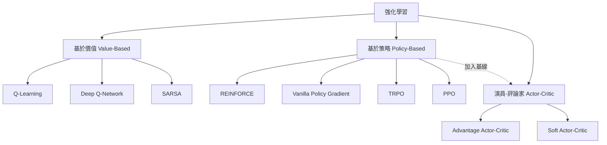

# Policy Gradient（策略梯度）

策略梯度（policy gradient）是強化學習中一類重要的方法，與 Q-Learning 這類基於價值函數（value-based）的方法不同，它直接對策略（policy）進行參數化，並透過梯度上升（gradient ascent）最大化期望累積獎勵。

## 為什麼需要策略梯度

基於價值函數的方法（如 Q-Learning）透過學習動作價值函數 Q(s,a) 來間接決定策略。這種路徑有二個根本限制：

1. **連續動作空間**：Q(s,a) 需要對每個動作計算最大值，當動作空間連續時（0.1、0.01、0.001...）無法窮舉。
2. **確定性策略**：argmax 操作天然產生確定性策略，難以處理需要隨機策略的問題（如不完全資訊賽局、對抗性環境）。
3. **間接最佳化**：Q 函數的微小誤差可能導致策略顯著偏離最優解。

策略梯度直接優化策略本身，天然避免了上述問題。它的優化目標非常直接：

$$J(\theta) = \mathbb{E}_{\pi_\theta} \left[ \sum_{t=0}^\infty \gamma^t r_t \right]$$

我們希望找到參數 $\theta$ 使目標函數 $J(\theta)$ 最大化。

## 策略參數化

策略 $\pi(a|s;\theta)$ 是一個條件機率分布，描述在狀態 $s$ 下選擇動作 $a$ 的機率。最常見的參數化方式是使用類神經網路（neural network）作為函數逼近器：

- **離散動作**：輸出層使用 softmax 激活，產生各動作的機率。
- **連續動作**：輸出高斯分布的均值和變異數 $\mu(s;\theta), \sigma(s;\theta)$。

以本專案 `world/examples/cartpole_vpg.py` 為例，策略網路是一個三層全連接網路：

```python
self.policy_net = nn.Sequential(
    nn.Linear(4, 128),   # 輸入：cartpole 的 4 維狀態
    nn.ReLU(),
    nn.Linear(128, 64),
    nn.ReLU(),
    nn.Linear(64, 2),    # 輸出：2 個動作（左/右）的 logits
    nn.Softmax(dim=1)    # 轉為機率分布
)
```

這裡 $\theta$ 包含所有權重和偏置，softmax 確保輸出形成合法的機率分布：

$$\pi(a|s;\theta) = \frac{\exp(z_a)}{\sum_{a'} \exp(z_{a'})}$$

其中 $z = f_\theta(s)$ 是網路最後一層的 logits 輸出。

## 策略梯度定理

策略梯度定理（Policy Gradient Theorem，Sutton et al., 1999）是整個方法家族的理論基石。它給出了目標函數對策略參數的梯度表達式：

$$\nabla_\theta J(\theta) = \mathbb{E}_{\pi_\theta} \left[ \nabla_\theta \log \pi_\theta(a|s) \cdot Q^{\pi_\theta}(s,a) \right]$$

### 推導直覺

從基本定義出發：

$$J(\theta) = \sum_{s} d^{\pi_\theta}(s) \sum_a \pi_\theta(a|s) \cdot Q^{\pi_\theta}(s,a)$$

其中 $d^{\pi_\theta}(s)$ 是策略 $\pi_\theta$ 下的平穩分布（stationary distribution）。直接對 $\theta$ 微分會遇到一個問題：$d^{\pi_\theta}(s)$ 也依賴於 $\theta$，但計算這個依賴幾乎是不切實際的。

策略梯度定理的優美之處在於：**完全不需要對狀態分布微分**。梯度可以僅透過 $\nabla_\theta \log \pi_\theta(a|s)$ 來表達，這使得計算變得可行。

### 得分函數（Score Function）

$\nabla_\theta \log \pi_\theta(a|s)$ 被稱為**得分函數**（score function），它也來自一個經典的恆等式：

$$\mathbb{E}_{x \sim p_\theta} \left[ \nabla_\theta \log p_\theta(x) \right] = 0$$

這個等式可以用來推導許多梯度估計方法，不限於強化學習，在變分推斷（variational inference）中也扮演關鍵角色。

## REINFORCE 演算法

REINFORCE（Williams, 1992），也稱為蒙地卡羅策略梯度（Monte Carlo Policy Gradient），是最簡單直接的政策梯度方法。

### 核心思想

使用完整回合（episode）的回報 $G_t = \sum_{k=0}^{T-t} \gamma^k r_{t+k}$ 來近似 $Q^{\pi_\theta}(s_t, a_t)$：

$$G_t = r_t + \gamma r_{t+1} + \gamma^2 r_{t+2} + \cdots + \gamma^{T-t} r_T$$

梯度估計變為：

$$\nabla_\theta J(\theta) \approx \sum_{t=0}^T G_t \cdot \nabla_\theta \log \pi_\theta(a_t|s_t)$$

直覺上：如果 $G_t > 0$，增加 $\log \pi(a_t|s_t)$（讓該動作更可能發生）；反之則減少。

### 演算法步驟

```
1. 初始化策略參數 θ
2. 對於每個回合：
   a. 根據 π_θ 生成完整回合 {s_0, a_0, r_1, s_1, a_1, r_2, ..., s_T}
   b. 對每個時間步 t，計算折扣回報 G_t
   c. 計算梯度 ∇_θ log π_θ(a_t|s_t) · G_t
   d. θ ← θ + α · (梯度總和)
```

### 本專案中的實現

`world/examples/cartpole_vpg.py` 中的 `VPGAgent.learn()` 方法實現了完整的 REINFORCE：

```python
# 計算折扣回報
discounts = torch.pow(self.gamma, torch.arange(T, dtype=torch.float))
discounted_returns = (discounts * rewards).flip(0).cumsum(0).flip(0)

# 歸一化
discounted_returns = (discounted_returns - discounted_returns.mean()) \
                   / (discounted_returns.std() + 1e-8)

# 計算 log 機率與 loss
all_probs = self.policy_net(states)
log_probs = torch.log(
    torch.gather(all_probs, 1, actions.unsqueeze(1)).squeeze(1)
)
loss = -(discounted_returns * log_probs).mean()
```

## 回報歸一化（Return Normalization）

原始的 REINFORCE 使用 $G_t$ 直接加權，但 $G_t$ 的絕對值會隨任務而變化。一個有力的改良是**歸一化回報**：

$$G_t^{\text{norm}} = \frac{G_t - \mu(G)}{\sigma(G) + \epsilon}$$

這個簡單的調整帶來了兩個好處：

1. **梯度大小穩定**：無論任務的獎勵尺度如何，梯度保持可控範圍。
2. **自然基線**：歸一化後，低於平均的回報得到負權重，高於平均得到正權重，相當於自動引入了 baseline。

典型 $\epsilon$ 取 $10^{-8}$ 防止除以零。在 cartpole_vpg.py 第 83 行可以看到這個處理。

## 基線減法（Baseline Subtraction）

更一般地，我們可以引入一個基線函數 $b(s)$ 來減少梯度估計的變異數：

$$\nabla_\theta J(\theta) = \mathbb{E}_{\pi_\theta} \left[ \nabla_\theta \log \pi_\theta(a|s) \cdot \left( Q^{\pi_\theta}(s,a) - b(s) \right) \right]$$

只要 $b(s)$ 不依賴於動作 $a$，這個減法不會引入偏差（bias），因為：

$$\mathbb{E}_a \left[ \nabla_\theta \log \pi_\theta(a|s) \cdot b(s) \right] = b(s) \cdot \mathbb{E}_a \left[ \nabla_\theta \log \pi_\theta(a|s) \right] = 0$$

常見的基線選擇：
- 常數基線：$b$ = 所有回報的平均
- 狀態價值函數：$b(s) = V^{\pi_\theta}(s)$，這讓權重變為優勢函數 $A(s,a) = Q(s,a) - V(s)$
- 學習得到的基線：使用另一個神經網路估計 $V(s)$

當基線為 $V(s)$ 時，演算法就過渡到**演員-評論家（Actor-Critic）**架構。

## 與基於價值函數方法的比較



| 特性 | 策略梯度 | Q-Learning |
|------|---------|------------|
| 動作空間 | 離散和連續 | 主要離散（連續需特殊處理） |
| 策略類型 | 天然隨機 | 確定性（argmax） |
| 收斂性 | 保證局部最優 | 需要函數逼近時不保證 |
| 樣本效率 | 低（on-policy） | 高（off-policy） |
| 梯度使用 | 直接策略梯度 | 透過 TD 誤差間接更新 |
| 穩定性 | 較穩定 | 可能發散（尤其是 DQN） |

## 高階變體

### TRPO（Trust Region Policy Optimization）

Schulman et al., 2015 提出使用 KL 散度（Kullback-Leibler divergence）約束每次更新的策略變化幅度，保證單調改善：

$$\max_\theta \mathbb{E} \left[ \frac{\pi_\theta(a|s)}{\pi_{\theta_\text{old}}(a|s)} A^{\pi_{\theta_\text{old}}}(s,a) \right]$$

$$\text{s.t. } \mathbb{E} \left[ D_{KL}(\pi_{\theta_\text{old}} \| \pi_\theta) \right] \leq \delta$$

### PPO（Proximal Policy Optimization）

TRPO 計算複雜度高（需要共軛梯度求解），PPO（Schulman et al., 2017）使用更簡單的裁剪（clipping）目標函數：

$$L^{\text{CLIP}}(\theta) = \mathbb{E} \left[ \min \left( r_t(\theta) A_t, \text{clip}(r_t(\theta), 1-\epsilon, 1+\epsilon) A_t \right) \right]$$

其中 $r_t(\theta) = \frac{\pi_\theta(a_t|s_t)}{\pi_{\theta_\text{old}}(a_t|s_t)}$ 是重要性取樣比率（importance sampling ratio）。

PPO 是目前深度強化學習的預設演算法，兼具穩定性、效能和實現簡單的優點。

## 策略梯度的變異數問題

策略梯度估計器的一個主要問題是**高變異數（high variance）**。這可以從梯度表達式看出：

$$\nabla_\theta J(\theta) = \mathbb{E}\left[ \nabla_\theta \log \pi_\theta(a|s) \cdot G_t \right]$$

回報 $G_t$ 的變異數直接乘到了梯度上。由於 $G_t$ 是多步隨機變數的總和（包括策略隨機性、環境轉移隨機性），它的變異數通常很大。

### 減小變異數的策略

1. **基線減法**：減去與動作無關的基線 $b(s)$，不改變期望但降低變異數。
2. **回報歸一化**：標準化 $G_t$ 使梯度大小可控。
3. **使用優勢函數**：$A(s,a) = Q(s,a) - V(s)$ 取代 $G_t$，這是 Actor-Critic 的核心思想。
4. **多步 TD**：使用 $n$ 步回報代替完整回報，平衡偏差與變異數。
5. **GAE（Generalized Advantage Estimation）**：Schulman et al., 2016 提出使用指數加權的平均 $n$ 步優勢估計，在偏差-變異數權衡上提供了平滑的控制參數 $\lambda$。

### 偏差-變異數權衡

```mermaid
graph LR
    subgraph 回報估計
        MC[蒙特卡羅 G_t\n無偏差, 高變異數]
        TD[TD(0) δ_t\n有偏差, 低變異數]
        NSTEP[n-step 回報\n可調控權衡]
        GAE[GAE(λ)\n平滑權衡]
    end
    MC -->|λ=1| GAE
    TD -->|λ=0| GAE
```

## 高斯策略（連續動作）

對於連續動作空間，策略通常參數化為高斯分布（Gaussian distribution）：

$$\pi(a|s;\theta) = \mathcal{N}\left( \mu_\theta(s), \sigma_\theta^2(s) \right)$$

其中 $\mu_\theta(s)$ 是均值網路，$\sigma_\theta(s)$ 是標準差網路（通常輸出 $\log \sigma$ 以保證正值）。

得分函數在這種情況下有閉合形式：

$$\nabla_\theta \log \pi(a|s;\theta) = \frac{(a - \mu_\theta(s))}{\sigma_\theta^2(s)} \cdot \nabla_\theta \mu_\theta(s) + \left( \frac{(a - \mu_\theta(s))^2}{\sigma_\theta^2(s)} - 1 \right) \frac{\nabla_\theta \sigma_\theta(s)}{\sigma_\theta(s)}$$

## 梯度計算的冷知識

## 自然梯度與 TRPO

標準的策略梯度使用歐幾里得距離（Euclidean distance）來衡量參數更新的大小，但參數空間的距離與分布空間的距離並不一致。一個微小的參數變動可能在某些方向完全改變策略行為，在其他方向卻幾乎無影響。

**自然梯度（Natural Gradient）**（Amari, 1998）使用 Fisher 資訊矩陣來衡量參數更新的「真實」大小：

$$\tilde{\nabla}_\theta J(\theta) = F(\theta)^{-1} \nabla_\theta J(\theta)$$

其中 Fisher 資訊矩陣 $F(\theta)$ 定義為：

$$F(\theta) = \mathbb{E}_{s \sim d^{\pi_\theta}, a \sim \pi_\theta} \left[ \nabla_\theta \log \pi_\theta(a|s) \cdot \nabla_\theta \log \pi_\theta(a|s)^T \right]$$

TRPO（Trust Region Policy Gradient）使用 KL 散度約束來近似自然梯度，確保每次更新不會使策略分布劇烈變化：

$$\max_\theta \mathbb{E} \left[ \frac{\pi_\theta(a|s)}{\pi_{\theta_\text{old}}(a|s)} A^{\pi_{\theta_\text{old}}}(s,a) \right] - \beta \cdot D_{KL}(\pi_{\theta_\text{old}} \| \pi_\theta)$$

## 本專案中的相關程式碼

---

**相關連結**：[Reinforcement-Learning.md](Reinforcement-Learning.md) | [Q-Learning.md](Q-Learning.md) | [SARSA.md](SARSA.md) | [CartPole-Environment.md](CartPole-Environment.md)
