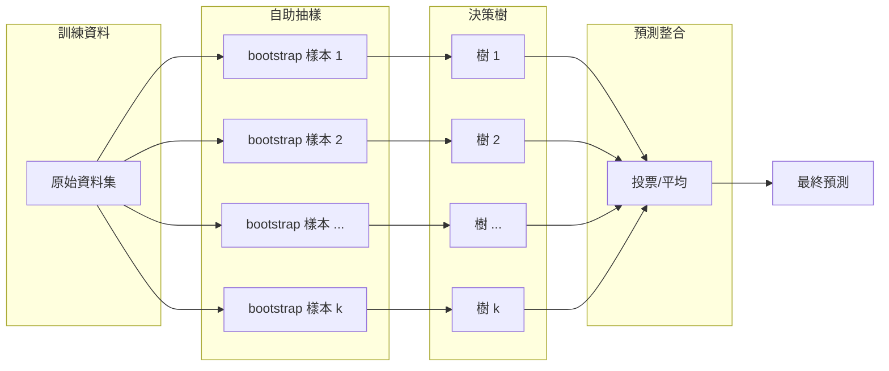
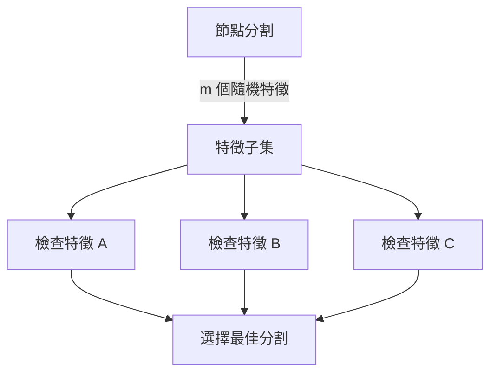
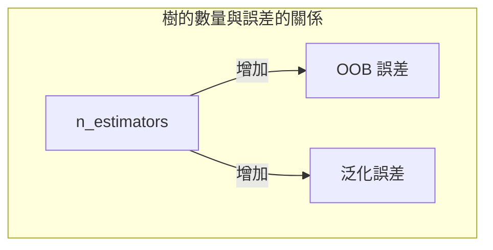

# Random Forest（隨機森林）

隨機森林 (random forest) 是一種基於決策樹的集成學習 (ensemble learning) 方法，由 Leo Breiman 在 2001 年正式提出。它結合了自助聚合 (bagging) 和隨機特徵子空間 (random subspace) 兩種核心技術，顯著降低了單一決策樹的變異數 (variance)，同時保持較低的偏誤 (bias)。

## 集成學習（Ensemble Learning）

集成學習的核心思想是「群眾的智慧」：組合多個弱學習器 (weak learners) 形成一個強學習器 (strong learner)。



### Bagging vs Boosting

| 特性 | Bagging (隨機森林) | Boosting (XGBoost/LightGBM) |
|------|--------------------|---------------------------|
| 訓練方式 | 並行建樹，獨立訓練 | 序列建樹，每棵樹修正前一棵的誤差 |
| 偏差-變異數 | 主要降低變異數 | 同時降低偏差和變異數 |
| 對離群值 | 較魯棒 | 較敏感 |
| 過擬合風險 | 較低 | 較高（需更多正則化） |

## 自助聚合（Bootstrap Aggregation, Bagging）

Bagging 分為兩個步驟：

### 1. 自助抽樣（Bootstrap Sampling）

從原始資料集 $D$ 中有放回地隨機抽取 $N$ 個樣本（$N$ 為原始樣本數），形成一個 bootstrap 樣本。由於是有放回抽樣，每個 bootstrap 樣本中約包含原始資料 63.2% 的樣本（其餘為重複），剩下的 36.8% 稱為**袋外樣本 (Out-of-Bag, OOB samples)**。

數學上，任一樣本不被選中的機率：

$$P(\text{不被選中}) = \left(1 - \frac{1}{N}\right)^N \xrightarrow{N \to \infty} \frac{1}{e} \approx 0.368$$

因此 OOB 樣本比例約為 36.8%。

### 2. 聚合（Aggregation）

- **分類**：多數投票 (majority voting)
- **迴歸**：平均 (averaging)

本專案 `ml/ensemble.py:RandomForest` 的實作：

```python
def predict(self, X):
    predictions = np.array([tree.predict(X) for tree in self.trees])
    if self.is_classification:
        majority_votes = np.apply_along_axis(
            lambda x: np.bincount(x.astype(int)).argmax(), 0, predictions)
        return majority_votes
    return np.mean(predictions, axis=0)
```

## 隨機子空間（Random Subspace / Feature Randomness）

隨機森林在 Bagging 的基礎上增加了第二層隨機性：在每個節點分割時，僅從隨機選取的特徵子集中選擇最佳分割。

### 為什麼需要特徵隨機性？

如果資料中存在非常強的特徵，則 Bagging 產生的所有決策樹都會在根節點使用該特徵，導致樹之間的相關性很高。集成方法的效果依賴於基學習器之間的**多樣性 (diversity)**。

透過限制每個節點可用的特徵數量，讓較弱的特徵也有機會被選中，增加樹的多樣性，從而降低集成的整體變異數。



### 特徵子集大小 m

- **分類**：通常 $m = \sqrt{d}$（$d$ 為總特徵數）
- **迴歸**：通常 $m = d/3$ 或 $m = d$

## Out-of-Bag 誤差（OOB Error）

每棵樹都有約 36.8% 的樣本未被用於訓練，這些袋外樣本可作為該樹的驗證集。對每個樣本 $i$，使用所有未包含該樣本的樹進行預測，聚合後得到的誤差即為 OOB 誤差。

OOB 誤差的優點：
- 無需額外的驗證集
- 近似交叉驗證的結果
- 在訓練過程中免費獲得

OOB 誤差通常會略微高估泛化誤差，但仍是非常有效的無偏估計。

## 變異數降低的數學直覺

假設 $T$ 棵決策樹，每棵樹的變異數為 $\sigma^2$，兩樹之間的相關係數為 $\rho$。

Bagging 集成的變異數：

$$\text{Var}\left(\frac{1}{T} \sum_{t=1}^T f_t(x)\right) = \frac{1}{T^2} \left( \sum_{t=1}^T \sigma^2 + 2 \sum_{i < j} \rho \sigma^2 \right)$$

$$= \frac{\sigma^2}{T} + \frac{T-1}{T} \rho \sigma^2 \approx \rho \sigma^2 + \frac{1-\rho}{T} \sigma^2$$

當 $T \to \infty$ 時，變異數收斂至 $\rho \sigma^2$。因此：

- 降低 $\sigma^2$：單棵樹的變異數（透過 Bagging 的隨機性）
- 降低 $\rho$：樹間的相關性（透過特徵隨機性）

這就是隨機森林同時使用 Bagging 和隨機子空間的原因。

## 偏差（Bias）

隨機森林的偏差與單棵決策樹大致相同（略高，因為隨機子空間限制可能錯過最佳分割）。集成主要降低變異數而非偏差，這與 Boosting 方法不同。

## 超參數

### 主要超參數

| 參數 | 用途 | 典型值 |
|------|------|--------|
| `n_estimators` | 樹的數量 | 100~1000 |
| `max_depth` | 樹的最大深度 | 10~30 或不限制 |
| `min_samples_split` | 節點分裂最小樣本數 | 2~10 |
| `min_samples_leaf` | 葉節點最小樣本數 | 1~5 |
| `max_features` | 每個節點考慮的特徵數 | $\sqrt{d}$ 或 $d/3$ |
| `bootstrap` | 是否使用自助抽樣 | True |

### n_estimators 的影響



- 更多的樹：降低變異數，穩定預測
- 收益遞減：超過一定數量後，增加樹的回報很小
- 計算成本：線性增加

## 與單一決策樹的比較

| 面向 | 單一決策樹 | 隨機森林 |
|------|------------|----------|
| 變異數 | 高（不穩定） | 低（穩定） |
| 偏誤 | 低 | 略高（可忽略） |
| 可解釋性 | 極佳（可視化規則） | 較差（數百棵樹難以單獨解釋） |
| 過擬合 | 容易 | 較難 |
| 訓練速度 | 快 | 慢（需建 T 棵樹） |
| 預測速度 | 快 | 慢（需 T 棵樹投票） |
| 特徵重要性 | 樹結構可直接讀取 | 需透過特徵重要度計算 |

### 何時使用決策樹而非隨機森林？
- 需要高度可解釋性的場景（如法規要求的白箱模型）
- 資料量非常小
- 計算資源或延遲要求極高

## 特徵重要性（Feature Importance）

隨機森林可提供兩種特徵重要性衡量：

### 1. 基於不純度的降低
對每個特徵，匯總其在所有樹中所有分割造成的加權不純度減少：

$$\text{Importance}(f) = \frac{1}{T} \sum_{t=1}^T \sum_{\text{node using } f} \frac{N_{\text{node}}}{N} \cdot \Delta \text{Impurity}$$

### 2. 基於 OOB 的置換重要性
1. 計算 OOB 基準誤差
2. 隨機打亂特徵 $f$ 的值
3. 重新計算 OOB 誤差
4. 重要性 = 誤差增加量

## 優缺點總結

### 優點
- 高準確率，泛化能力強
- 可處理高維度資料
- 可處理混合型資料（數值 + 類別）
- 內建 OOB 驗證
- 對離群值和雜訊較魯棒
- 不易過擬合

### 缺點
- 模型體積大（需儲存所有樹）
- 預測延遲較高
- 可解釋性較差
- 對類別不平衡資料可能需要特殊處理

---

**上一篇**：[Decision-Tree.md](Decision-Tree.md)

**相關連結**：[Decision-Tree.md](Decision-Tree.md) | [Train-Test-Split.md](Train-Test-Split.md) | [StandardScaler.md](StandardScaler.md)
