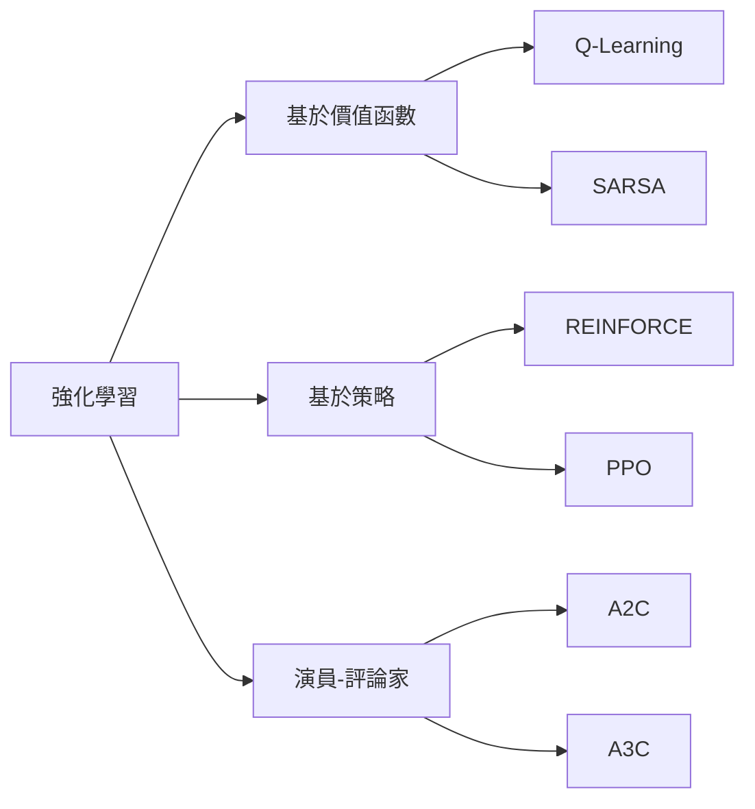

# Reinforcement Learning（強化學習）

強化學習是機器學習的三大範式之一，專注於智慧體（agent）如何根據環境（environment）的獎勵（reward）信號學會做出一連串決策。與監督學習（需要標註資料）和非監督學習（尋找資料結構）不同，強化學習的核心挑戰是**序列決策問題**：當下的動作不僅影響立即獎勵，更會影響未來所有可能的狀態與獎勵。

## 馬可夫決策過程（MDP）

強化學習的數學框架基於**馬可夫決策過程**（Markov Decision Process, MDP）。一個 MDP 由以下元素組成：

$$MDP = (S, A, P, R, \gamma)$$

- **S**：狀態空間（state space），所有可能狀態的集合
- **A**：動作空間（action space），智慧體可以選擇的動作集合
- **P**：轉移函數（transition function），$P(s' \mid s, a)$ 描述在狀態 s 執行動作 a 後轉移到 s' 的機率
- **R**：獎勵函數（reward function），$R(s, a, s')$ 給予對應的立即獎勵
- **γ**：折扣因子（discount factor），控制未來獎勵的重要性

「馬可夫」一詞表示轉移機制僅依賴當前狀態與動作，不受歷史影響。這個性質稱為**馬可夫性質**（Markov property）。

## 回饋假設（Reward Hypothesis）

強化學習基於一個核心假設：**所有目標都能透過最大化期望折扣累積獎勵來描述**。這意味著複雜的目標（如走路、說話、下棋）都可以轉化為對應的獎勵信號設計問題。獎勵函數的設計（reward shaping）是 RL 應用中的關鍵藝術。

## 策略（Policy）與價值函數

**策略 π** 是從狀態到動作的映射，可以是確定的（π(s) = a）或隨機的（π(a|s) 為機率分布）。智慧體的目標是學到最優策略 π*，最大化期望累積折扣獎勵。

**狀態價值函數 V^π(s)** 衡量在狀態 s 遵循策略 π 的期望回報：

$$V^\pi(s) = \mathbb{E}\_\pi \left[ \sum\_{t=0}^{\infty} \gamma^t r_t \mid s_0 = s \right]$$

**動作價值函數 Q^π(s, a)** 衡量在狀態 s 執行動作 a 後遵循策略 π 的期望回報：

$$Q^\pi(s, a) = \mathbb{E}\_\pi \left[ \sum\_{t=0}^{\infty} \gamma^t r_t \mid s_0 = s, a_0 = a \right]$$

兩者滿足著名的**貝爾曼方程式**（Bellman Equation）：

$$V^\pi(s) = \sum_a \pi(a \mid s) \sum\_{s'} P(s' \mid s, a) \left[ R(s, a, s') + \gamma V^\pi(s') \right]$$

## 探索與利用的權衡（Exploration vs Exploitation）

這是強化學習最核心的張力之一：
- **利用（exploitation）**：選擇已知能獲取高獎勵的動作（貪婪策略）
- **探索（exploration）**：嘗試新的動作以發現更好的策略

过度利用会导致智慧體困在局部最优解；过度探索则会让学习效率低下。常用方法包括：
- ε-greedy： 以 ε 機率隨機選擇（探索），否則貪婪（利用）
- Softmax/boltzmann 探索：根據價值指數分配機率
- UCB（Upper Confidence Bound）：考慮不確定性
- 湯姆森探樣（Thompson Sampling）：基於後驗分布抽樣

## Model-Free vs Model-Based

**無模型方法（model-free）** 不學習環境轉移機制，直接從互動經驗中學習策略或價值函數。代表演算法：
- Q-Learning、SARSA（基於價值）
- Policy Gradient、Actor-Critic（基於策略）

**有模型方法（model-based）** 先學習環境轉移 P(s'|s,a)，再用於規劃或模擬。優點是樣本效率高，缺點是模型誤差可能累積。主要應用：AlphaGo、World Models。

## 離策略與在策略（Off-policy vs On-policy）

離策略學習使用與當前策略不同的策略生成的數據進行訓練（如 Q-Learning 使用 ε-greedy 生成的數據更新 greedy 策略）。在策略學習則只能使用當前策略生成的數據（如 SARSA、Policy Gradient）。離策略更 sample-efficient，但穩定性較差。

## 常見演算法分類

## 深度強化學習（Deep RL）

傳統 RL 在連續高維狀態空間（如影像輸入）中難以運作。深度強化學習用深度神經網路表示價值函數或策略：

- **DQN**（Deep Q-Network）：用 CNN 逼近 Q 函數，首創經驗回放與目標網路
- **DDPG**（Deep Deterministic Policy Gradient）：連續動作空間
- **A3C**（Asynchronous Advantage Actor-Critic）：並行化加速
- **PPO**（Proximal Policy Optimization）：穩定、易調參的主流演算法

## 信用分配問題（Credit Assignment Problem）

在稀疏獎勵的環境中（如圍棋只有結局才知勝負），智慧體需要判断漫長決策序列中哪一步應該受到讚賞或責怪。這稱為信用分配問題。方法包括：
- TD 學習：透過時間差分逐步傳播信用
- 資格跡（eligibility trace）：結合多步 TD 信號
- 蒙特卡洛方法：完整回合後計算回報

## 本專案中的實現

本專案 `world/` 是一個輕量級的 RL 環境框架，實現了經典的 FrozenLake（離散網格世界）和 CartPole（連續平衡控制）環境，以及 TimeLimit、RecordEpisode 等常用包裝器（wrapper）。其核心接口借鑒了 OpenAI Gym 的設計理念，讓使用者能以統一方式與不同環境互動，並支援 Q-Learning、Policy Gradient 等各種學習演算法的實驗。

---

**上一篇**：[Q-Learning.md](Q-Learning.md)

**相關連結**：[GPT.md](GPT.md) | [Attention-Mechanism.md](Attention-Mechanism.md)