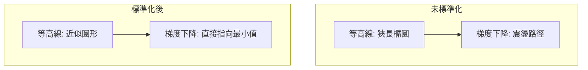
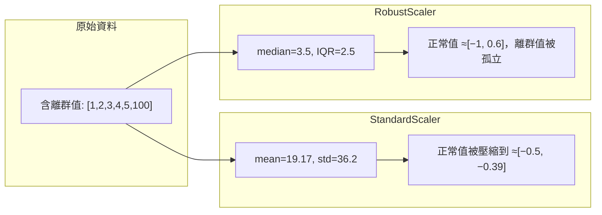
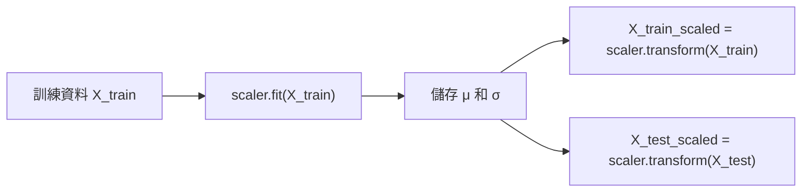

# StandardScaler（標準化）

標準化 (standardization) 是機器學習中最常見的資料前處理 (preprocessing) 步驟，將特徵調整為具有零均值 (zero mean) 和單位變異數 (unit variance)。本專案的 `ml/preprocessing.py:StandardScaler` 實作了標準化功能，遵循 scikit-learn 風格的 fit/transform 模式。

## 為什麼需要特徵縮放（Feature Scaling）

許多機器學習演算法對特徵的尺度 (scale) 敏感。當不同特徵的數值範圍差異很大時，可能導致以下問題：

### 1. 梯度下降收斂緩慢

考慮一個二維特徵的線性迴歸：$x_1 \in [0, 1]$（房屋房間數），$x_2 \in [10^4, 10^6]$（房屋價格）。

成本函數 $J(w_1, w_2)$ 的等高線圖呈狹長的橢圓形，梯度下降會在陡峭方向（$w_2$）震盪，在平緩方向（$w_1$）進展緩慢。



標準化後，成本函數的等高線變得接近圓形，梯度下降可以更直接地朝向最小值。

### 2. 距離計算偏差

K 近鄰 (KNN)、K-means、SVM（RBF 核）等演算法依賴樣本間的距離。若未標準化，數值範圍大的特徵會主導距離計算：

$$d(x_i, x_j) = \sqrt{(x_{i1} - x_{j1})^2 + (x_{i2} - x_{j2})^2}$$

若 $x_1 \in [0, 1]$ 而 $x_2 \in [0, 10^6]$，那麼距離幾乎完全由 $x_2$ 決定，$x_1$ 的資訊被淹沒。

### 3. 正則化效果不均

L1/L2 正則化對每個參數施加相同的懲罰。若特徵尺度不同，尺度大的特徵對應的權重自然較小，正則化對它們的影響不平衡。

### 4. PCA 方向偏差

PCA 尋找最大變異方向。若未標準化，變異數大的特徵會主導主成分方向，而這些大變異可能來自單位選擇而非真實的資訊重要性。

### 不需縮放的演算法

- **決策樹 / 隨機森林**：基於分割點，不受特徵尺度影響
- **Naive Bayes**：基於機率，不依賴距離
- **線性判別分析 (LDA)**：內建尺度處理

## 標準化 vs 正規化

### 標準化（Standardization / Z-score）

也稱為 Z-score 標準化，將資料轉換為均值 0、標準差 1：

$$z = \frac{x - \mu}{\sigma}$$

其中 $\mu$ 為特徵均值，$\sigma$ 為特徵標準差。

**結果**：$z \in \mathbb{R}$（理論上無界），多數值落在 $[-3, 3]$ 區間。

本專案 `ml/preprocessing.py:StandardScaler` 的實作：

```python
class StandardScaler:
    def fit(self, X):
        self.mean = np.mean(X, axis=0)
        self.std = np.std(X, axis=0)
        self.std[self.std == 0] = 1  # 避免除零
        return self

    def transform(self, X):
        return (X - self.mean) / self.std
```

### 正規化（Normalization / Min-Max Scaling）

也稱為最小-最大正規化，將資料縮放到固定區間 $[a, b]$（通常為 $[0, 1]$）：

$$x' = \frac{x - \min(x)}{\max(x) - \min(x)} \cdot (b - a) + a$$

**結果**：$x' \in [a, b]$，有界。

### 比較

| 特性 | 標準化 (Z-score) | 正規化 (Min-Max) |
|------|-------------------|-------------------|
| 輸出範圍 | 無界（通常 $[-3,3]$） | 有界 $[0,1]$ |
| 對離群值 | 較魯棒 | 敏感（離群值壓縮正常值範圍） |
| 保留分佈形狀 | 是 | 是 |
| 適用場景 | 常態分佈資料、梯度下降、PCA、SVM | 已知有界資料、像素值、神經網路 |
| 公式 | $(x-\mu)/\sigma$ | $(x-\min)/(\max-\min)$ |

## 對離群值的魯棒性（Robustness to Outliers）

標準化使用均值和標準差，這兩者都對離群值敏感。一個極大的離群值會：
- 拉動均值 $\mu$ 偏離資料主體
- 放大標準差 $\sigma$
- 導致標準化後正常值的範圍被壓縮

### 魯棒替代方案

對於含離群值的資料，可考慮：

**RobustScaler**：使用中位數 (median) 和四分位距 (IQR)：

$$x' = \frac{x - \text{median}(x)}{\text{IQR}(x)}$$

其中 $\text{IQR} = Q_3 - Q_1$。



## Fit/Transform 模式

本專案的 StandardScaler 遵循 scikit-learn 風格的 fit/transform 模式：



核心原則：**使用訓練資料擬合 (fit) 的統計量來轉換 (transform) 訓練和測試資料**。

### 為什麼測試資料不能獨立擬合？
- 測試資料的 $\mu$ 和 $\sigma$ 理論上應與訓練資料相近（來自同一分佈）
- 獨立擬合會引入資料洩漏 (data leakage)：測試資訊不應影響訓練過程
- 模擬真實應用場景：新樣本出現時，我們只能使用已知道的統計量

### 正確與錯誤的做法

```python
# 正確
scaler = StandardScaler()
scaler.fit(X_train)           # 只從訓練資料學習
X_train_scaled = scaler.transform(X_train)
X_test_scaled = scaler.transform(X_test)  # 使用相同的 μ, σ

# 錯誤（資料洩漏）
scaler_full = StandardScaler()
scaler_full.fit(np.vstack([X_train, X_test]))  # 測試資料的資訊洩漏到訓練流程中
X_train_scaled = scaler_full.transform(X_train)
```

## 注意事項

### 1. 標準差為零的特徵

當某特徵在所有樣本上取值相同（標準差為 0），標準化會導致除零錯誤。本專案的處理方式：

```python
self.std[self.std == 0] = 1
```

這使得該特徵變換後的值為 0（因為 $x - \mu = 0$），相當於忽略該特徵。

### 2. 稀疏資料

對稀疏矩陣（如 One-hot 編碼後的詞袋特徵）進行標準化會破壞稀疏性（因為減去均值後不再為零）。此時應考慮保持稀疏的轉換方式。

### 3. 離散/類別特徵

Ordinal 特徵（如學歷：小學/中學/大學）是否需要標準化取決於模型：
- 距離模型 (KNN, SVM)：建議標準化
- 樹模型：不需要
- 對 Ordinal 特徵的處理本身就是一個建模選擇

### 4. 管道 (Pipeline)

在實際專案中，標準化通常作為預處理管道的第一步：

```python
# 典型流程
scaler = StandardScaler()
X_train_scaled = scaler.fit_transform(X_train)
model.fit(X_train_scaled, y_train)
X_test_scaled = scaler.transform(X_test)
predictions = model.predict(X_test_scaled)
```

## 數學性質

標準化後的資料具有以下性質：

- **均值為 0**：$\mathbb{E}[z] = 0$
- **變異數為 1**：$\text{Var}[z] = 1$
- **共變異數矩陣 = 相關矩陣**：對標準化資料計算共變異數矩陣等同於計算原始資料的相關矩陣 (correlation matrix)

**對線性迴歸係數的影響**：標準化後，迴歸係數 $w_j$ 的絕對值可以直接比較特徵重要性（因為所有特徵都在同一尺度上），稱為標準化係數 (standardized coefficients / beta weights)。

## 常見誤解

1. **標準化使資料常態分佈**：❌。標準化只是線性變換，不改變資料分佈的形狀。偏態資料標準化後仍然是偏態。
2. **標準化總是必要的**：❌。樹模型不需標準化，而神經網路強烈建議標準化。
3. **標準化後可比較不同模型係數**：部分正確。標準化係數在同一模型內可比較，但跨模型比較仍需謹慎。

---

**上一篇**：[PCA.md](PCA.md)

**相關連結**：[PCA.md](PCA.md) | [Linear-Regression.md](Linear-Regression.md) | [Logistic-Regression.md](Logistic-Regression.md)
