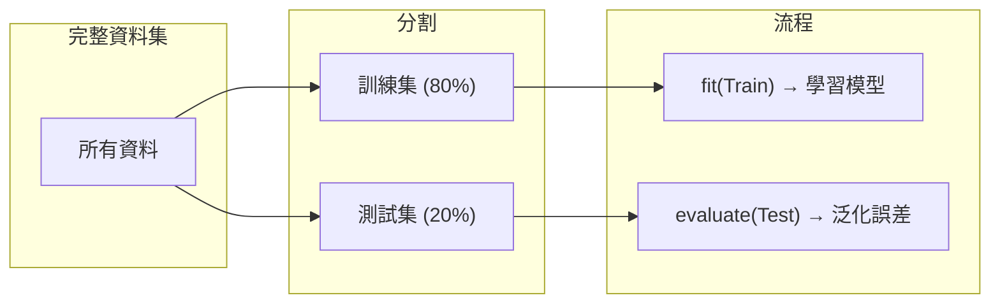
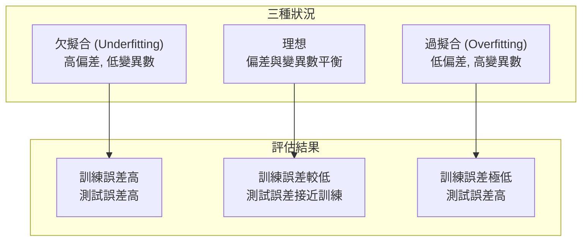
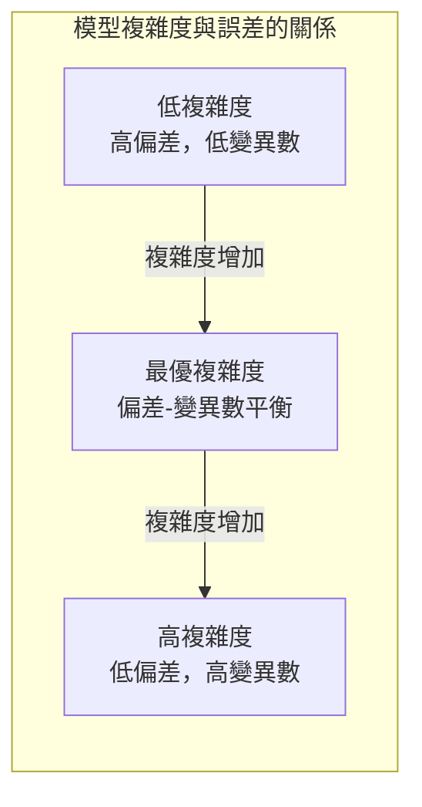
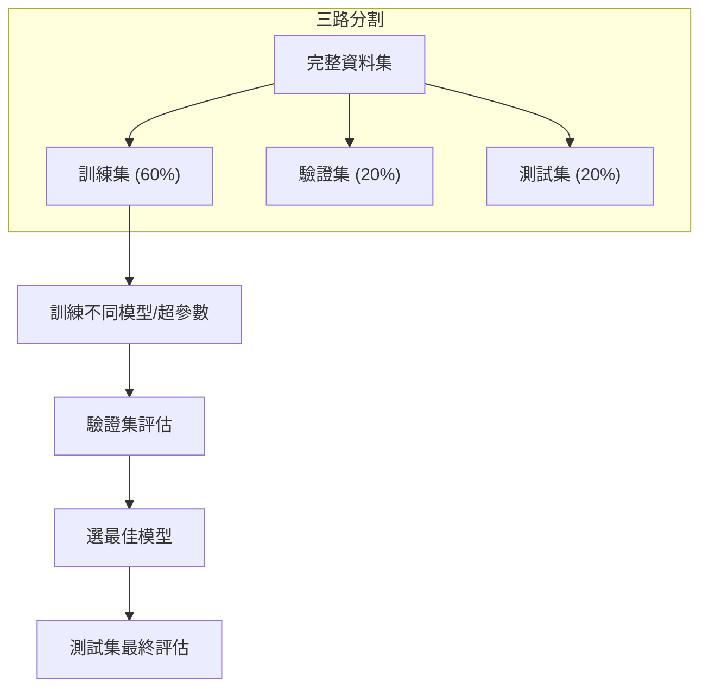
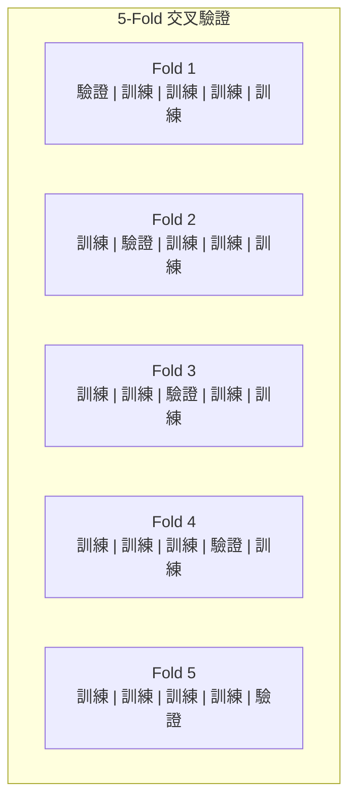
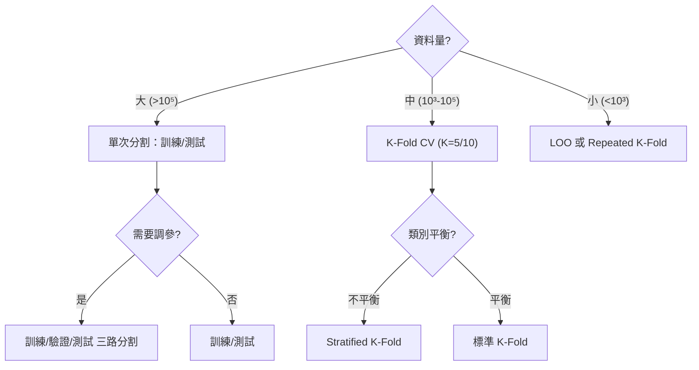
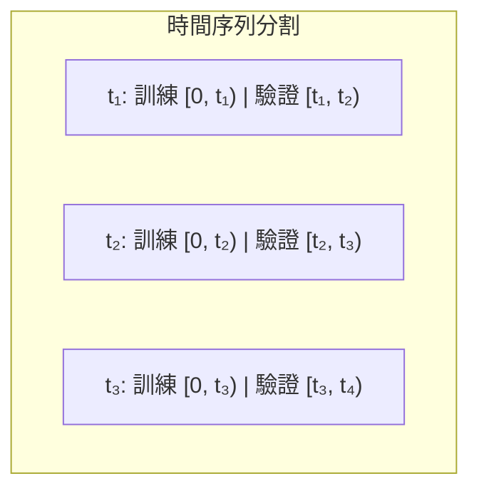

# Train-Test-Split（訓練-測試分割）

訓練-測試分割 (train-test split) 是機器學習模型評估的基本方法，將可用資料劃分為互斥的訓練集 (training set) 和測試集 (test set)，用訓練集學習模型、用測試集評估泛化能力。

## 為什麼需要資料分割

### 核心問題：泛化能力

機器學習的核心目標不是記住訓練資料，而是對**未見過的資料**做出準確預測。如果在訓練資料上評估模型，無法反映其真實的泛化能力。



### 過擬合與欠擬合



## 偏差-變異數權衡（Bias-Variance Tradeoff）

泛化誤差可以分解為三個部分：

$$\mathbb{E}[(y - \hat{f}(x))^2] = \text{Bias}[\hat{f}(x)]^2 + \text{Var}[\hat{f}(x)] + \sigma^2$$

其中：
- **偏差 (Bias)**：模型對真實關係的簡化假設造成的誤差（欠擬合）
- **變異數 (Variance)**：模型對訓練資料波動的敏感度（過擬合）
- **不可避免誤差 (Irreducible Error)**：$\sigma^2$，資料本身的雜訊



訓練-測試分割的關鍵作用：透過測試集上的表現來判斷模型處於哪個狀態。

## 資料劃分策略

### 訓練集 / 測試集分割

最基礎的劃分方式。本專案 `ml/preprocessing.py:train_test_split` 的實作：

```python
def train_test_split(X, y, test_size=0.2, random_state=None):
    if random_state is not None:
        np.random.seed(random_state)
    n_samples = len(X)
    n_test = int(n_samples * test_size)
    indices = np.random.permutation(n_samples)
    test_idx = indices[:n_test]
    train_idx = indices[n_test:]
    return X[train_idx], X[test_idx], y[train_idx], y[test_idx]
```

#### 常見分割比例

| 資料量 | 訓練集 | 測試集 | 說明 |
|--------|--------|--------|------|
| 大量 (>10⁶) | 99% | 1% | 少量測試資料即可穩定評估 |
| 中等 (10⁴-10⁵) | 80% | 20% | 最常見的比例 |
| 少量 (<10³) | 70-80% | 30-20% | 需要保留更多測試樣本 |
| 極少量 (<10²) | 需交叉驗證 | — | 單次分割不穩定 |

### 訓練集 / 驗證集 / 測試集

當需要進行模型選擇 (model selection) 或超參數調優 (hyperparameter tuning) 時，需要三個獨立的資料集：

1. **訓練集 (Training set)**：學習模型參數
2. **驗證集 (Validation set)**：選擇模型、調整超參數
3. **測試集 (Test set)**：最終評估（只能使用一次！）



**測試集只能使用一次**：若根據測試結果反覆調整模型，測試集就變成了「隱藏的驗證集」，會高估模型在真正新資料上的表現。

### 分層抽樣（Stratification）

當資料類別不平衡時（如 95% 負類、5% 正類），隨機分割可能導致測試集中沒有正類樣本。分層抽樣 (stratified sampling) 確保訓練集和測試集中各類別比例與原始資料一致。

```mermaid
graph TD
    subgraph 不平衡資料
        A["95% 類別 0<br/>5% 類別 1"]
    end
    subgraph 隨機分割（可能）
        B["訓練集: 95% 0, 5% 1"]
        C["測試集: 100% 0, 0% 1"]
    end
    subgraph 分層分割
        D["訓練集: 95% 0, 5% 1"]
        E["測試集: 95% 0, 5% 1"]
    end
    A --> B & C
    A --> D & E
```

本專案雖然未實作分層抽樣，但 `sklearn.model_selection.train_test_split` 提供了 `stratify` 參數。

### 隨機種子與可重現性（Random State）

隨機種子確保分割結果可重現 (reproducibility)：

```python
# 設定 random_state 確保每次分割結果相同
X_train, X_test, y_train, y_test = train_test_split(
    X, y, test_size=0.2, random_state=42)
```

本專案中：

```python
if random_state is not None:
    np.random.seed(random_state)
```

設定 `random_state` 後，同一程式碼在不同時間執行得到相同的分割結果。這在以下場景至關重要：
- 論文實驗的可重現性
- 團隊協作時共享一致的實驗設定
- 版本控制：程式碼不變，結果不變

## 資料洩漏（Data Leakage）

資料洩漏是指訓練過程中不當引入了測試資料或未來資訊，導致評估結果過度樂觀。

### 常見的資料洩漏場景

1. **標準化 / 資料前處理**：對全部資料（含測試集）計算均值和標準差，再分割。正確做法：先分割，再只從訓練集擬合標準化器。

2. **特徵選擇**：使用全部資料選擇特徵，再分割訓練/測試。正確做法：只在訓練集上進行特徵選擇。

3. **缺失值填補**：使用全部資料的統計量填補缺失值。正確做法：只從訓練集學習填補策略。

4. **時間序列資料**：隨機分割會破壞時間順序，導致用未來資料預測過去。應按時間順序分割。

## 交叉驗證（Cross-Validation）

當資料量有限時，單次分割的結果可能不穩定。交叉驗證 (cross-validation) 透過多次不同分割來獲得更穩定的評估。

### K-Fold 交叉驗證

將資料分為 $K$ 份，每次用 $K-1$ 份訓練、1 份驗證，輪流 $K$ 次：



最終評分為 $K$ 次結果的平均：

$$E_{\text{CV}} = \frac{1}{K} \sum_{k=1}^K E_k$$

### 常見的交叉驗證方法

| 方法 | 描述 | 適用場景 |
|------|------|----------|
| K-Fold CV | 平分 K 份，輪流驗證 | 通用 |
| Stratified K-Fold | 每份保留類別比例 | 類別不平衡 |
| Leave-One-Out (LOO) | K = N，每次留一個樣本 | 極小資料集 |
| Time Series CV | 按時間順序擴展窗口 | 時間序列 |
| Repeated K-Fold | 重複多次 K-Fold，不同隨機分割 | 更穩定評估 |

### K 的選擇

- **K=5 或 K=10**：最常見的選擇
- **K 越大**：偏差越小（使用更多訓練資料），但計算代價越大，變異數越大（訓練集高度重疊）
- **K=2 或 K=3**：用於大規模資料、降低計算成本

### K-Fold 的偏差-變異數

給定 $K$ 的 K-Fold CV：
- 偏差隨 $K$ 增加而降低（因為每次使用 $(K-1)/K$ 的資料，接近使用全部資料）
- 計算成本隨 $K$ 線性增長
- 預測值的變異數來自於不同分割的差異

| K | 訓練資料比例 | 偏差 | 計算成本 |
|---|-------------|------|----------|
| 2 | 50% | 最高 | 最低 |
| 5 | 80% | 中 | 中 |
| 10 | 90% | 低 | 高 |
| N (LOO) | ~100% | 最低 | 最高 |

## 分割策略的選擇指南



## 時間序列的特殊考量

對於時間序列資料，不能使用隨機分割（會破壞時間依賴性）。應使用**時間序列交叉驗證 (Time Series CV / Walk-Forward Validation)**：



## 本專案中的評估實踐

本專案使用 `ml/preprocessing.py:train_test_split` 進行資料分割，並使用 `ml/metrics.py` 中的指標進行評估：

```python
from ml.preprocessing import train_test_split
from ml.metrics import accuracy_score, mean_squared_error, r2_score

X_train, X_test, y_train, y_test = train_test_split(
    X, y, test_size=0.2, random_state=42)

model.fit(X_train, y_train)
y_pred = model.predict(X_test)
score = accuracy_score(y_test, y_pred)  # 分類
# 或
mse = mean_squared_error(y_test, y_pred)   # 迴歸
r2 = r2_score(y_test, y_pred)              # R²
```

---

**上一篇**：[StandardScaler.md](StandardScaler.md)

**相關連結**：[Linear-Regression.md](Linear-Regression.md) | [Logistic-Regression.md](Logistic-Regression.md) | [Decision-Tree.md](Decision-Tree.md) | [Random-Forest.md](Random-Forest.md)
