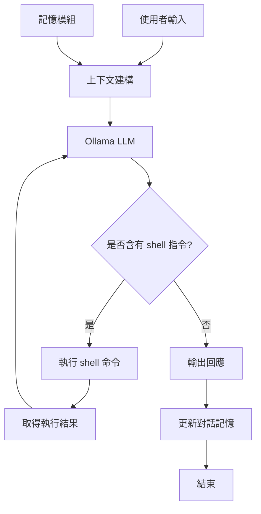
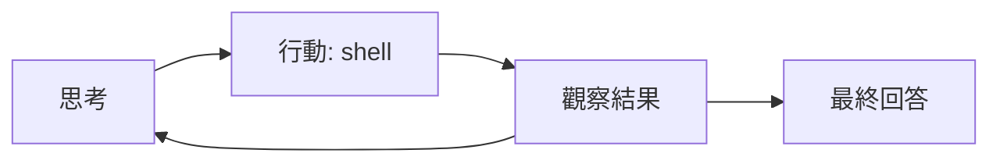

# llm/agent.md - LLM Agent 框架理論

本模組實現了一個基於 Ollama 的 AI Agent 框架，讓大型語言模型（LLM）能透過對話、記憶和工具呼叫來完成任務。

## Agent 架構



## 系統提示（System Prompt）

Agent 的行為由系統提示控制，定義了三個關鍵規則：

1. **工具呼叫**：需要執行 shell 命令時，用 `<shell>` 標籤包住
2. **多步驟執行**：可以多次呼叫 `<shell>`，逐步完成任務
3. **完成標記**：完成後用 `<end/>` 結束回應

這種設計是**工具使用（Tool Use）** 模式的簡單實作，讓 LLM 能操作外部環境。

## 對話管理

### 上下文建構

每次請求時，Agent 從記憶和對話歷史建構上下文：

```
<memory>
  <item>Project root is /home/user/project</item>
  <item>Python 3.10 is available</item>
</memory>

<history>
  <user>Create a new file</user>
  <assistant>I'll help you create it</assistant>
</history>

<user>Current request</user>
```

上下文包含：
- **記憶（Memory）**：跨對話的長期資訊（自動萃取）
- **歷史（History）**：最近幾輪的對話記錄
- **當前輸入**：使用者的最新請求

### 記憶萃取

Agent 會自動從對話中**萃取關鍵資訊**存入長期記憶：

```python
extract_prompt = "根據這段對話，有沒有需要長期記憶的關鍵資訊？"
```

提取機制使用 LLM 自身判斷哪些資訊值得記憶，實作簡單但有效。

## 工具使用（Shell 執行）

LLM 透過 `<shell>` 標籤執行命令，流程如下：

```
User: "顯示當前目錄的檔案"
Assistant: <shell>ls -la</shell>
System: [執行結果：總計 24  drwxr-xr-x  8 user staff  256 May 21 10:00 .]
Assistant: 當前目錄有這些檔案：...
          <end/>
```

命令執行使用 `subprocess.run()`，支援：
- 多行命令（`&&` 連接）
- 逾時控制（30 秒）
- 工作目錄設定

## ReAct 模式

Agent 的決策流程遵循**ReAct（Reasoning + Acting）** 模式：



- **思考（Thought）**：LLM 決定下一步做什麼
- **行動（Action）**：透過 shell 執行命令
- **觀察（Observation）**：獲取執行結果
- 循環直到任務完成

## 與 LangChain Agent 的比較

| 特性 | 本專案 Agent | LangChain Agent |
|------|-------------|-----------------|
| LLM 後端 | Ollama（本機） | 多種後端 |
| 工具 | Shell 命令 | 插件系統 |
| 記憶 | 簡單的列表管理 | 向量資料庫 |
| 序列長度 | 固定 MAX_TURNS | 可配置 |
| 依賴 | aiohttp | 大量套件 |

本專案專注於**最小可行實作**，適合理解 Agent 的核心機制。

詳細理論請見 [_wiki/LLM-Agent-Framework.md](../_wiki/LLM-Agent-Framework.md)。

---

**相關連結**：[GPT.md](../_wiki/GPT.md) | [Transformer.md](../_wiki/Transformer.md)
