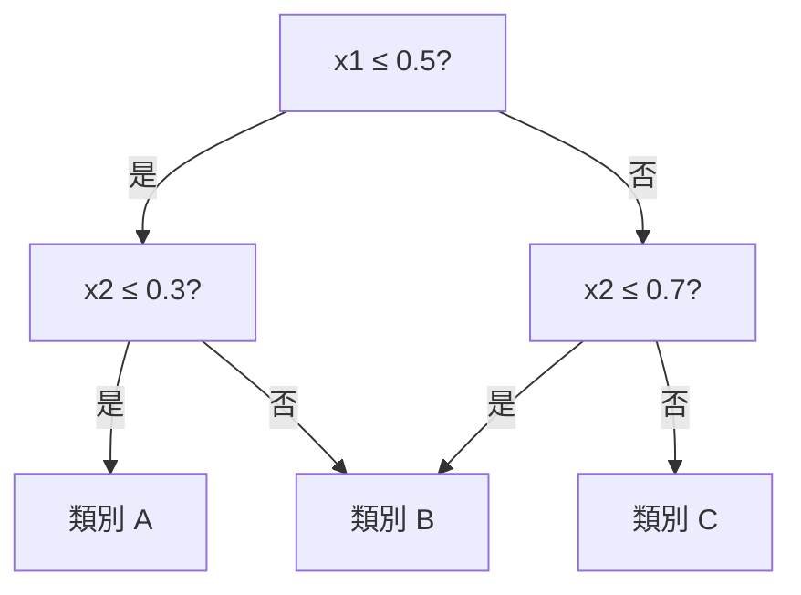

# ml/tree.md - 決策樹理論

本模組實現了決策樹（Decision Tree）演算法，支援分類（Classification）和回歸（Regression）兩種任務。決策樹是機器學習中最直觀的模型之一，也是 Random Forest 和 Gradient Boosting 的基礎。

## 樹狀決策模型

決策樹透過一連串的**條件判斷**（if-then-else）來做出預測：



每個內部節點是一個特徵的測試，每個葉節點是預測輸出。

## 分類樹的核心演算法

### 不純度度量

決策樹在每個節點選擇**最能降低不純度（impurity）** 的特徵和切分點：

**Gini 不純度**（分類任務預設）：

$$Gini = 1 - \sum_{k=1}^K p_k^2$$

其中 $p_k$ 是節點中第 k 類樣本的比例。Gini 越小，節點越「純」。

**熵（Entropy）**：

$$H = -\sum_{k=1}^K p_k \log p_k$$

### 資訊增益

選擇特徵 $j$ 和閾值 $t$，最大化：

$$IG = Impurity(parent) - \frac{N_{left}}{N} Impurity(left) - \frac{N_{right}}{N} Impurity(right)$$

### 遞迴分割

```python
def build_tree(X, y, depth):
    if depth >= max_depth or len(set(y)) == 1:
        return LeafNode(majority_class(y))
    best_feat, best_thresh = find_best_split(X, y)
    left_idx = X[:, best_feat] <= best_thresh
    return DecisionNode(
        feature=best_feat,
        threshold=best_thresh,
        left=build_tree(X[left_idx], y[left_idx], depth+1),
        right=build_tree(X[~left_idx], y[~left_idx], depth+1),
    )
```

## 回歸樹

回歸樹的葉節點輸出是該區域的**平均值**而非類別：

$$\hat{y} = \frac{1}{N_{leaf}} \sum_{i \in leaf} y_i$$

分割標準改用**均方誤差（MSE）** 減少量：

$$MSE_{parent} - \left(\frac{N_{left}}{N} MSE_{left} + \frac{N_{right}}{N} MSE_{right}\right)$$

## 過擬合控制

決策樹容易過擬合，本實作支援以下限制：

- **max_depth**：限制樹的最大深度（預設 None）
- **min_samples_split**：內部節點最少樣本數
- **min_samples_leaf**：葉節點最少樣本數

深度過大會讓樹記住雜訊，限制深度強制模型學習主要模式。

## 決策邊界

決策樹的決策邊界是**軸平行（axis-aligned）** 的矩形區域，每個分割對應一條垂直或水平線。這與線性模型的超平面決策邊界不同。

詳細理論請見 [_wiki/Decision-Tree.md](../_wiki/Decision-Tree.md)。

---

**相關連結**：[ensemble.md](ensemble.md) | [linear_models.md](linear_models.md)
