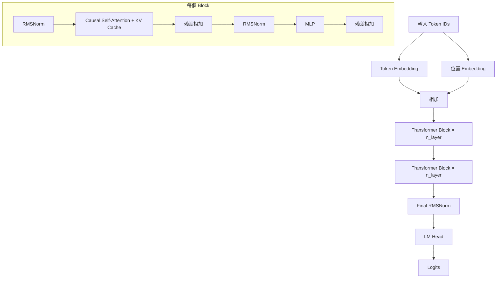

# nn/gpt.md - GPT 模型理論

本模組實現了完整的 GPT（Generative Pre-trained Transformer）語言模型，包含位置編碼、多層 Transformer Block、因果注意力與 KV Cache 支援。

## 架構總覽



## Token Embedding 與位置 Embedding

語言模型的第一步是將離散的 token ID 轉換為連續向量表示：

- **Token Embedding (`wte`)**：將單詞映射到 d 維向量空間，矩陣形狀為 `(vocab_size, n_embd)`，每行是一個 token 的嵌入向量
- **位置 Embedding (`wpe`)**：讓模型區分不同位置的 token，矩陣形狀為 `(block_size, n_embd)`

兩者相加得到最終輸入表示：
$$x = \text{Emb}(token) + \text{Emb}(position)$$

這個設計源於原始 Transformer，後續 LLaMA 等模型改用旋轉位置編碼（RoPE）替代。

## Causal Self-Attention

### 為什麼需要 Causal Mask

語言模型是自回歸的——預測下一個 token 時只能看到之前的 token，不能偷看答案。因此需要在注意力計算中遮蔽未來的位置。

實作方式：建立上三角矩陣作為 mask，使第 i 個位置只能 attend 到 j ≤ i 的位置。

### KV Cache 機制

推理時，若完整重算，時間複雜度 O(T²)。KV Cache 的關鍵思想：
1. 第一次 forward：計算並儲存所有歷史的 K、V
2. 之後每步：新 token 的 Q 與快取的 K、V 拼接，計算注意力
3. 新計算的 K、V 加入快取

本模組實現：
```python
if kv_cache is not None:
    past_k, past_v = kv_cache
    k = cat([past_k, k], axis=2)  # 沿序列維度拼接
    v = cat([past_v, v], axis=2)
```

返回新的 `(k, v)` 供下次使用。

## Transformer Block

每個 Block 包含兩個子層，採用 Pre-LN 結構（LayerNorm 在子層輸入處）：

1. **注意力子層**：RMSNorm → CausalSelfAttention → 殘差相加
2. **MLP 子層**：RMSNorm → FFN → 殘差相加

Pre-LN vs Post-LN：
- Post-LN（原始論文）：LayerNorm 在殘差相加之後，訓練初期可能不穩定
- Pre-LN：本專案採用的方式，LayerNorm 在殘差路徑上，訓練更穩定

## MLP（前饋網路）

每層的 FFN 是一個兩層的全連接網路：
```python
self.fc1 = Linear(n_embd, 4 * n_embd)  # 擴展維度
self.fc2 = Linear(4 * n_embd, n_embd)   # 壓縮回原維度
```

啟動函數使用 ReLU。LLaMA 等現代模型使用 SwiGLU 等更複雜的變體。

## 因果遮蔽的實現

```python
mask = np.triu(np.ones((T, T_k)), k=1) == 1
attn_logits = attn_logits.masked_fill(mask, float('-inf'))
```

- `np.triu(..., k=1)` 產生上三角矩陣（不含對角線）
- `== True` 轉為布林陣列
- `masked_fill` 將 mask 為 True 的位置設為 -inf
- softmax 後這些位置的權重趨近於零

訓練時 T > 1 需要 mask；推理時 T=1（只有一個新 token），天然滿足因果性，不需要遮罩。

## 損失函數與訓練

語言模型的訓練目標是最小化負對數似然：

$$\mathcal{L} = -\frac{1}{T} \sum_{t=1}^T \log P(x_t \mid x_{<t})$$

本模組使用 `cross_entropy` 損失函數（在 `tensor.py` 中定義）計算每個位置的預測 loss。

---

**下一篇**：[chargpt.md](chargpt.md) | [optim.md](optim.md)